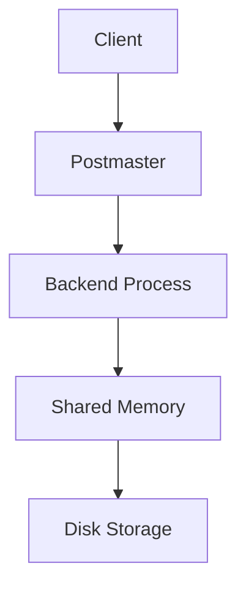
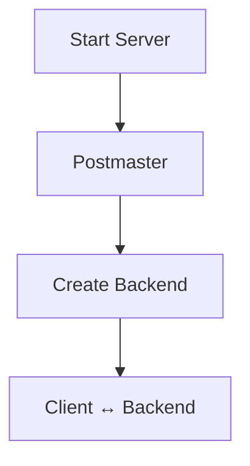
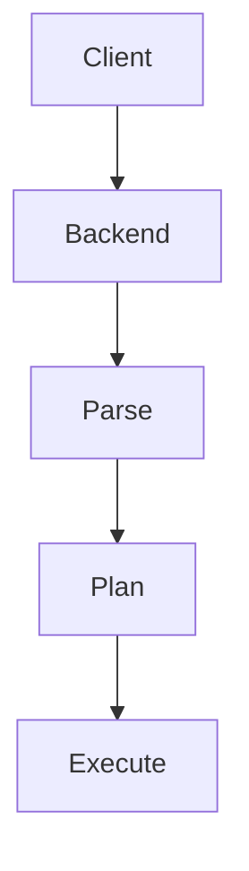
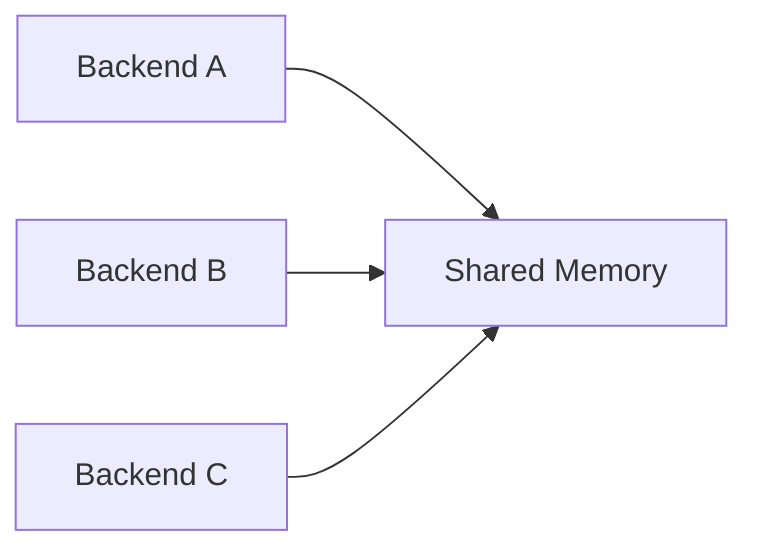
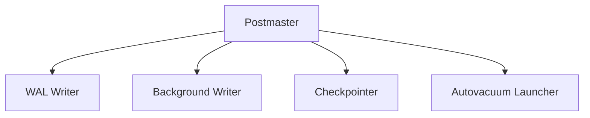
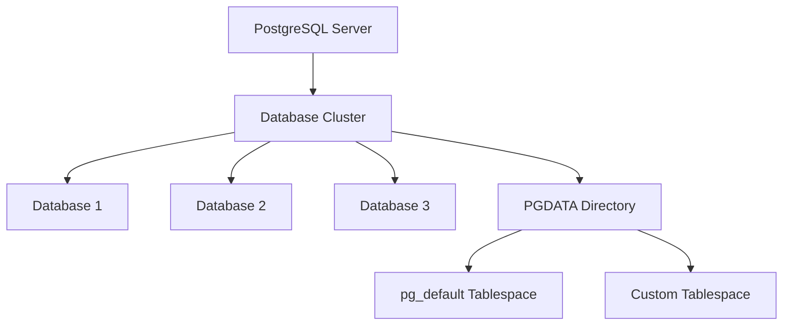
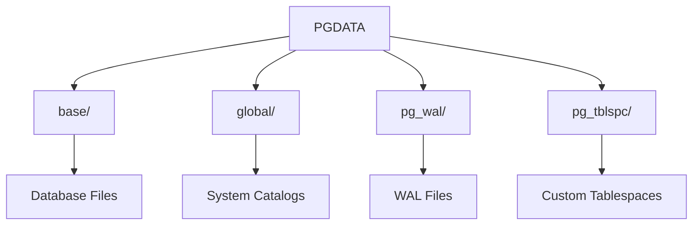
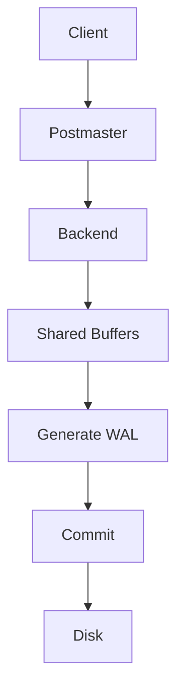

# Chapter 1 -- PostgreSQL Architecture

## Lesson 1 -- PostgreSQL Architecture

### Q: Explain PostgreSQL Architecture.

PostgreSQL follows a **process-per-connection** architecture, meaning
every client connection gets its own **Backend Process**. The
**Postmaster** is the parent process that starts the server, accepts
client connections, and creates Backend Processes. Each Backend executes
SQL independently while sharing common resources through **Shared
Memory**. Shared Memory contains structures such as **Shared Buffers**,
**WAL Buffers**, and lock information that all Backends can access.
Several **Background Processes** perform maintenance tasks like writing
dirty pages, flushing WAL, and running VACUUM. Permanent data is stored
on disk in heap files, index files, and WAL files. A SQL query typically
flows from the client to a Backend Process, accesses Shared Memory, and
eventually reaches disk. This separation allows PostgreSQL to support
many concurrent users while maintaining consistency and durability.

### Popular Questions

-   Explain PostgreSQL architecture.
-   What are the major components?
-   Why process-per-connection?

### Remember

-   Postmaster starts the server.
-   Backend executes SQL.
-   Shared Memory is shared by all Backends.
-   Background Processes perform maintenance.
-   Disk stores permanent data.

------------------------------------------------------------------------

## Lesson 2 -- Postmaster

### Q: What is the Postmaster?

The **Postmaster** is the first PostgreSQL process started when the
server boots. It reads configuration files, allocates Shared Memory, and
starts Background Processes. It listens for incoming client connections
on the configured port. Whenever a client connects, the Postmaster
creates a dedicated Backend Process. After the Backend is created, the
client communicates directly with it. The Postmaster does **not** parse
or execute SQL queries. It monitors child processes and coordinates
server shutdown. Think of the Postmaster as the manager of the
PostgreSQL server rather than a query executor.

### Popular Questions

-   What is the Postmaster?
-   Does the Postmaster execute SQL?
-   What happens when a client connects?

### Remember

-   Parent process.
-   Starts PostgreSQL.
-   Creates Backend Processes.
-   Doesn't execute SQL.
-   Monitors child processes.

------------------------------------------------------------------------

## Lesson 3 -- Backend Process

### Q: What is a Backend Process?

A **Backend Process** is a dedicated process that serves one client
connection. It receives SQL statements from the client and executes them
until the connection closes. The Backend parses SQL, creates an
execution plan, executes operators, accesses data pages, and manages
transactions. For write operations, it also generates WAL records before
committing. Backend Processes have their own private memory but share
common resources through Shared Memory. Multiple Backends can work
concurrently while safely accessing the same database. If one Backend
crashes, the other Backends continue running because they are separate
processes.

### Popular Questions

-   What does a Backend Process do?
-   One Backend per query or connection?
-   Does the Backend write directly to disk?

### Remember

-   One Backend per connection.
-   Executes SQL.
-   Manages transactions.
-   Generates WAL.
-   Shares Shared Memory.

------------------------------------------------------------------------

## Lesson 4 -- Shared Memory

### Q: Why does PostgreSQL need Shared Memory?

PostgreSQL uses Shared Memory so all Backend Processes can share common
resources efficiently. Without Shared Memory, every Backend would need
its own cache and repeatedly read the same pages from disk. Shared
Memory contains Shared Buffers, WAL Buffers, the Lock Manager,
transaction information, and buffer metadata. Backend Processes attach
to this shared region when they start. Shared Buffers cache frequently
accessed pages, greatly reducing disk I/O. The Lock Manager coordinates
concurrent access to data. Shared Memory is created once by the
Postmaster during server startup.

### Popular Questions

-   What is Shared Memory?
-   What does it contain?
-   Why can't every Backend have its own cache?

### Remember

-   Shared by all Backends.
-   Created by Postmaster.
-   Contains Shared Buffers.
-   Contains WAL Buffers.
-   Enables efficient concurrency.

------------------------------------------------------------------------

## Lesson 5 -- Background Processes

### Q: What are Background Processes?

Background Processes perform maintenance tasks so Backend Processes can
focus on executing user queries. The Background Writer gradually writes
dirty pages to disk to reduce sudden I/O spikes. The Checkpointer
periodically creates checkpoints, making crash recovery faster. The WAL
Writer flushes WAL records from memory to WAL files. The Autovacuum
Launcher starts workers that remove dead tuples and update table
statistics. These processes run continuously even when there are no
active clients. Separating maintenance from query execution improves
performance and keeps the database healthy. The Postmaster starts and
monitors all Background Processes.

### Popular Questions

-   What are the major Background Processes?
-   Difference between Background Writer and Checkpointer?
-   What does Autovacuum do?

### Remember

-   Started by Postmaster.
-   Run continuously.
-   Handle maintenance.
-   Improve performance.
-   Support durability.

------------------------------------------------------------------------

## Lesson 6 – Database Cluster & Tablespaces

**Q: What is a PostgreSQL Database Cluster? What are Tablespaces?**

A **PostgreSQL Database Cluster** is the complete collection of databases managed by a single PostgreSQL server instance. The cluster is stored inside a single data directory called **PGDATA**, which contains database files, configuration files, WAL files, and system catalogs. A single cluster can contain multiple databases, but each database is isolated from the others and cannot directly access objects in another database. Every table and index belongs to a database within the cluster. By default, PostgreSQL stores user objects in the **`pg_default`** tablespace. A **Tablespace** allows administrators to store databases, tables, or indexes on a different disk or directory, making it possible to improve I/O performance or utilize faster storage devices such as SSDs. PostgreSQL tracks tablespaces using its system catalogs and maps them to physical directories on disk. Understanding the relationship between the database cluster, PGDATA, and tablespaces is important because it explains how PostgreSQL organizes and stores data.

### Conceptual View

### Physical Layout of PGDATA

### Popular Questions

* What is a PostgreSQL Database Cluster?
* What is the difference between a PostgreSQL server and a database cluster?
* Can one PostgreSQL cluster contain multiple databases?
* What is **PGDATA**?
* What is a Tablespace, and why would you create one?
* What is the purpose of the **pg_default** and **pg_tblspc** directories?

### Remember

* One PostgreSQL **Server** manages one **Database Cluster**.
* A **Database Cluster** can contain multiple databases.
* **PGDATA** is the root directory that stores the entire cluster.
* **`base/`** stores database files.
* **`global/`** stores shared system catalogs.
* **`pg_wal/`** stores Write-Ahead Log (WAL) files.
* **`pg_tblspc/`** stores links to custom tablespaces.
* **`pg_default`** is the default tablespace for user objects.

------------------------------------------------------------------------

## Lesson 7 -- Architecture Walkthrough
### Q: Walk me through an UPDATE in PostgreSQL.

When a client sends an UPDATE statement, it first reaches the
Postmaster, which ensures the client has a Backend Process. The Backend
receives the SQL and parses, plans, and executes it. Required pages are
fetched through the Buffer Manager into Shared Buffers if they are not
already cached. The row is updated in memory using PostgreSQL's MVCC
mechanism, which creates a new tuple version instead of overwriting the
old one. A WAL record describing the change is generated and written
before the transaction commits. The client receives a success response
after the commit is durable. Later, Background Processes flush dirty
pages to disk and VACUUM eventually removes obsolete tuple versions.
This architecture allows PostgreSQL to provide concurrency, durability,
and efficient performance.

### Popular Questions

-   Walk me through an UPDATE.
-   Where is the row modified first?
-   When is WAL generated?

### Remember

-   Backend executes SQL.
-   Data changes in memory first.
-   WAL before data pages.
-   Background Processes flush pages.
-   VACUUM cleans old versions.
