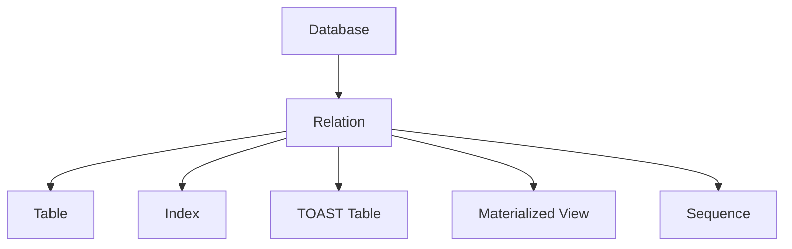
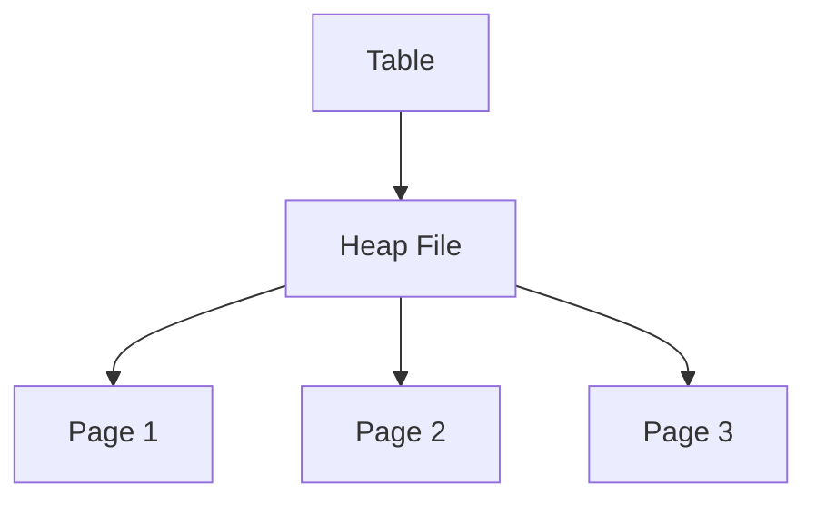
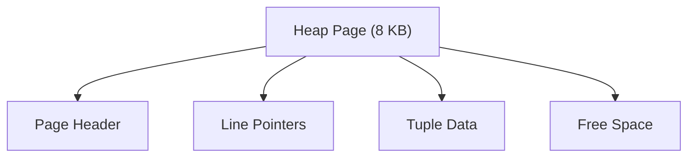
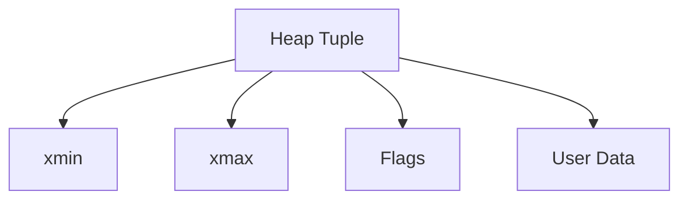
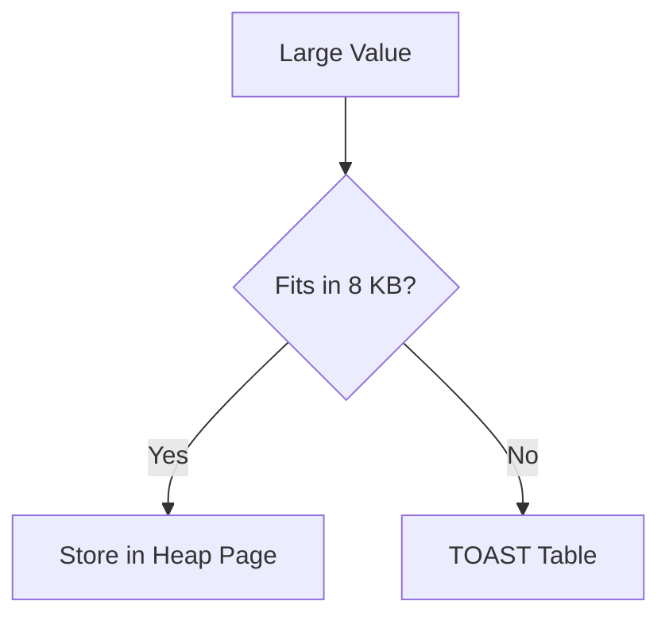
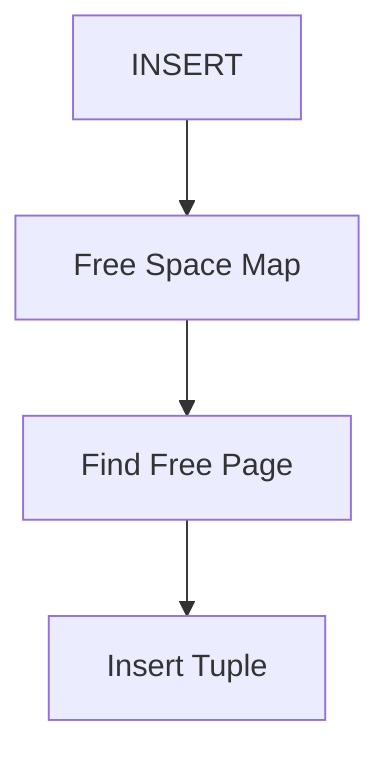
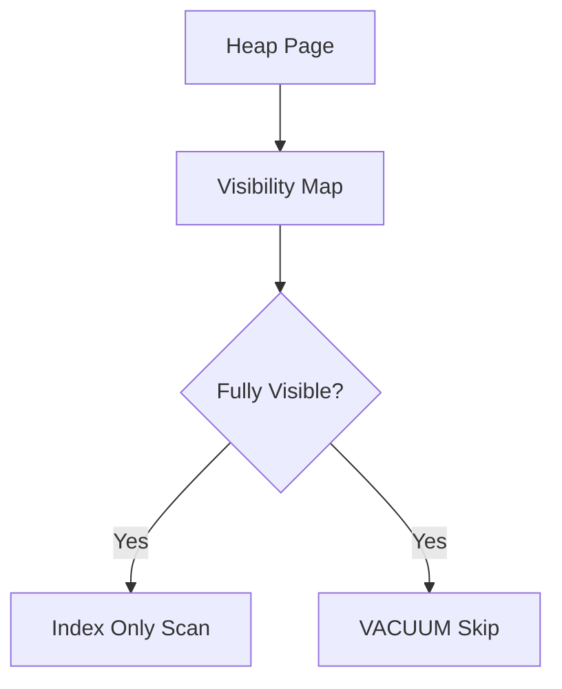
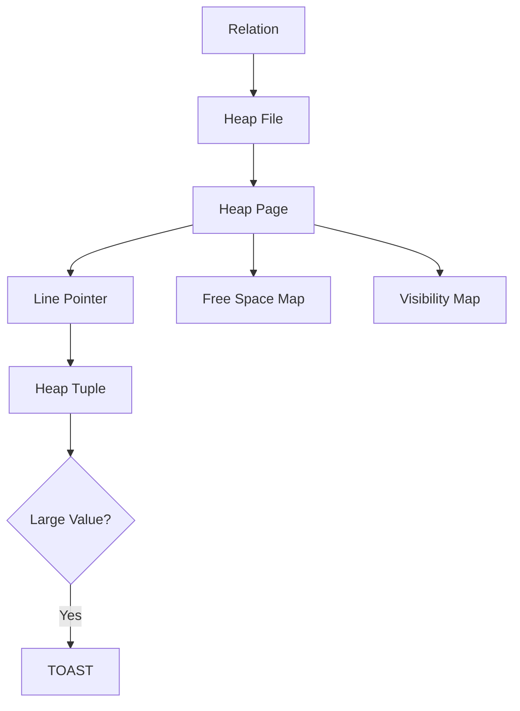
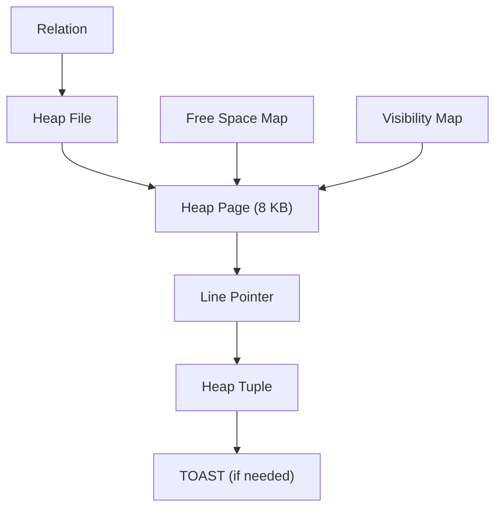

# Chapter 2 – Storage Engine

**Question:** Where is my data physically stored?

---

# Lesson 1 – Relation: Everything is a Relation

**Q: What is a Relation in PostgreSQL?**

In PostgreSQL, a **Relation** is any database object that stores data. Tables, indexes, materialized views, TOAST tables, and sequences are all relations. PostgreSQL internally uses the term **relation** instead of **table** because these objects share the same storage infrastructure. Every relation has metadata stored in the system catalogs and is uniquely identified by an Object Identifier (OID). A relation is backed by one or more files on disk. Whenever you query a table or use an index, PostgreSQL first opens the corresponding relation. This unified design simplifies the storage engine because every data object is managed in a consistent way. At the storage layer, PostgreSQL works with relations rather than SQL object names.

### Diagram

### Popular Questions

- What is a Relation?
- Are indexes also relations?
- Why doesn't PostgreSQL simply use the word "table"?

### Remember

- Tables are relations.
- Indexes are relations.
- TOAST tables are relations.
- Relations have OIDs.
- Relations are stored on disk.

---

# Lesson 2 – Heap Files

**Q: How are tables stored?**

PostgreSQL stores table data in **Heap Files**. A heap file is an unordered collection of fixed-size pages containing table rows. Unlike a B-tree index, rows inside a heap are not sorted by any column. PostgreSQL inserts new rows into pages with sufficient free space and automatically allocates new pages as the table grows. Because PostgreSQL uses MVCC, updates usually create new row versions instead of overwriting existing rows. Every SELECT, INSERT, UPDATE, and DELETE eventually accesses the heap file. Heap files are therefore the primary storage structure for table data.

### Diagram

### Popular Questions

- What is a Heap File?
- Why are rows unordered?
- How does PostgreSQL grow a table?

### Remember

- Tables are stored as Heap Files.
- Heap files contain pages.
- Pages contain tuples.
- Rows are unordered.
- Heap files grow automatically.

---

# Lesson 3 – Heap Page Layout

**Q: What does a Heap Page contain?**

A Heap File is divided into fixed-size **8 KB pages**, the smallest unit of disk I/O in PostgreSQL. Each page contains a **Page Header**, **Line Pointers**, **Tuple Data**, and **Free Space**. The Page Header stores metadata describing the page. Line Pointers reference tuples without requiring them to move physically inside the page. Free Space is reserved for future inserts and updates. PostgreSQL always reads and writes entire pages rather than individual rows. Whenever a row is accessed, its entire page is loaded into Shared Buffers. Efficient page organization improves storage and query performance.

### Diagram

### Popular Questions

- Why are pages 8 KB?
- What is stored in a Page Header?
- Why use Line Pointers?

### Remember

- Heap pages are 8 KB.
- Smallest disk I/O unit.
- Contains Page Header.
- Contains Line Pointers.
- Contains Tuple Data.

---

# Lesson 4 – Heap Tuple Layout

**Q: How is a row stored?**

A database row is stored as a **Heap Tuple**. Besides user data, each tuple stores metadata such as **xmin** and **xmax**, which identify the creating and deleting transactions. These fields are the foundation of PostgreSQL's MVCC implementation. Tuples also contain flags and internal pointers used by the storage engine. Rows are referenced through Line Pointers rather than their physical position inside the page. When a row is updated, PostgreSQL usually creates a new tuple version instead of overwriting the old one. Old tuple versions remain until VACUUM removes them. This design allows readers and writers to operate concurrently without blocking each other.

### Diagram

### Popular Questions

- What is a Heap Tuple?
- What are xmin and xmax?
- Why doesn't PostgreSQL overwrite rows?

### Remember

- One tuple represents one row.
- xmin stores creator transaction.
- xmax stores deleting transaction.
- MVCC uses tuple versions.
- VACUUM removes old versions.

---

# Lesson 5 – TOAST

**Q: What is TOAST?**

A PostgreSQL page is only **8 KB**, so very large values cannot always fit inside a single page. PostgreSQL solves this limitation using **TOAST (The Oversized-Attribute Storage Technique)**. Large values are automatically compressed or stored in a separate TOAST table. The original heap tuple stores only a pointer to the external value. TOAST is commonly used for large TEXT, JSON, XML, and BYTEA columns. This mechanism works automatically without requiring changes to application code. By moving oversized values out of heap pages, PostgreSQL keeps table scans efficient while improving storage utilization.

### Diagram

### Popular Questions

- Why is TOAST needed?
- Which data types use TOAST?
- Does PostgreSQL compress large values?

### Remember

- TOAST handles large values.
- Large values may be compressed.
- Values may be stored externally.
- Heap stores only a pointer.
- Automatic feature.

---

# Lesson 6 – Free Space Map (FSM)

**Q: How does PostgreSQL know where to insert a new row?**

The **Free Space Map (FSM)** tracks the amount of free space available in every heap page. Instead of scanning every page during an INSERT, PostgreSQL first consults the FSM to find a suitable page. This greatly improves insert performance, especially for large tables. Whenever rows are inserted, updated, or deleted, the available space changes and the FSM is updated. The FSM stores only free-space information, not table data. If no page has enough room, PostgreSQL allocates a new page automatically. Using the FSM minimizes unnecessary disk reads during inserts.

### Diagram

### Popular Questions

- What is the Free Space Map?
- Why is FSM needed?
- What happens if no page has enough free space?

### Remember

- Tracks free space.
- Speeds up INSERT.
- Avoids scanning all pages.
- Updated automatically.
- Allocates new pages when needed.

---

# Lesson 7 – Visibility Map (VM)

**Q: What is the Visibility Map?**

The **Visibility Map (VM)** records whether all tuples in a page are visible to every transaction. If a page is marked as fully visible, PostgreSQL does not need to examine each tuple individually. This enables **Index Only Scans**, which can return results without reading the heap page. The VM also allows VACUUM to skip pages that do not require cleanup, reducing maintenance work. The Visibility Map stores only visibility information and occupies very little disk space. PostgreSQL updates it as transactions commit and VACUUM runs. Although small, the VM provides significant performance improvements.

### Diagram

### Popular Questions

- What is the Visibility Map?
- Why does Index Only Scan need it?
- How does it help VACUUM?

### Remember

- Tracks page visibility.
- Used by Index Only Scan.
- Helps VACUUM.
- Small metadata structure.
- Improves performance.

---

# Lesson 8 – Walking Through a Heap Page

**Q: Explain how PostgreSQL stores one row on disk.**

Suppose you insert an employee record into a table. PostgreSQL first opens the table's **Relation**, then locates its **Heap File**. Using the **Free Space Map**, it finds a page with enough available space. Inside that page, a **Line Pointer** is created to reference the new **Heap Tuple**. If the row contains a very large value, PostgreSQL stores it separately using **TOAST**. After the transaction commits, the **Visibility Map** is updated when appropriate. During a query, PostgreSQL loads the required heap page into Shared Buffers and follows the line pointer to locate the tuple. This sequence ties together every storage concept introduced in this chapter.

### Diagram

### Popular Questions

- Walk me through storing a row.
- How does PostgreSQL find free space?
- When is TOAST used?
- Why are Line Pointers needed?

### Remember

- Relation identifies the table.
- Heap File stores pages.
- Heap Page stores tuples.
- FSM finds free space.
- TOAST stores oversized values.
- VM tracks page visibility.

---

# 📌 Chapter 2 Summary

After this chapter, we should be able to answer:

- How are tables stored on disk?
- What is the difference between a relation, heap file, page, and tuple?
- Why are pages fixed at 8 KB?
- What are xmin and xmax?
- How does PostgreSQL insert a new row efficiently?
- Why does PostgreSQL need TOAST?
- How do FSM and the Visibility Map improve performance?

