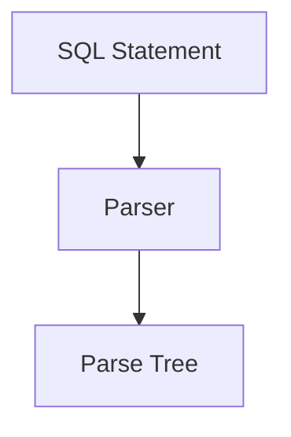
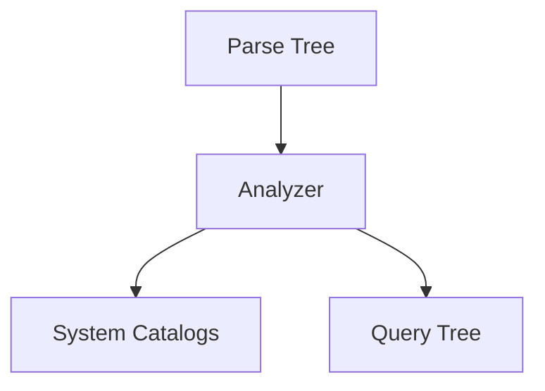
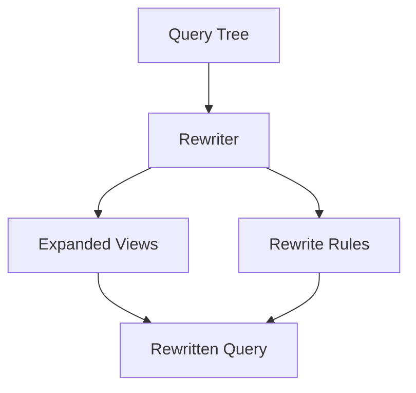
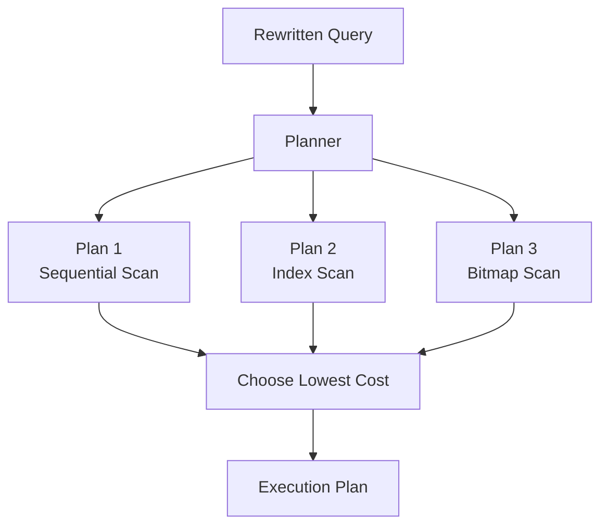
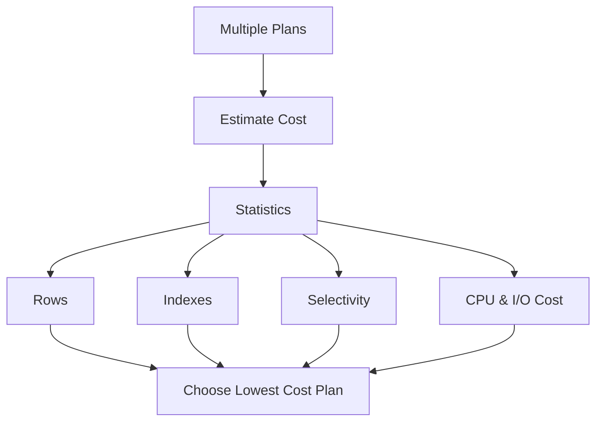
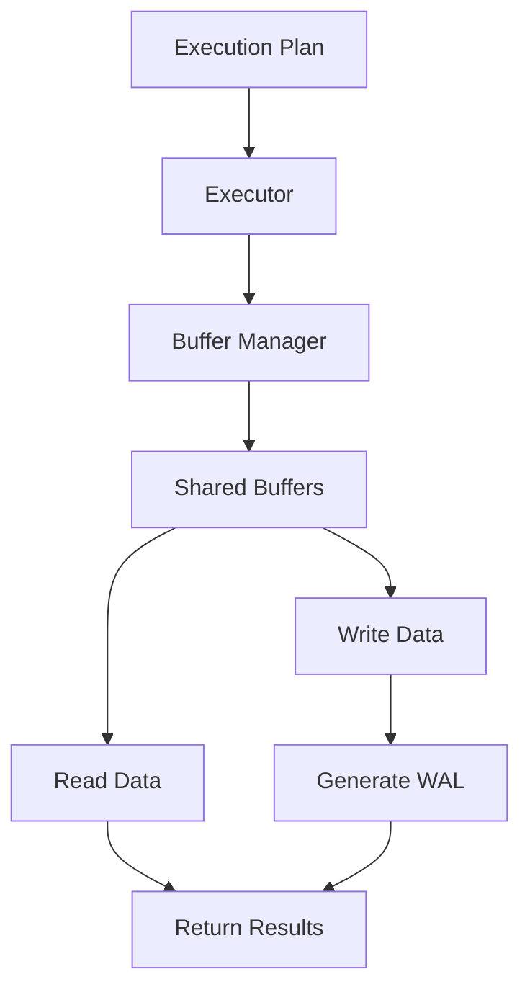
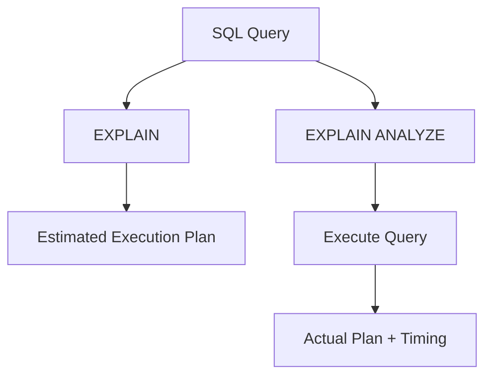
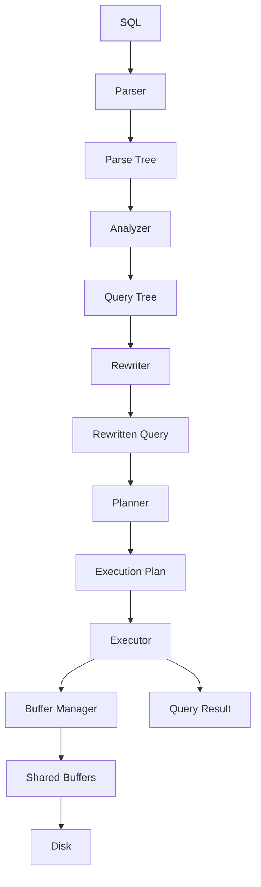
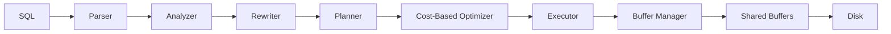
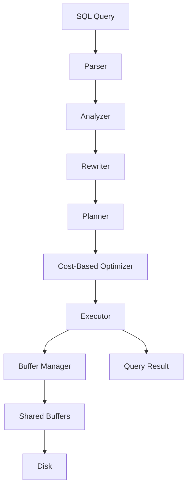

# Chapter 3 – Query Processing

**Question:** How does PostgreSQL understand SQL?

---

# Lesson 1 – Parser

**Interview Question:** What does the Parser do?

## Lesson

The **Parser** is the first stage of PostgreSQL's query processing pipeline. It checks whether the SQL statement follows PostgreSQL's grammar and syntax rules. If the SQL is valid, the Parser converts it into a **Parse Tree**, which is a structured representation of the SQL statement. The Parse Tree captures the query structure but does not contain any execution information. At this stage, PostgreSQL does **not** verify whether tables, columns, or functions actually exist. It also does **not** access any database data. If the SQL contains a syntax error, processing stops immediately and an error is returned to the client. Every SQL statement must successfully pass through the Parser before it can proceed to the Analyzer.

### Diagram

### Popular Questions

- What is a Parse Tree?
- Does the Parser execute SQL?
- What errors are detected by the Parser?
- Does the Parser check whether a table exists?

### Remember

- First stage of query processing.
- Checks SQL syntax only.
- Produces a Parse Tree.
- Does not validate schema.
- Does not execute SQL.

---

# Lesson 2 – Analyzer

**Interview Question:** What does the Analyzer do?

## Lesson

The **Analyzer** performs semantic validation of the Parse Tree. Unlike the Parser, it understands the database schema by consulting PostgreSQL's **System Catalogs**. It verifies that referenced tables, columns, operators, functions, and data types actually exist. The Analyzer also checks whether the current user has sufficient privileges to access the requested objects. If the query contains `SELECT *`, the Analyzer expands it into the actual list of column names. If a referenced table or column is missing, PostgreSQL reports an error during this stage. After successful validation, PostgreSQL generates a **Query Tree**, which is passed to the Rewriter for further processing.

### Diagram

### Popular Questions

- What is the difference between the Parser and Analyzer?
- Does the Analyzer access System Catalogs?
- What errors are detected during semantic analysis?
- Why is `SELECT *` expanded here?

### Remember

- Validates schema.
- Checks tables and columns.
- Checks user permissions.
- Expands `SELECT *`.
- Produces a Query Tree.
- Does not optimize the query.

---

# Lesson 3 – Rewriter

**Interview Question:** What is the Rewriter?

## Lesson

The **Rewriter** transforms the validated Query Tree before optimization begins. It applies PostgreSQL's rewrite rules and expands **Views** into their underlying SQL definitions. Because of this stage, the Planner never works on the original SQL submitted by the user—it always receives the rewritten query. For most simple SQL statements, the Rewriter makes no changes. However, when a query references a View or uses user-defined rewrite rules, PostgreSQL rewrites the query into an equivalent form. The Rewriter does not access table data and does not choose an execution strategy. Its only responsibility is to transform the query into a form that is easier for the Planner to optimize.

### Diagram

### Popular Questions

- What does the Rewriter do?
- Why is the Rewriter needed?
- What happens when querying a View?
- Does the Rewriter execute SQL?

### Remember

- Rewrites validated queries.
- Expands Views.
- Applies rewrite rules.
- Runs before the Planner.
- Does not execute SQL.
- Produces a rewritten Query Tree.

---

# Lesson 4 – Planner

**Interview Question:** What does the Planner do?

## Lesson

The **Planner** determines the most efficient way to execute a SQL query. Instead of directly executing the rewritten query, PostgreSQL first generates multiple possible execution plans. These plans may use different strategies such as **Sequential Scan**, **Index Scan**, **Bitmap Scan**, **Nested Loop Join**, **Hash Join**, or **Merge Join**. The Planner estimates the cost of each plan using table statistics collected by **ANALYZE**. It considers factors such as table size, number of rows, available indexes, selectivity, CPU cost, and disk I/O. The Planner then chooses the execution plan with the **lowest estimated cost**, not necessarily the shortest SQL statement. It does not read table data or execute the query. Its output is an **Execution Plan**, which is passed to the Executor.

### Diagram

### Popular Questions

- What does the Planner do?
- What is an Execution Plan?
- Does the Planner read table data?
- What execution strategies can the Planner choose?

### Remember

- Generates multiple plans.
- Uses table statistics.
- Cost-based decision.
- Doesn't execute SQL.
- Produces the Execution Plan.

---

# Lesson 5 – Cost-Based Optimization (CBO)

**Interview Question:** How does PostgreSQL choose the best execution plan?

## Lesson

PostgreSQL uses a **Cost-Based Optimizer (CBO)** to compare different execution plans. Rather than relying on fixed rules, it estimates the cost of each possible plan before execution. These estimates are based on statistics such as table size, row count, data distribution, index availability, selectivity, CPU cost, and disk I/O cost. The Planner selects the plan with the **lowest estimated cost** because it is expected to perform the least amount of work. If the statistics are outdated or inaccurate, PostgreSQL may choose an inefficient plan, such as a Sequential Scan when an Index Scan would be faster. Running **ANALYZE** updates these statistics and helps the optimizer make better decisions. Cost-Based Optimization is one of the key reasons PostgreSQL performs well on complex queries.

### Diagram

### Popular Questions

- What is Cost-Based Optimization?
- Why does PostgreSQL sometimes choose a Sequential Scan?
- Why is ANALYZE important?
- What statistics does PostgreSQL use?

### Remember

- Compares multiple plans.
- Uses statistics.
- Estimates CPU and I/O cost.
- Chooses the lowest-cost plan.
- Depends on accurate ANALYZE statistics.

---

# Lesson 6 – Executor

**Interview Question:** What does the Executor do?

## Lesson

The **Executor** is the only stage that actually performs the work described in the Execution Plan. It executes operations such as **Sequential Scans**, **Index Scans**, **Joins**, **Sorting**, **Filtering**, and **Aggregation**. To access data, the Executor requests pages from the **Buffer Manager**, which loads them into **Shared Buffers** if they are not already cached. For **INSERT**, **UPDATE**, and **DELETE** statements, the Executor creates new tuple versions according to PostgreSQL's MVCC rules and generates **Write-Ahead Log (WAL)** records before committing the transaction. Once execution is complete, the Executor returns the query results to the client. Unlike the Planner, the Executor actually reads and modifies table data.

### Diagram

### Popular Questions

- What does the Executor do?
- Which stage actually reads table data?
- Does the Planner execute SQL?
- How does the Executor access disk pages?

### Remember

- Executes the plan.
- Reads and writes data.
- Uses the Buffer Manager.
- Generates WAL for writes.
- Returns results to the client.

---

# Lesson 7 – EXPLAIN & EXPLAIN ANALYZE

**Interview Question:** What is the difference between EXPLAIN and EXPLAIN ANALYZE?

## Lesson

PostgreSQL provides **EXPLAIN** and **EXPLAIN ANALYZE** to help understand how a query is executed. **EXPLAIN** displays the execution plan chosen by the Planner **without executing the query**. It shows operators such as **Sequential Scan**, **Index Scan**, **Hash Join**, and **Nested Loop Join**, along with estimated costs and estimated row counts. **EXPLAIN ANALYZE** goes one step further—it actually **executes the query** and reports the **actual execution time**, **actual row counts**, and runtime statistics. By comparing the estimated values with the actual values, database engineers can identify inaccurate statistics, inefficient execution plans, or missing indexes. These commands are among the most important tools for PostgreSQL performance tuning.

### Diagram

### Popular Questions

- What is the difference between EXPLAIN and EXPLAIN ANALYZE?
- Why are estimated rows different from actual rows?
- How is EXPLAIN used for performance tuning?
- Does EXPLAIN execute the query?

### Remember

- EXPLAIN does **not** execute the query.
- EXPLAIN ANALYZE executes the query.
- Shows execution plans.
- Compares estimates with reality.
- Essential for query tuning.

---

# Lesson 8 – Complete Query Pipeline

**Interview Question:** Walk me through a SELECT query.

## Lesson

When PostgreSQL receives a SQL statement, it first sends it to the **Parser**, which checks the syntax and builds a **Parse Tree**. The **Analyzer** validates tables, columns, data types, and user permissions using the system catalogs. Next, the **Rewriter** expands views and applies rewrite rules when necessary. The **Planner** generates multiple execution plans and uses **Cost-Based Optimization (CBO)** to choose the one with the lowest estimated cost. The selected **Execution Plan** is then passed to the **Executor**. The Executor accesses pages through the **Buffer Manager**, which loads data into **Shared Buffers** if it is not already cached. If the required pages are not in memory, they are fetched from **Disk**. For write operations, PostgreSQL generates **WAL** records before committing the transaction. Finally, the query results are returned to the client.

### Diagram

### Popular Questions

- Walk me through query execution.
- Where does optimization happen?
- Which stage actually reads the data?
- Which stage accesses the System Catalogs?
- When is WAL generated?

### Remember

- Parser → Syntax checking.
- Analyzer → Schema validation.
- Rewriter → Query transformation.
- Planner → Optimization.
- Executor → Executes the plan.
- Buffer Manager → Loads pages.
- Shared Buffers → Cache data.
- Disk → Permanent storage.

---

# 📌 Chapter 3 Summary

### Query Processing Pipeline

1. **Parser** checks SQL syntax and creates a **Parse Tree**.
2. **Analyzer** validates schema objects, permissions, and data types.
3. **Rewriter** expands views and applies rewrite rules.
4. **Planner** generates multiple execution plans.
5. **Cost-Based Optimizer** selects the lowest-cost plan.
6. **Executor** performs the actual work.
7. **Buffer Manager** loads required pages into **Shared Buffers**.
8. If pages are not cached, PostgreSQL reads them from **Disk**.
9. For write operations, **WAL** records are generated before commit.
10. Results are returned to the client.

---

# ⭐ Interview Tip

One of the most common PostgreSQL interview questions is:

> **"Walk me through what happens after PostgreSQL receives a SQL query."**

A strong answer is simply the complete query pipeline:

