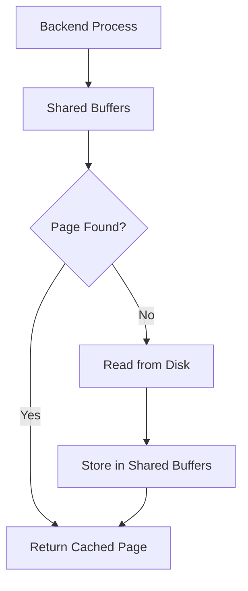
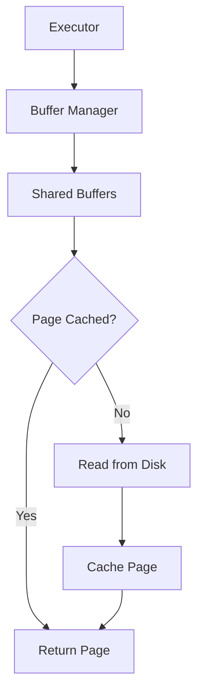
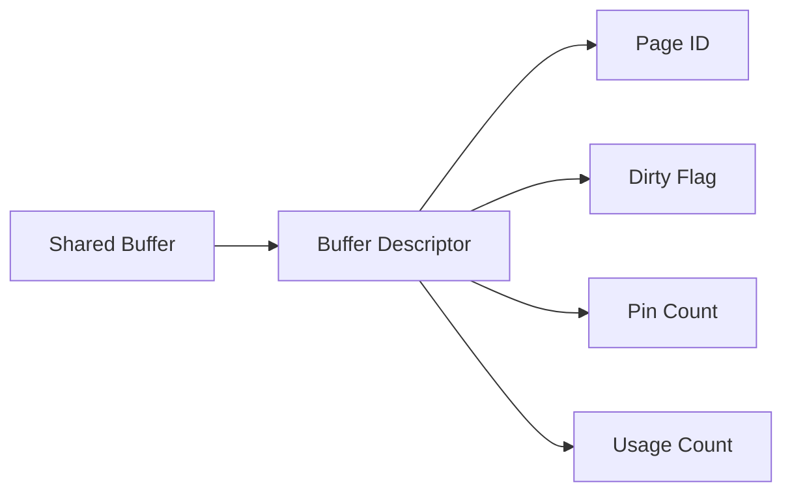
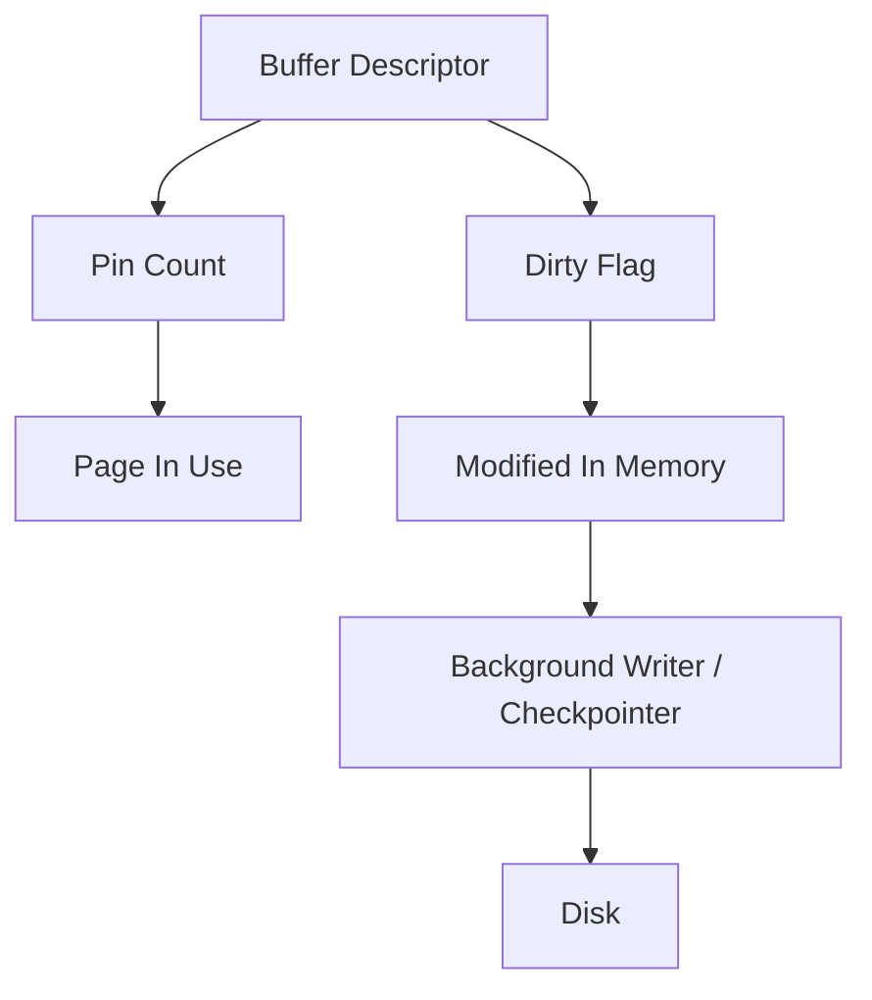
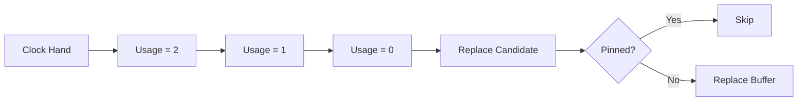
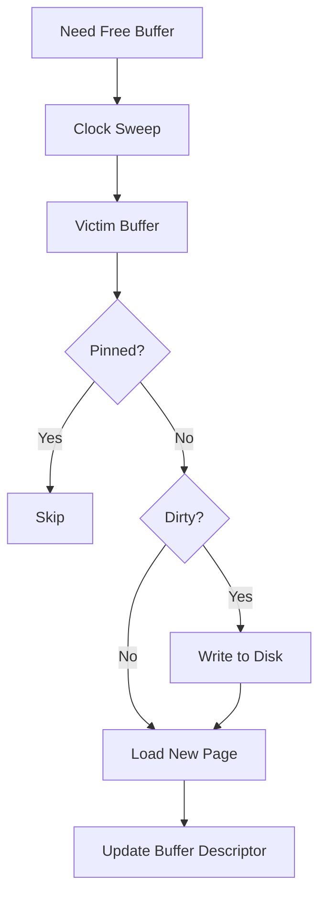
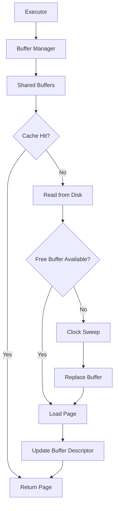
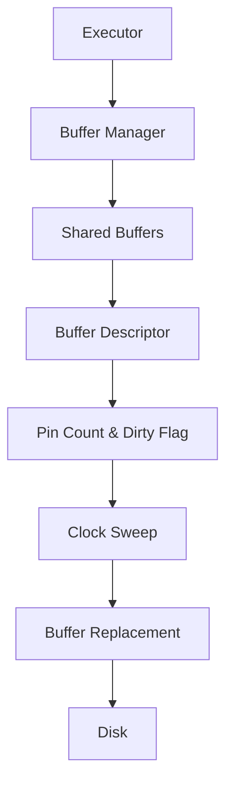
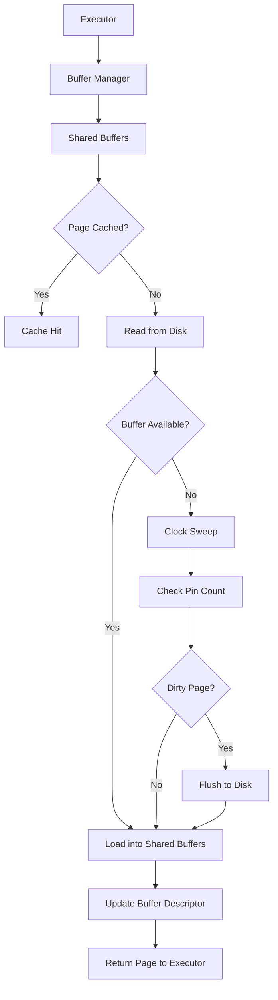

# Chapter 4 – Buffer Manager

**Question:** How does PostgreSQL avoid reading from disk every time?

---

# Lesson 1 – Shared Buffers

**Interview Question:** What are Shared Buffers?

## Lesson

**Shared Buffers** is PostgreSQL's primary in-memory cache for database pages. Instead of reading data from disk for every query, PostgreSQL first checks whether the required page is already present in Shared Buffers. If the page is found, it is immediately returned to the requesting Backend Process, avoiding expensive disk I/O. If the page is not cached, PostgreSQL reads it from disk and stores it in Shared Buffers for future access. Since all Backend Processes share this memory region, multiple client sessions can reuse the same cached pages without repeatedly accessing disk. When a page is modified, PostgreSQL updates it in Shared Buffers first, marking it as **dirty**. The modified page remains in memory until it is later written to disk by the Background Writer or Checkpointer. By caching frequently accessed pages, Shared Buffers significantly improve query performance and reduce storage latency.

### Diagram

### Popular Questions

- What are Shared Buffers?
- Why does PostgreSQL need Shared Buffers?
- Are Shared Buffers shared by all Backend Processes?
- Are modified pages immediately written to disk?

### Remember

- Main page cache.
- Shared by all Backends.
- Reduces disk I/O.
- Stores database pages.
- Dirty pages remain in memory.

---

# Lesson 2 – Buffer Manager

**Interview Question:** What does the Buffer Manager do?

## Lesson

The **Buffer Manager** is responsible for managing all pages stored in Shared Buffers. Whenever the Executor needs to read or modify a database page, it first requests that page from the Buffer Manager. If the requested page is already cached, the Buffer Manager immediately returns it. Otherwise, it loads the page from disk into an available buffer. If no free buffer exists, the Buffer Manager chooses an existing page to replace using PostgreSQL's **Clock Sweep** replacement algorithm. In addition to loading pages, the Buffer Manager maintains metadata such as dirty status, usage count, and pin count for every cached page. Every table scan, index lookup, INSERT, UPDATE, and DELETE passes through the Buffer Manager before accessing storage.

### Diagram

### Popular Questions

- What does the Buffer Manager do?
- Who requests pages from the Buffer Manager?
- What happens during a cache miss?
- Does every query use the Buffer Manager?

### Remember

- Manages Shared Buffers.
- Loads pages from disk.
- Handles cache hits and misses.
- Performs page replacement.
- Used by every query.

---

# Lesson 3 – Buffer Descriptors

**Interview Question:** What is a Buffer Descriptor?

## Lesson

Every page stored inside Shared Buffers has an associated **Buffer Descriptor** that stores metadata about that page. The Buffer Descriptor does **not** contain the page's actual data. Instead, it stores information such as the **Page ID**, **Dirty Flag**, **Pin Count**, and **Usage Count**. PostgreSQL uses this metadata to determine whether a page can be safely replaced, whether it has been modified, and how frequently it has been accessed. Whenever a Backend Process reads or modifies a page, the Buffer Manager updates the corresponding Buffer Descriptor. Because every buffer has exactly one descriptor, PostgreSQL can efficiently track the state of thousands of cached pages without examining their contents.

### Diagram

### Popular Questions

- What is a Buffer Descriptor?
- What metadata does it store?
- Does it contain page data?
- Why is a Buffer Descriptor needed?

### Remember

- One descriptor per buffer.
- Stores metadata only.
- Tracks dirty pages.
- Tracks pin count.
- Managed by the Buffer Manager.

---

# Lesson 4 – Pin Count & Dirty Pages

**Interview Question:** What is a pinned page? What is a dirty page?

## Lesson

Every page stored in **Shared Buffers** has metadata describing its current state. Two of the most important pieces of metadata are the **Pin Count** and the **Dirty Flag**. A **Pinned Page** is a page that is currently being used by one or more Backend Processes. Its **Pin Count** indicates how many processes are actively reading or modifying the page. A pinned page cannot be replaced because another process may still be using it. A **Dirty Page** is a page that has been modified in Shared Buffers but has not yet been written back to disk. PostgreSQL keeps dirty pages in memory and later flushes them using the **Background Writer** or **Checkpointer**. Both the Pin Count and Dirty Flag are stored in the **Buffer Descriptor**, allowing PostgreSQL to safely manage concurrent access while minimizing unnecessary disk writes.

### Diagram

### Popular Questions

- What is a pinned page?
- What is a dirty page?
- When is a dirty page written to disk?
- Why can't a pinned page be replaced?

### Remember

- Pin Count = page currently in use.
- Dirty = page modified in memory.
- Dirty pages stay in Shared Buffers.
- Pinned pages cannot be replaced.
- Both are stored in the Buffer Descriptor.

---

# Lesson 5 – Clock Sweep Algorithm

**Interview Question:** Why does PostgreSQL use Clock Sweep instead of LRU?

## Lesson

When **Shared Buffers** become full, PostgreSQL must decide which page should be replaced. Instead of maintaining an exact **Least Recently Used (LRU)** list, PostgreSQL uses the **Clock Sweep Algorithm** because it scales much better under high concurrency. Every cached page has a **Usage Count** that increases whenever the page is accessed. A circular pointer, known as the **Clock Hand**, continuously scans the buffers. As it moves, it decreases the Usage Count of each page. When it finds a page with a Usage Count of **zero** that is **not pinned**, that page becomes the replacement candidate. This approach approximates LRU while avoiding the overhead of constantly updating a global LRU list. As a result, Clock Sweep provides excellent performance even when many Backend Processes access Shared Buffers simultaneously.

### Diagram

### Popular Questions

- What is Clock Sweep?
- Why doesn't PostgreSQL use LRU?
- What is Usage Count?
- Why are pinned pages skipped?

### Remember

- Buffer replacement algorithm.
- Uses Usage Count.
- Circular scan.
- Skips pinned pages.
- Lower overhead than LRU.

---

# Lesson 6 – Buffer Replacement

**Interview Question:** What happens when PostgreSQL replaces a page?

## Lesson

When the **Buffer Manager** needs a free buffer and none are available, it begins the **Buffer Replacement** process. Using the **Clock Sweep Algorithm**, PostgreSQL selects a candidate buffer for replacement. Before reusing that buffer, it first checks the **Pin Count**. If the page is pinned, it cannot be replaced because another Backend Process is still using it. If the page is **dirty**, PostgreSQL must first write it to disk before reusing the buffer. Once the page is safely written (or if it was already clean), the old page is discarded, and the requested page is loaded from disk into the buffer. Finally, PostgreSQL updates the **Buffer Descriptor** with the metadata of the newly loaded page. This process allows PostgreSQL to efficiently reuse a fixed-size memory cache while maintaining data consistency.

### Diagram

### Popular Questions

- What happens during buffer replacement?
- Can a dirty page be replaced immediately?
- Why can't pinned pages be replaced?
- What metadata is updated after replacement?

### Remember

- Select victim buffer.
- Check Pin Count.
- Flush dirty pages.
- Load new page.
- Update Buffer Descriptor.

---

# Lesson 7 – Complete Page Read Path

**Interview Question:** Walk me through how PostgreSQL reads a page.

## Lesson

Whenever the **Executor** needs to read a table or index page, it first sends a request to the **Buffer Manager**. The Buffer Manager checks whether the requested page is already present in **Shared Buffers**. If the page is found, PostgreSQL records a **cache hit** and immediately returns the page to the Executor without accessing the disk. If the page is not found, PostgreSQL records a **cache miss** and must load the page from disk. If no free buffer is available, the Buffer Manager invokes the **Clock Sweep Algorithm** to select a buffer for replacement. Before replacing a page, PostgreSQL verifies that the page is not pinned and flushes it to disk if it is dirty. The requested page is then loaded into Shared Buffers, and its **Buffer Descriptor** is updated with the new metadata. Finally, the Executor reads the page directly from memory and continues executing the query. This caching mechanism dramatically reduces disk I/O and is one of the primary reasons PostgreSQL delivers high query performance.

### Diagram

### Popular Questions

- Explain a cache hit and a cache miss.
- Walk me through reading a page.
- Where does Clock Sweep fit into page reads?
- When is the Buffer Descriptor updated?

### Remember

- Executor requests the page.
- Buffer Manager checks Shared Buffers.
- Cache hit = immediate return.
- Cache miss = read from disk.
- Clock Sweep selects a replacement buffer if needed.
- Buffer Descriptor is updated after loading.
- Executor reads the page from memory.

---

# 📌 Chapter 4 Summary

### Buffer Management Pipeline

1. The **Executor** requests a database page.
2. The **Buffer Manager** checks **Shared Buffers**.
3. If the page is cached, PostgreSQL records a **cache hit** and returns it immediately.
4. If the page is missing, PostgreSQL records a **cache miss** and reads it from disk.
5. If Shared Buffers are full, **Clock Sweep** selects a replacement buffer.
6. Pinned pages are skipped, and dirty pages are written to disk before replacement.
7. The new page is loaded into Shared Buffers.
8. The **Buffer Descriptor** is updated with the page metadata.
9. The Executor continues processing using the in-memory page.

---

# ⭐ Interview Tip

One of the most common PostgreSQL internals interview questions is:

> **"How does PostgreSQL avoid reading from disk for every query?"**

A strong answer is simply the complete page-read pipeline:

### 🎯 Interview Outcome

After this chapter, you should confidently answer:

- What are Shared Buffers?
- What does the Buffer Manager do?
- What is a Buffer Descriptor?
- What is the difference between a pinned page and a dirty page?
- Why does PostgreSQL use Clock Sweep instead of LRU?
- What happens during buffer replacement?
- Walk through the complete page read path.

