# Chapter 5 – Transactions & MVCC

**Question:** How do thousands of users modify data simultaneously?

---

# Lesson 1 – Transaction Lifecycle

**Interview Question:** What is a transaction?

## Lesson

A **transaction** is a sequence of SQL statements executed as a single logical unit of work. PostgreSQL guarantees the **ACID** properties, ensuring that database operations remain reliable even during crashes or concurrent access. A transaction begins with the `BEGIN` statement (or implicitly for a single SQL statement) and ends with either `COMMIT` or `ROLLBACK`. During execution, all changes remain private to the transaction according to PostgreSQL's **MVCC** rules. When a transaction commits, its changes become permanently visible to other transactions. If an error occurs or the user issues a `ROLLBACK`, all changes made by the transaction are discarded. Every `INSERT`, `UPDATE`, and `DELETE` executes within a transaction, ensuring that partial updates never leave the database in an inconsistent state.

### Diagram

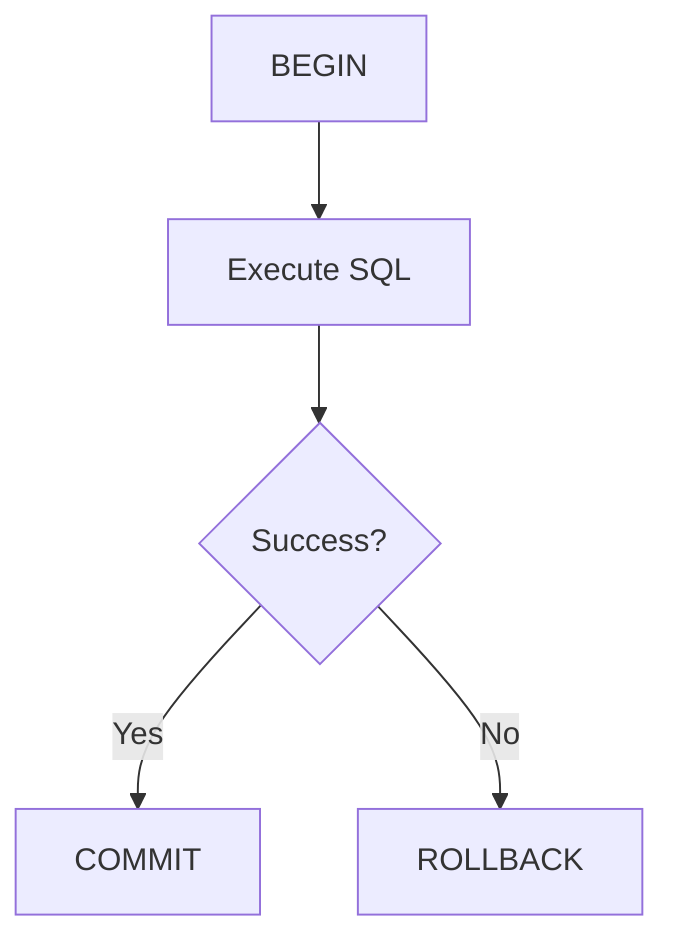

### Popular Questions

- What is a transaction?
- What are the ACID properties?
- What is the difference between COMMIT and ROLLBACK?
- Does every SQL statement run inside a transaction?

### Remember

- Unit of work.
- ACID guarantees.
- COMMIT saves changes.
- ROLLBACK discards changes.
- Every write is transactional.

---

# Lesson 2 – Transaction IDs (XIDs)

**Interview Question:** What is a Transaction ID (XID)?**

## Lesson

Every transaction in PostgreSQL is assigned a unique **Transaction ID (XID)** when it begins. PostgreSQL uses these IDs to track which transaction created or modified each tuple. Transaction IDs are stored inside tuples and compared with transaction snapshots to determine row visibility. As new transactions begin, XIDs increase sequentially. They allow PostgreSQL to distinguish committed, in-progress, and aborted transactions. Without Transaction IDs, PostgreSQL would not be able to implement **MVCC**, maintain snapshot consistency, or recover correctly after crashes. XIDs are therefore one of the fundamental building blocks of PostgreSQL's concurrency control mechanism.

### Diagram

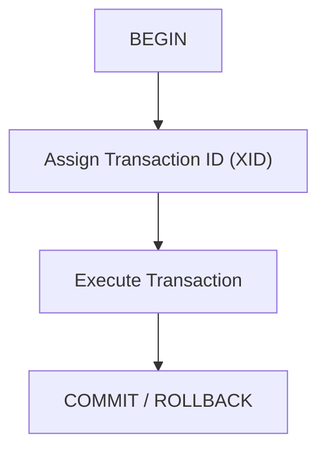

### Popular Questions

- What is a Transaction ID?
- Why are Transaction IDs needed?
- Are Transaction IDs unique?
- Where are XIDs stored?

### Remember

- One XID per transaction.
- Assigned when a transaction starts.
- Used by MVCC.
- Stored in tuples.
- Determines tuple visibility.

---

# Lesson 3 – xmin & xmax

**Interview Question:** What are xmin and xmax?**

## Lesson

Every **Heap Tuple** stores two important transaction IDs: **xmin** and **xmax**. The **xmin** field records the Transaction ID that created the tuple, while **xmax** records the Transaction ID that deleted or updated it. PostgreSQL compares these values with the current transaction's snapshot to determine whether the tuple should be visible. When a row is updated, PostgreSQL creates a **new tuple version** instead of overwriting the old one. The old tuple receives an **xmax**, indicating that it has been superseded, while the new tuple receives a fresh **xmin**. These metadata fields are stored in every tuple and form the foundation of PostgreSQL's **MVCC** implementation.

### Diagram

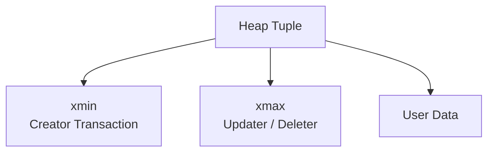

### Popular Questions

- What are xmin and xmax?
- Why are they stored in every tuple?
- How does PostgreSQL use them?
- When does xmax change?

### Remember

- xmin = creator transaction.
- xmax = updater/deleter transaction.
- Stored in every tuple.
- Used for visibility checks.
- Core MVCC metadata.

---

# Lesson 4 – MVCC (Multi-Version Concurrency Control)

**Interview Question:** What is MVCC?

## Lesson

**MVCC (Multi-Version Concurrency Control)** is PostgreSQL's concurrency mechanism that allows multiple transactions to read and modify data simultaneously without blocking each other. Instead of overwriting an existing row during an `UPDATE`, PostgreSQL creates a **new tuple version** while keeping the old version intact. Transactions that started earlier continue reading the old version, while newer transactions see the updated version after it becomes visible. This approach eliminates most read-write locking conflicts, allowing readers and writers to operate concurrently. Every tuple version contains **xmin** and **xmax** metadata, which PostgreSQL uses together with transaction snapshots to determine visibility. Old tuple versions remain in the table until they are no longer needed, after which **VACUUM** removes them. MVCC is one of PostgreSQL's most important architectural features because it provides high concurrency while maintaining data consistency.

### Diagram

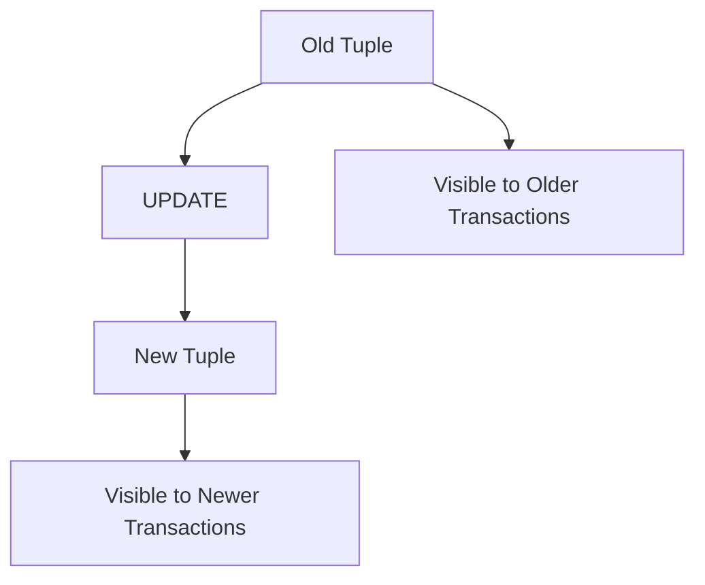

### Popular Questions

- What is MVCC?
- Why doesn't PostgreSQL overwrite rows?
- How does MVCC improve concurrency?
- Why can readers and writers work simultaneously?

### Remember

- Multiple tuple versions.
- Readers don't block writers.
- UPDATE creates a new tuple.
- Old versions remain temporarily.
- VACUUM removes obsolete versions.

---

# Lesson 5 – Snapshots

**Interview Question:** What is a Snapshot?

## Lesson

A **Snapshot** represents the set of transactions that are visible to a query or transaction at a particular point in time. PostgreSQL creates a snapshot when a query or transaction begins, depending on the isolation level. Each snapshot records which transactions have already committed and which are still in progress. When PostgreSQL reads a tuple, it compares the tuple's **xmin** and **xmax** values against the current snapshot to determine whether the tuple should be visible. Because each transaction works with its own snapshot, different transactions may see different versions of the same row simultaneously. This provides every transaction with a **consistent view** of the database while allowing other transactions to continue making changes. Snapshots are the key mechanism that makes **MVCC** possible.

### Diagram

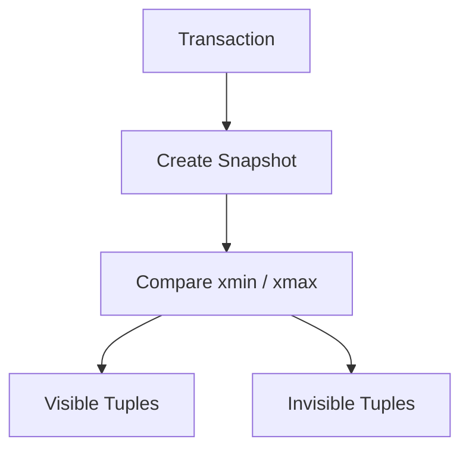

### Popular Questions

- What is a Snapshot?
- Why are Snapshots needed?
- Can two transactions see different data?
- How are xmin and xmax used with a Snapshot?

### Remember

- Consistent view of the database.
- Created when a query or transaction starts.
- Uses xmin and xmax.
- Controls tuple visibility.
- Enables MVCC.

## MVCC Visibility Decision Table

**Let:**

- **Tuple.xmin** = Transaction that inserted the tuple
- **Tuple.xmax** = Transaction that deleted/updated the tuple
- **Snapshot.xmin** = Oldest active transaction
- **Snapshot.xmax** = First unassigned transaction ID
- **Snapshot.xip[]** = Transactions active when the snapshot was taken

This version shows exactly how **tuple.xmin**, **tuple.xmax**, **snapshot.xmin**, **snapshot.xmax**, and **snapshot.xip[]** work together in PostgreSQL's MVCC visibility algorithm.

---

## INSERT (`tuple.xmin`)

| Condition | Visibility |
|-----------|------------|
| `tuple.xmin < snapshot.xmin` | ✅ Definitely visible |
| `snapshot.xmin ≤ tuple.xmin < snapshot.xmax` **and** `tuple.xmin ∉ snapshot.xip[]` | ✅ Visible |
| `snapshot.xmin ≤ tuple.xmin < snapshot.xmax` **and** `tuple.xmin ∈ snapshot.xip[]` | ❌ Invisible |
| `tuple.xmin ≥ snapshot.xmax` | ❌ Invisible |

---

## DELETE (`tuple.xmax`)

| Condition | Visibility |
|-----------|------------|
| `tuple.xmax = 0` | ✅ Visible |
| `tuple.xmax < snapshot.xmin` | ❌ Invisible |
| `snapshot.xmin ≤ tuple.xmax < snapshot.xmax` **and** `tuple.xmax ∉ snapshot.xip[]` | ❌ Invisible |
| `snapshot.xmin ≤ tuple.xmax < snapshot.xmax` **and** `tuple.xmax ∈ snapshot.xip[]` | ✅ Visible |
| `tuple.xmax ≥ snapshot.xmax` | ✅ Visible |

Summary: A tuple is visible **only if both conditions are true**:

### 1. INSERT is visible

- ✅ Insert committed before the snapshot.
- ❌ Insert was still in progress or started after the snapshot.

### 2. DELETE is **not** visible

- ✅ No delete exists, or the delete was still in progress when the snapshot was taken.

- ❌ Delete committed before the snapshot.

---

# Lesson 6 – HOT Updates

**Interview Question:** What is a HOT Update?

## Lesson

A **HOT (Heap-Only Tuple) Update** is a PostgreSQL optimization that avoids updating indexes when indexed columns are unchanged. During a normal `UPDATE`, PostgreSQL creates a new tuple version and may also need to update every affected index entry. With a HOT Update, PostgreSQL creates the new tuple **within the same heap page** and links it to the old tuple, allowing existing index entries to continue pointing to the tuple chain. This eliminates unnecessary index modifications, making updates significantly faster. HOT Updates are only possible when no indexed column changes and there is enough free space available on the same page. Because fewer index pages are modified, HOT Updates also reduce index bloat and improve overall performance. Applications benefit from HOT Updates automatically without requiring any code changes.

### Diagram

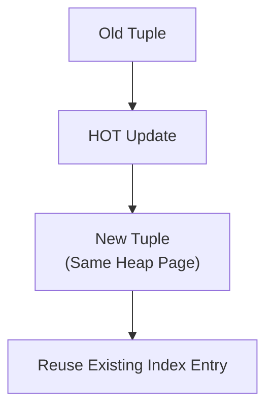

### Popular Questions

- What is a HOT Update?
- Why is a HOT Update faster?
- When can't HOT Updates be used?
- Does a HOT Update modify indexes?

### Remember

- Heap-Only Tuple update.
- No index updates.
- New tuple stays on the same page.
- Faster UPDATE performance.
- Reduces index maintenance and bloat.

---

# Lesson 7 – Tuple Version Chains

**Interview Question:** What is a Tuple Version Chain?

## Lesson

Every time PostgreSQL executes an **UPDATE**, it creates a **new tuple version** instead of modifying the existing row. As a result, multiple versions of the same logical row may exist simultaneously inside the table. These versions form a **Tuple Version Chain**, where each tuple represents the row at a different point in time. When PostgreSQL reads a row, it follows the chain and uses the current transaction's **Snapshot** together with **xmin** and **xmax** to determine which version is visible. Older transactions continue reading older versions, while newer transactions see the latest committed version. Once no active transaction requires an old tuple version, **VACUUM** removes it and reclaims the storage space. Tuple Version Chains allow PostgreSQL to support high concurrency without sacrificing consistency.

### Diagram

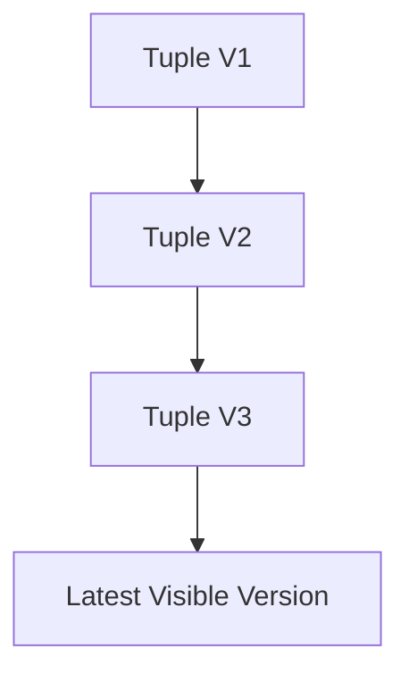

### Popular Questions

- What is a Tuple Version Chain?
- Why does PostgreSQL keep multiple row versions?
- How does PostgreSQL find the correct tuple version?
- When are old versions removed?

### Remember

- UPDATE creates a new tuple.
- Multiple versions may exist.
- Snapshot selects the visible version.
- VACUUM removes obsolete versions.
- Supports MVCC concurrency.

---

# Lesson 8 – Transaction Isolation

**Interview Question:** What are PostgreSQL's transaction isolation levels?

## Lesson

**Transaction Isolation** determines how concurrent transactions interact and what data they are allowed to see. PostgreSQL supports three isolation levels: **Read Committed**, **Repeatable Read**, and **Serializable**. **Read Committed** is the default isolation level and allows each statement to see only data that has already been committed. **Repeatable Read** uses the same snapshot throughout the transaction, ensuring that repeated queries return consistent results even if other transactions commit changes. **Serializable** provides the strongest isolation by detecting and preventing concurrency anomalies, making concurrent execution behave as if transactions were executed one after another. Higher isolation levels provide stronger consistency guarantees but may reduce concurrency and increase the likelihood of transaction retries. Choosing the appropriate isolation level depends on the application's consistency and performance requirements.

### Diagram

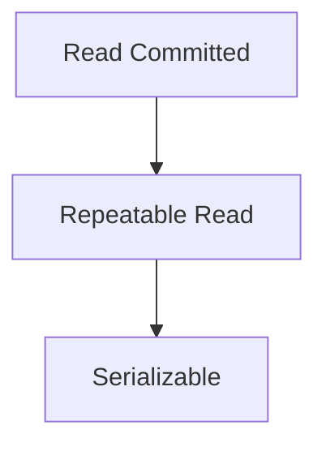

### Popular Questions

- What is PostgreSQL's default isolation level?
- What is the difference between Read Committed and Repeatable Read?
- When should Serializable be used?
- Why do higher isolation levels reduce concurrency?

### Remember

- Default = Read Committed.
- Repeatable Read = fixed snapshot.
- Serializable = strongest isolation.
- Higher isolation reduces concurrency.
- Controls transaction visibility.

---

# Lesson 9 – Complete UPDATE Walkthrough

**Interview Question:** Walk me through an UPDATE statement.

## Lesson

When PostgreSQL receives an **UPDATE** statement, it first starts a **transaction** and assigns it a unique **Transaction ID (XID)**. The Executor locates the target tuple and creates a **new tuple version** instead of overwriting the existing one. The old tuple receives an **xmax**, indicating that it has been updated, while the new tuple receives a new **xmin** representing the current transaction. If the updated columns are not indexed and enough free space exists on the same page, PostgreSQL performs a **HOT Update**, avoiding unnecessary index modifications. Before the transaction commits, PostgreSQL generates a **Write-Ahead Log (WAL)** record to ensure durability. Other transactions continue seeing either the old or new tuple depending on their **Snapshot**. After the transaction commits, the new tuple becomes visible to future transactions, while **VACUUM** eventually removes obsolete tuple versions that are no longer needed.

### Diagram

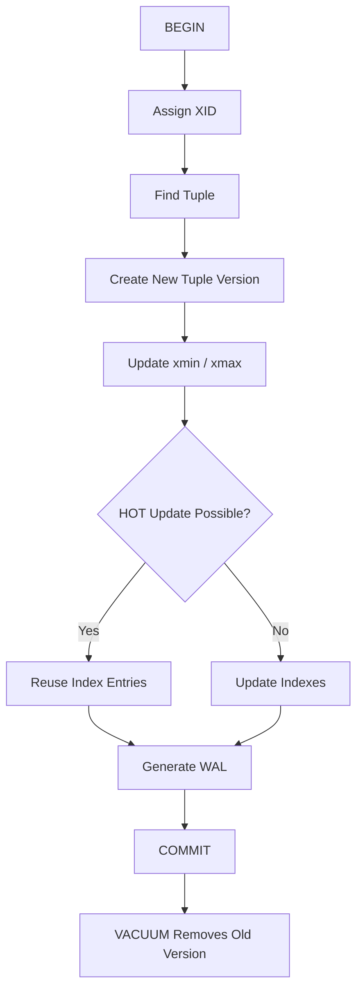

### Popular Questions

- Walk me through an UPDATE statement.
- Why doesn't PostgreSQL overwrite the old row?
- When is WAL generated?
- When is a HOT Update used?
- When does VACUUM remove old rows?

### Remember

- Begin transaction.
- Assign XID.
- Create new tuple.
- Update xmin/xmax.
- HOT Update when possible.
- Generate WAL before COMMIT.
- VACUUM removes obsolete versions.

---

# 📌 Chapter 5 Summary

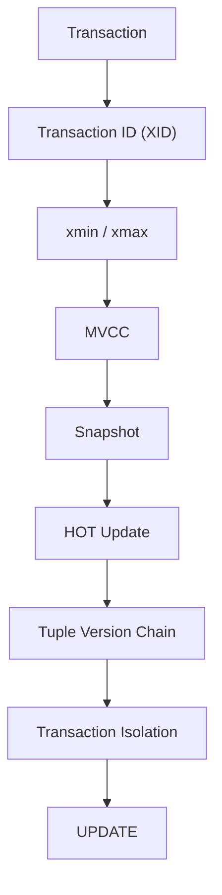

### Transaction Processing Pipeline

1. Every write operation starts a **Transaction**.
2. PostgreSQL assigns a unique **Transaction ID (XID)**.
3. Each tuple stores **xmin** and **xmax** metadata.
4. **MVCC** creates new tuple versions instead of overwriting rows.
5. **Snapshots** determine which tuple version is visible.
6. **HOT Updates** avoid unnecessary index modifications.
7. Multiple versions form a **Tuple Version Chain**.
8. Transaction isolation controls visibility between concurrent transactions.
9. **VACUUM** removes obsolete tuple versions after they are no longer needed.

---

# ⭐ Interview Tip

One of the most frequently asked PostgreSQL internals interview questions is:

> **"How does PostgreSQL allow thousands of users to update data simultaneously without locking every row?"**

A strong answer is the complete MVCC lifecycle:

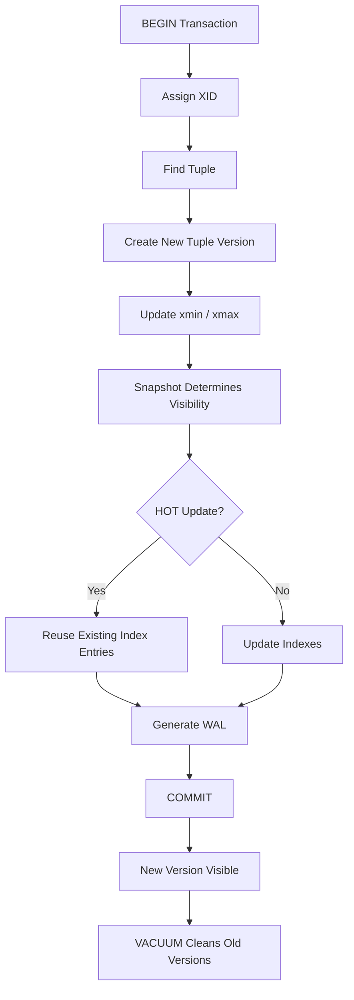

### 🎯 Interview Outcome

After this chapter, you should be able to confidently explain:

- What is a transaction?
- Why are Transaction IDs (XIDs) required?
- What are **xmin** and **xmax**?
- How does MVCC enable concurrent readers and writers?
- How do snapshots determine row visibility?
- What is a HOT Update?
- How do Tuple Version Chains work?
- What are PostgreSQL's transaction isolation levels?
- Walk through the complete lifecycle of an **UPDATE** statement from **BEGIN** to **VACUUM**.

