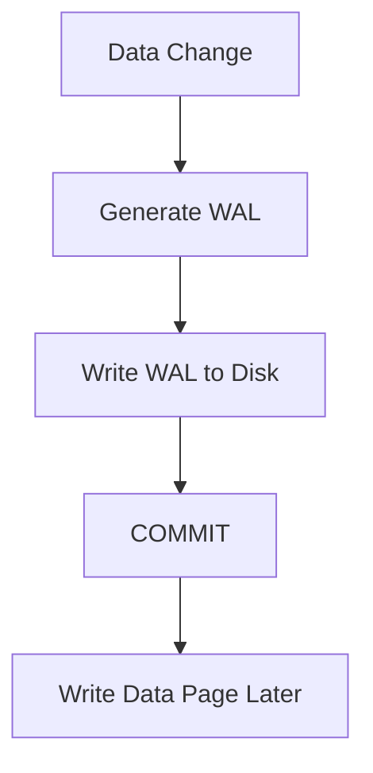
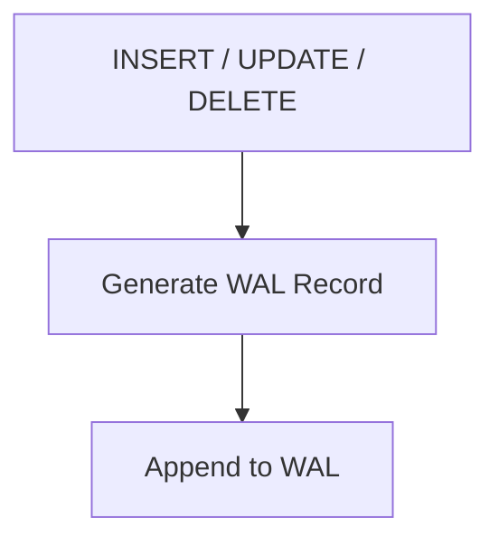
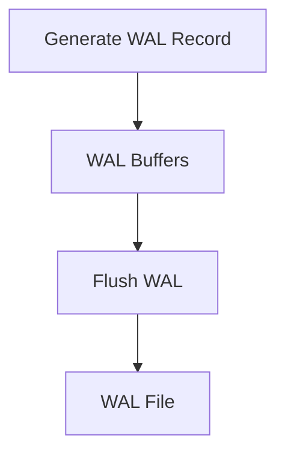
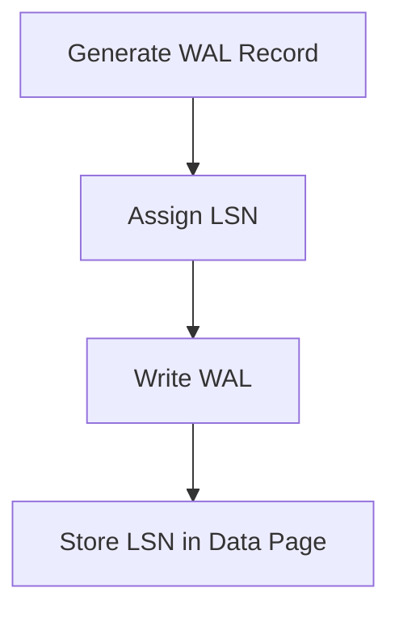
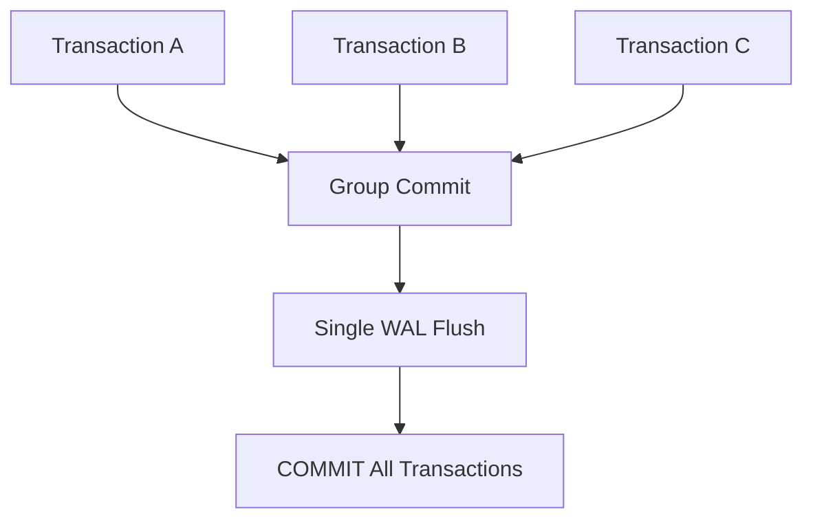
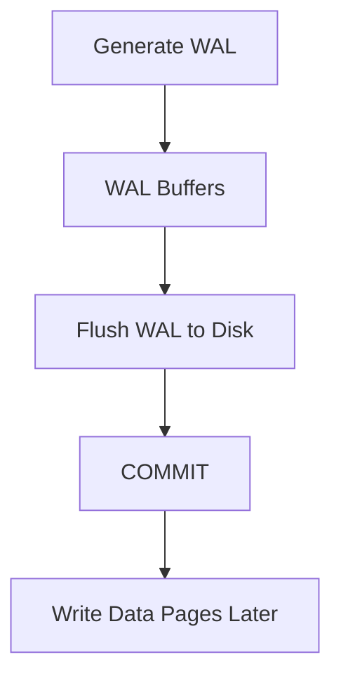
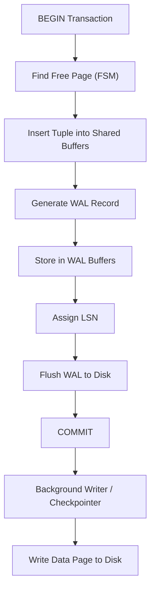
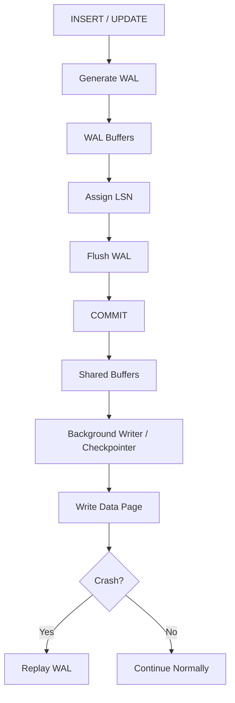
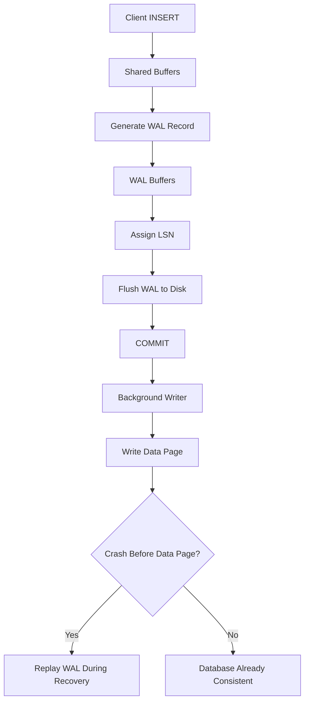

# Chapter 6 – WAL & Durability

**Question:** How does PostgreSQL survive crashes?

---

# Lesson 1 – Why Write-Ahead Logging (WAL)?

**Interview Question:** Why does PostgreSQL need WAL?

## Lesson

A database server can crash at any time because of power failures, hardware faults, or operating system crashes. If PostgreSQL wrote modified data pages directly to disk, a crash during the write could leave the database in an inconsistent state. To prevent this, PostgreSQL uses **Write-Ahead Logging (WAL)**. Before any modified data page is written to disk, PostgreSQL first records the change in the WAL. Once the WAL record is safely stored on durable storage, the transaction can commit even if the corresponding data page has not yet been written. If a crash occurs later, PostgreSQL replays the WAL records during recovery to restore all committed changes. This mechanism guarantees the **Durability** property of ACID while allowing PostgreSQL to delay expensive data page writes.

### Diagram

### Popular Questions

- Why does PostgreSQL need WAL?
- Why is WAL written before data pages?
- How does WAL provide durability?
- Can PostgreSQL commit before writing data pages?

### Remember

- WAL is written first.
- Protects against crashes.
- Guarantees durability.
- Data pages are written later.
- Used during crash recovery.

---

# Lesson 2 – WAL Records

**Interview Question:** What is a WAL Record?

## Lesson

A **WAL Record** describes a modification made to the database rather than storing an entire data page. Every `INSERT`, `UPDATE`, `DELETE`, index modification, and structural change generates one or more WAL records. These records contain enough information for PostgreSQL to reproduce the original operation during crash recovery. Instead of modifying existing log entries, PostgreSQL continuously **appends** new WAL records to the log. Because sequential writes are much faster than random disk writes, WAL significantly improves write performance. During recovery, PostgreSQL replays these records in order to restore the database to a consistent state. WAL Records are therefore the fundamental building blocks of PostgreSQL's durability mechanism.

### Diagram

### Popular Questions

- What is stored in a WAL Record?
- Does a WAL Record store an entire page?
- Why are WAL writes fast?
- Why is WAL append-only?

### Remember

- Describes database changes.
- Generated for every modification.
- Written sequentially.
- Append-only.
- Used during recovery.

---

# Lesson 3 – WAL Buffers

**Interview Question:** What are WAL Buffers?

## Lesson

**WAL Buffers** are an in-memory area used to temporarily store WAL records before they are written to WAL files on disk. Instead of writing every WAL record immediately, PostgreSQL batches multiple records together to reduce the number of disk writes. During `COMMIT`, PostgreSQL flushes the required WAL records from WAL Buffers to durable storage. Only after this flush succeeds can the transaction safely commit. WAL Buffers improve throughput by reducing I/O overhead while still maintaining durability guarantees. Although they are conceptually similar to **Shared Buffers**, WAL Buffers store **log records**, whereas Shared Buffers store **database pages**. Keeping these two buffer types separate allows PostgreSQL to optimize both data caching and write-ahead logging independently.

### Diagram

### Popular Questions

- What are WAL Buffers?
- Why doesn't PostgreSQL write every WAL record directly to disk?
- When are WAL Buffers flushed?
- What is the difference between WAL Buffers and Shared Buffers?

### Remember

- Temporary storage for WAL.
- Improves write performance.
- Flushed during COMMIT.
- Stores WAL records only.
- Separate from Shared Buffers.

---

# Lesson 4 – Log Sequence Number (LSN)

**Interview Question:** What is an LSN?

## Lesson

A **Log Sequence Number (LSN)** uniquely identifies a position within the Write-Ahead Log (WAL). Every WAL record receives a new LSN as it is generated, ensuring that each change can be identified and replayed in the correct order. PostgreSQL also stores the most recent LSN inside every modified data page. During crash recovery, PostgreSQL compares the page's LSN with the WAL LSN to determine whether the page already contains the latest changes. If the page LSN is older, PostgreSQL replays the missing WAL records. This mechanism guarantees that every committed change is applied **exactly once**. LSNs are also used during checkpoints, streaming replication, and backup/recovery operations, making them one of the most important concepts in PostgreSQL internals.

### Diagram

### Popular Questions

- What is an LSN?
- Why is an LSN stored in every data page?
- How is the LSN used during crash recovery?
- How does replication use LSNs?

### Remember

- Unique position in the WAL.
- Assigned to every WAL record.
- Stored in modified data pages.
- Used during recovery.
- Also used for replication and checkpoints.

---

# Lesson 5 – Group Commit

**Interview Question:** What is Group Commit?

## Lesson

Writing WAL records to disk is one of the most expensive parts of transaction processing because durable storage requires an **fsync** operation. If every transaction flushed its own WAL records independently, PostgreSQL would spend a significant amount of time waiting for disk I/O. To improve throughput, PostgreSQL uses **Group Commit**. Multiple transactions that are ready to commit briefly wait while PostgreSQL collects their pending WAL records. These records are flushed together using a **single disk write**, after which every participating transaction is allowed to commit. Sharing one WAL flush among many transactions dramatically reduces disk overhead while preserving full durability. Group Commit is especially beneficial for OLTP systems with many concurrent writes.

### Diagram

### Popular Questions

- What is Group Commit?
- Why is Group Commit faster?
- Does Group Commit reduce durability?
- Why doesn't every transaction flush WAL independently?

### Remember

- Multiple transactions.
- Single WAL flush.
- Reduces disk I/O.
- Improves throughput.
- Still guarantees durability.

---

# Lesson 6 – Commit Processing

**Interview Question:** What happens during COMMIT?

## Lesson

When a transaction executes **COMMIT**, PostgreSQL first checks whether all WAL records generated by that transaction have been safely written to durable storage. If they are still in **WAL Buffers**, PostgreSQL flushes them to the WAL file on disk. Only after the WAL flush successfully completes does PostgreSQL report a successful COMMIT to the client. At this point, the transaction is considered durable, even though the modified data pages may still exist only in **Shared Buffers**. Those data pages are written to disk later by the **Background Writer** or **Checkpointer**. If the server crashes before the data pages are flushed, PostgreSQL simply replays the WAL during recovery. This ordering—**WAL first, data pages later**—is the core principle of Write-Ahead Logging.

### Diagram

### Popular Questions

- What happens during COMMIT?
- Why isn't the data page written before COMMIT?
- When does the client receive a successful COMMIT?
- Why is COMMIT considered durable before the data page is written?

### Remember

- WAL flushed first.
- COMMIT waits for WAL.
- Data pages written later.
- Ensures durability.
- Crash-safe ordering.

---

# Lesson 7 – Complete INSERT Walkthrough

**Interview Question:** Walk me through an INSERT statement.

## Lesson

When PostgreSQL receives an **INSERT** statement, it first starts a transaction and locates a page with enough free space using the **Free Space Map (FSM)**. The new tuple is inserted into **Shared Buffers**, where the page is updated in memory. At the same time, PostgreSQL generates one or more **WAL Records** describing the change. These records are placed into **WAL Buffers** and assigned unique **Log Sequence Numbers (LSNs)**. During **COMMIT**, PostgreSQL flushes the required WAL records from WAL Buffers to the WAL file on disk. Only after the WAL is safely stored does PostgreSQL report a successful COMMIT to the client. The modified data page may still remain in Shared Buffers and is written to disk later by the **Background Writer** or **Checkpointer**. If the server crashes before the page is written, PostgreSQL replays the WAL records during recovery, ensuring that every committed INSERT is preserved.

### Diagram

### Popular Questions

- Walk me through an INSERT statement.
- When is WAL generated?
- Why is COMMIT returned before the data page is written?
- What happens if the server crashes immediately after COMMIT?
- Why are Shared Buffers and WAL Buffers separate?

### Remember

- Insert into Shared Buffers.
- Generate WAL.
- Store WAL in WAL Buffers.
- Assign LSN.
- Flush WAL before COMMIT.
- Data pages written later.
- WAL guarantees recovery after crashes.

---

# 📌 Chapter 6 Summary

### WAL Processing Pipeline

1. A transaction modifies data in **Shared Buffers**.
2. PostgreSQL generates one or more **WAL Records**.
3. WAL Records are stored temporarily in **WAL Buffers**.
4. Every WAL Record receives a unique **LSN**.
5. During **COMMIT**, PostgreSQL flushes WAL to durable storage.
6. After the WAL flush succeeds, the client receives a successful **COMMIT**.
7. The modified data page remains in **Shared Buffers**.
8. The **Background Writer** or **Checkpointer** writes the page to disk later.
9. If PostgreSQL crashes before the data page is written, **WAL Recovery** replays the missing changes.

---

# ⭐ Interview Tip

One of the most common PostgreSQL interview questions is:

> **"Why does PostgreSQL write the WAL before writing the actual data page?"**

A strong answer is the complete Write-Ahead Logging pipeline:

### 🎯 Interview Outcome

After this chapter, you should confidently answer:

- Why does PostgreSQL use **Write-Ahead Logging (WAL)**?
- What is a **WAL Record**?
- What are **WAL Buffers**, and how are they different from Shared Buffers?
- What is a **Log Sequence Number (LSN)**?
- What is **Group Commit**, and why does it improve performance?
- What happens internally during **COMMIT**?
- Walk through the lifecycle of an **INSERT** statement.
- Explain why PostgreSQL writes the **WAL before the data page**.
- Describe how PostgreSQL **recovers committed transactions after a crash**.

