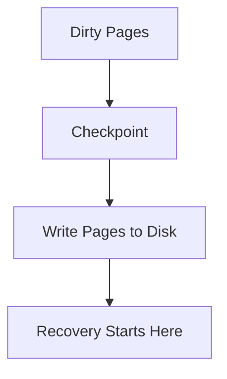
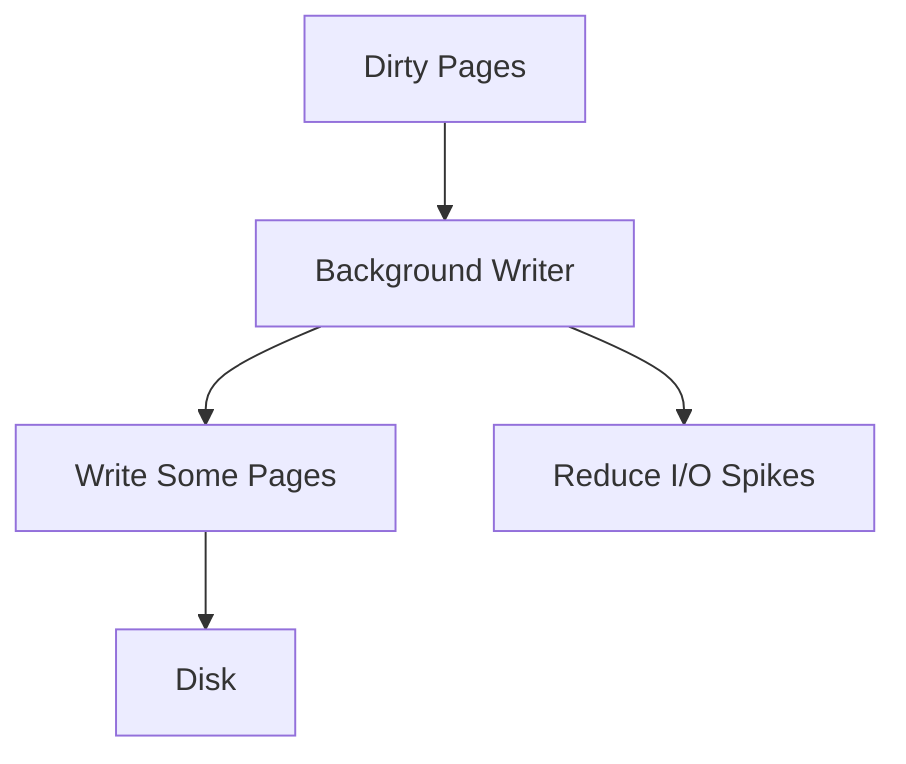
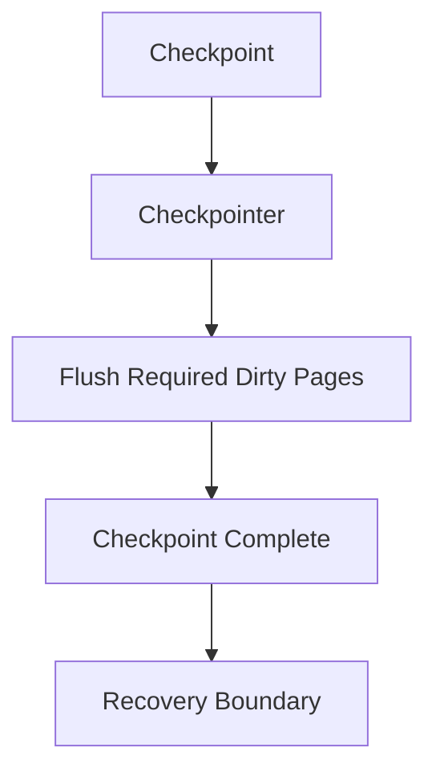
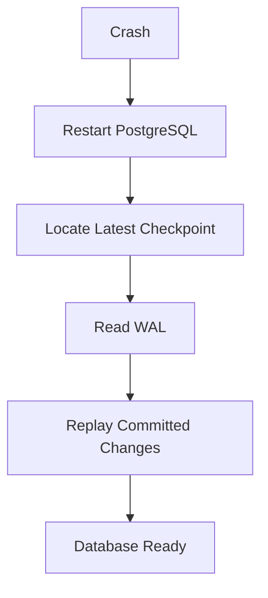
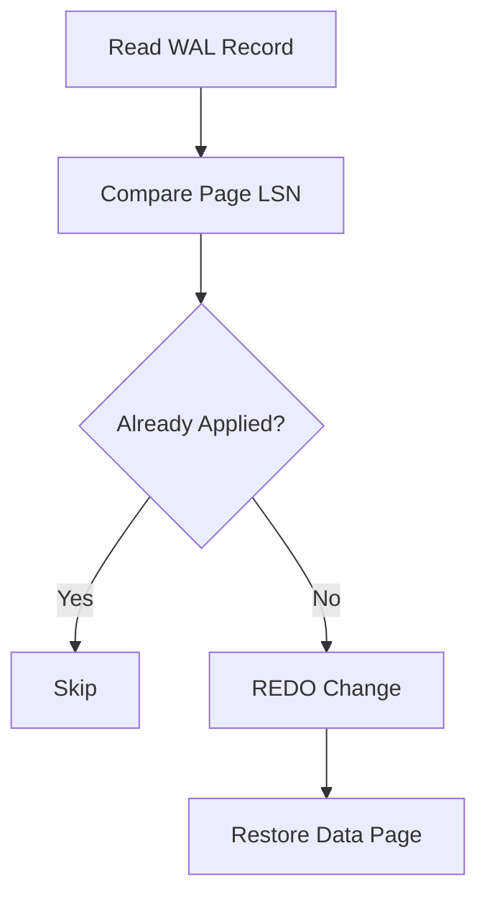
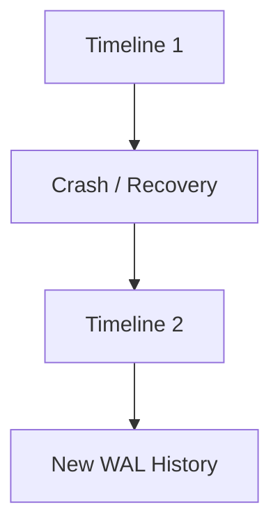
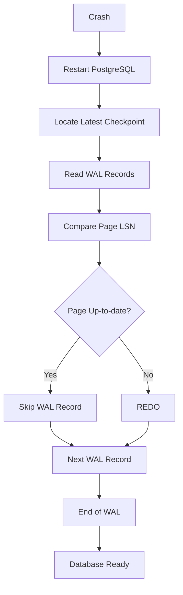
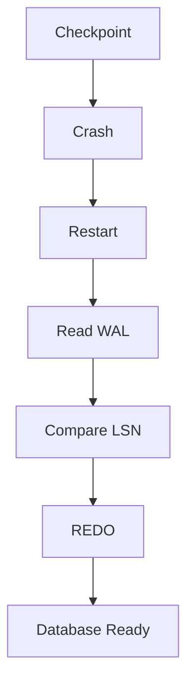
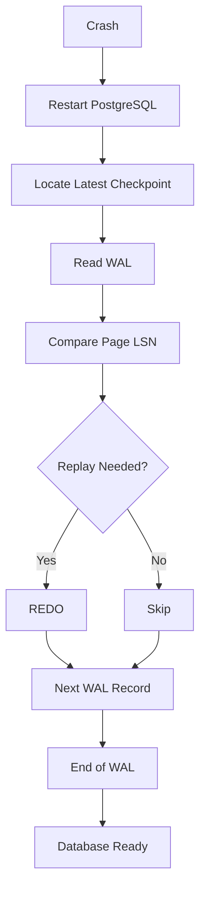

# Chapter 7 – Checkpoints & Recovery

**Question:** What happens after a crash?

---

# Lesson 1 – Checkpoints

**Interview Question:** What is a Checkpoint?

## Lesson

A **Checkpoint** is the process of writing dirty pages from **Shared Buffers** to disk. Without checkpoints, PostgreSQL would need to replay the entire Write-Ahead Log (WAL) after every crash, making recovery very slow. During a checkpoint, PostgreSQL ensures that all modified pages up to a specific point have been safely written to disk. This creates a recovery boundary from which future crash recovery can begin. Checkpoints occur automatically at regular intervals or when triggered manually by an administrator. Although checkpoints generate additional disk I/O, they significantly reduce recovery time after unexpected failures. PostgreSQL carefully balances checkpoint frequency to avoid excessive write activity while keeping crash recovery fast.

### Diagram

### Popular Questions

- What is a Checkpoint?
- Why are checkpoints needed?
- Do checkpoints remove WAL files?
- Why don't checkpoints eliminate crash recovery?

### Remember

- Flushes dirty pages.
- Creates a recovery boundary.
- Reduces recovery time.
- Runs periodically.
- Generates disk I/O.
- Does not replace WAL.

---

# Lesson 2 – Background Writer

**Interview Question:** What does the Background Writer do?

## Lesson

The **Background Writer** continuously writes dirty pages from **Shared Buffers** to disk before a checkpoint occurs. Its primary goal is to spread disk writes over time instead of allowing them to accumulate until the next checkpoint. By gradually flushing dirty pages, the Background Writer reduces sudden I/O spikes that could slow down user queries. It also helps maintain a supply of free buffers, making it easier for PostgreSQL to cache newly accessed pages. The Background Writer does **not** guarantee that every dirty page is written to disk. That responsibility belongs to the **Checkpointer**. Instead, it focuses on improving runtime performance through continuous background maintenance.

### Diagram

### Popular Questions

- What does the Background Writer do?
- Why doesn't PostgreSQL wait until checkpoints?
- Does the Background Writer write every dirty page?
- How does it improve performance?

### Remember

- Writes pages gradually.
- Reduces I/O spikes.
- Keeps free buffers available.
- Runs continuously.
- Supports checkpoints.
- Optimizes performance.

---

# Lesson 3 – Checkpointer

**Interview Question:** What does the Checkpointer do?

## Lesson

The **Checkpointer** is responsible for completing every checkpoint successfully. During a checkpoint, it ensures that **all dirty pages required for that checkpoint** are safely written from Shared Buffers to disk. Once the checkpoint finishes, PostgreSQL knows that pages modified before that checkpoint no longer require WAL replay during crash recovery. Unlike the Background Writer, whose goal is to improve performance, the Checkpointer has a **durability responsibility**. It guarantees that checkpoints are completed correctly and establishes clear recovery boundaries in the WAL. By coordinating checkpoint timing and page flushing, the Checkpointer plays a critical role in PostgreSQL's crash recovery mechanism.

### Diagram

### Popular Questions

- What is the difference between the Background Writer and the Checkpointer?
- What does the Checkpointer guarantee?
- Why is the Checkpointer required?
- Does the Checkpointer improve performance?

### Remember

- Completes checkpoints.
- Guarantees durability.
- Flushes required dirty pages.
- Defines recovery boundaries.
- Different from the Background Writer.
- Essential for crash recovery.

---

# Lesson 4 – Crash Recovery

**Interview Question:** What happens when PostgreSQL crashes?

## Lesson

When PostgreSQL restarts after an unexpected crash, it automatically begins **Crash Recovery**. Instead of trusting data pages that may have been only partially written, PostgreSQL starts from the most recent **Checkpoint** and reads the **Write-Ahead Log (WAL)**. It replays committed changes that were recorded in the WAL but had not yet been written to the data files on disk. Any transaction that had **not committed** before the crash is ignored because its changes are not considered durable. Recovery continues until PostgreSQL reaches the end of the WAL. Once all required WAL records have been replayed, the database is restored to a consistent state and begins accepting new client connections. Crash Recovery is possible because PostgreSQL always writes the WAL before writing modified data pages.

### Diagram

### Popular Questions

- What happens after PostgreSQL crashes?
- Why is WAL replay required?
- Are uncommitted transactions recovered?
- When does the database accept new connections?

### Remember

- Restart PostgreSQL.
- Locate the latest checkpoint.
- Read WAL records.
- Replay committed changes.
- Ignore uncommitted work.
- Restore database consistency.

---

# Lesson 5 – REDO

**Interview Question:** What is REDO?

## Lesson

**REDO** is the process of replaying WAL records during crash recovery. As PostgreSQL reads the WAL, it examines each record and determines whether the corresponding change has already been written to the data page on disk. To make this decision, PostgreSQL compares the page's **Log Sequence Number (LSN)** with the LSN stored in the WAL record. If the page already contains that change, PostgreSQL skips the record. Otherwise, it reapplies the modification to the page. This ensures that every committed transaction survives a crash while preventing the same change from being applied multiple times. REDO is therefore the primary recovery operation performed after an unexpected shutdown.

### Diagram

### Popular Questions

- What is REDO?
- How does PostgreSQL avoid replaying changes twice?
- What role does the LSN play?
- Why is REDO needed?

### Remember

- Replays WAL.
- Restores committed data.
- Uses LSN comparison.
- Runs during recovery.
- Prevents data loss.
- Avoids duplicate replay.

---

# Lesson 6 – Timelines

**Interview Question:** What is a Timeline?

## Lesson

A **Timeline** represents a specific history of WAL records. During normal database operation, PostgreSQL writes WAL records along a single timeline. However, when PostgreSQL performs recovery and then resumes accepting new writes, it starts a **new Timeline** instead of continuing the previous WAL history. This allows different recovery paths to exist without overwriting earlier WAL records. Timelines are especially important for **Point-in-Time Recovery (PITR)**, backups, and standby replication, where administrators may restore the database to different points in time. Most production databases remain on a single timeline unless recovery or failover occurs. Timelines ensure that PostgreSQL can safely maintain multiple histories without creating conflicting WAL sequences.

### Diagram

### Popular Questions

- What is a Timeline?
- Why does PostgreSQL create a new Timeline?
- Where are Timelines used?
- Are Timelines important during normal operation?

### Remember

- Represents WAL history.
- New Timeline after recovery.
- Used in PITR.
- Prevents conflicting WAL histories.
- Important for backups and replication.
- Usually invisible during normal operation.
---

# Lesson 7 – Recovery Walkthrough

**Interview Question:** Walk me through PostgreSQL recovery after a crash.

## Lesson

Suppose PostgreSQL crashes immediately after a transaction commits. When the server restarts, it first locates the most recent **Checkpoint** and begins recovery from that point instead of scanning the entire WAL history. PostgreSQL then reads each **WAL Record** sequentially and compares its **Log Sequence Number (LSN)** with the LSN stored in the corresponding data page. If the page already contains the change, PostgreSQL skips the WAL record. Otherwise, it performs **REDO** and reapplies the missing modification. Only **committed transactions** are recovered because their WAL records were safely flushed before the crash. Any uncommitted transactions are ignored since they never became durable. Recovery continues until the end of the WAL is reached, after which PostgreSQL opens the database and begins accepting new client connections. This entire process guarantees that committed transactions are never lost while maintaining database consistency.

### Diagram

### Popular Questions

- Walk me through PostgreSQL crash recovery.
- Where does recovery begin?
- How does PostgreSQL know which changes to replay?
- Why are uncommitted transactions ignored?
- When is the database ready for new connections?

### Remember

- Start from the latest checkpoint.
- Read WAL sequentially.
- Compare page LSN with WAL LSN.
- REDO missing committed changes.
- Ignore uncommitted transactions.
- Open the database after recovery completes.

---

# 📌 Chapter 7 Summary

### Recovery Pipeline

1. PostgreSQL periodically creates **Checkpoints**.
2. A crash occurs unexpectedly.
3. PostgreSQL restarts and locates the latest checkpoint.
4. Recovery begins from that checkpoint instead of the beginning of the WAL.
5. WAL records are read sequentially.
6. PostgreSQL compares each **WAL LSN** with the **Page LSN**.
7. Missing committed changes are replayed using **REDO**.
8. Already-applied changes are skipped.
9. Uncommitted transactions are discarded.
10. Once the end of the WAL is reached, PostgreSQL opens the database for normal operation.

---

# ⭐ Interview Tip

One of the most common PostgreSQL interview questions is:

> **"What happens after PostgreSQL crashes?"**

A strong answer is the complete recovery pipeline:

### 🎯 Interview Outcome

After this chapter, you should confidently answer:

- What is a **Checkpoint**?
- What is the difference between the **Background Writer** and the **Checkpointer**?
- What happens after PostgreSQL crashes?
- What is **REDO**, and why is it needed?
- How does PostgreSQL use **LSNs** during recovery?
- What is a **Timeline**, and when is it used?
- Walk through the complete PostgreSQL crash recovery process.

