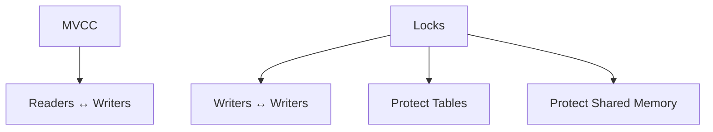
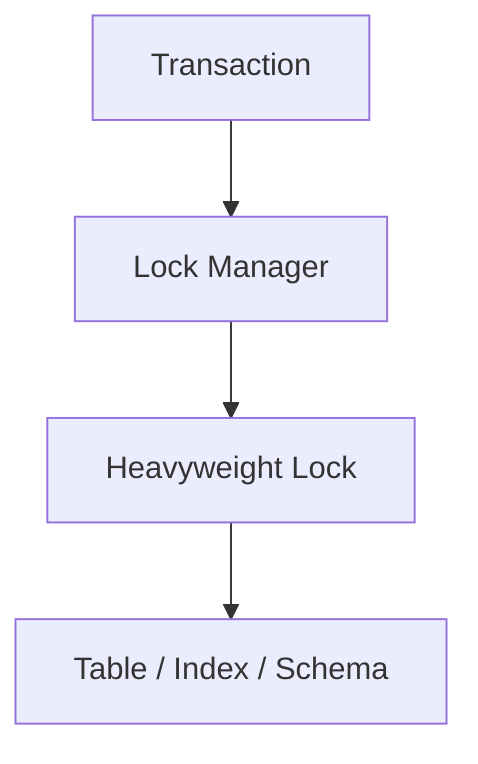
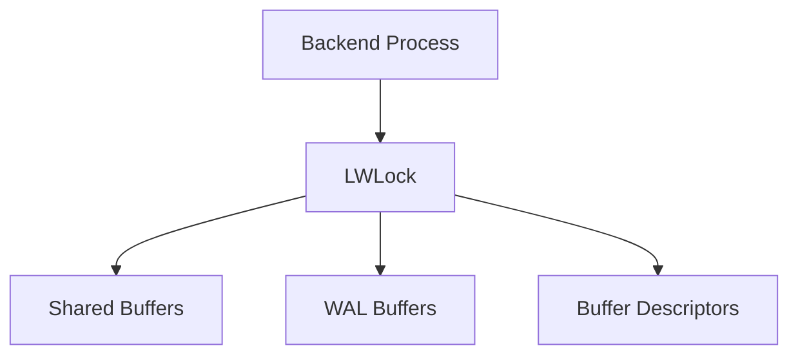
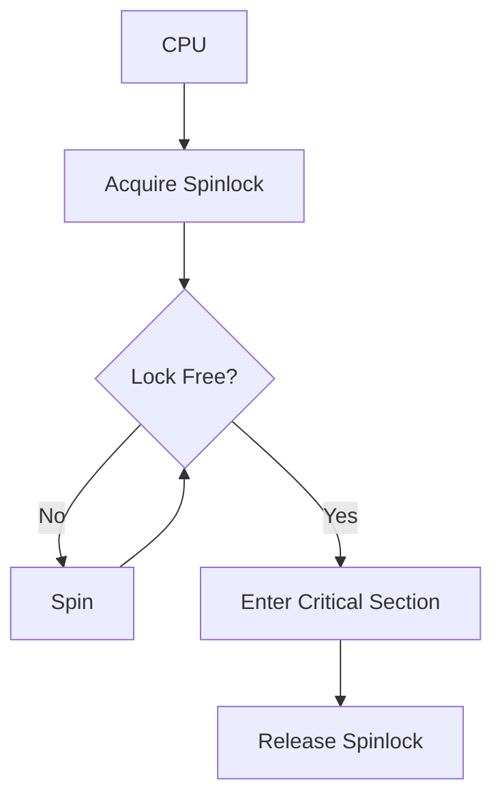
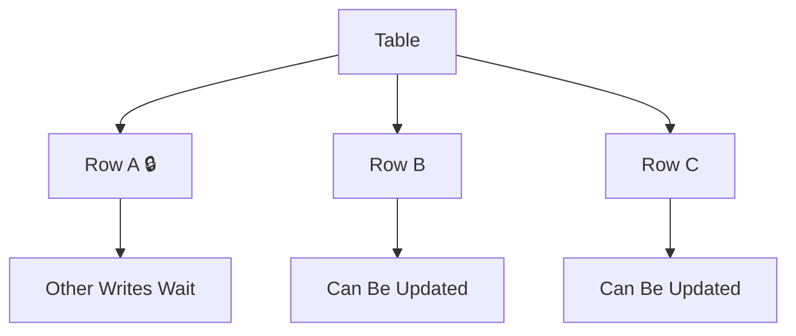
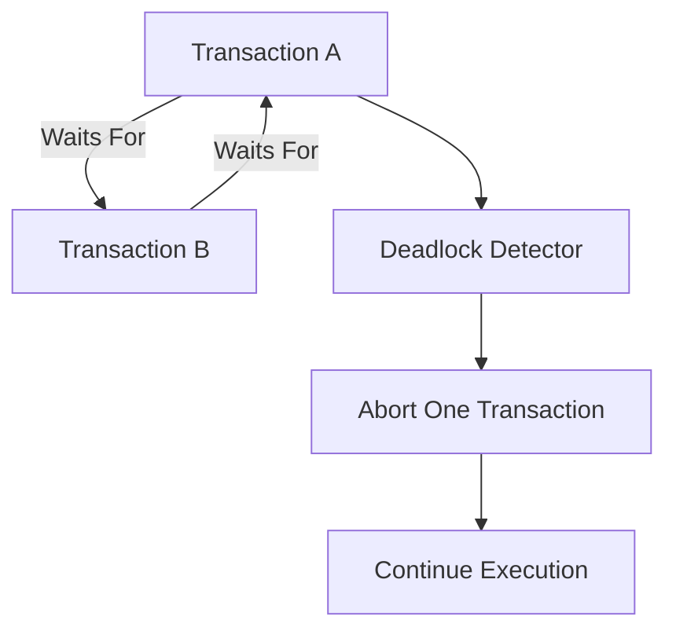
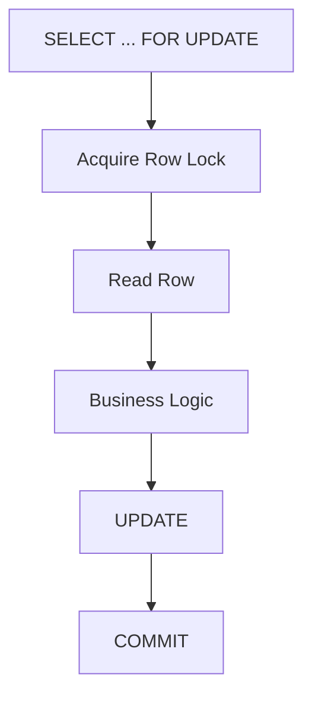
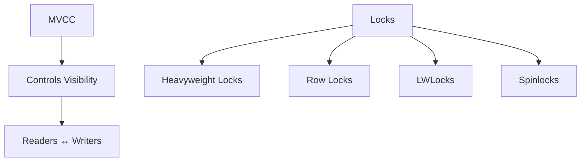

# Chapter 8 – Locking & Concurrency

**Question:** If MVCC exists, why do we still need locks?

---

# Lesson 1 – Why Locks?

**Interview Question:** If PostgreSQL has MVCC, why are locks still needed?

## Lesson

**MVCC (Multi-Version Concurrency Control)** allows readers and writers to work concurrently by maintaining multiple versions of a row. Readers can continue accessing older versions while writers create new versions, greatly reducing read-write blocking. However, MVCC does **not** solve every concurrency problem. When multiple transactions attempt to modify the **same row**, alter a table's schema, or update shared database structures, PostgreSQL still needs locks to coordinate access. Locks prevent conflicting writes, protect database objects, and ensure internal consistency. PostgreSQL therefore combines **MVCC** for row visibility with **locking** for synchronization. Together, they provide both high concurrency and correctness.

### Diagram

### Popular Questions

- If MVCC exists, why does PostgreSQL still need locks?
- What problems does MVCC solve?
- What problems require locks?
- Can MVCC prevent write conflicts?

### Remember

- MVCC does not eliminate locks.
- MVCC controls visibility.
- Locks coordinate concurrent updates.
- Locks prevent write conflicts.
- Locks protect internal database structures.

---

# Lesson 2 – Heavyweight Locks

**Interview Question:** What are Heavyweight Locks?

## Lesson

**Heavyweight Locks** protect shared database objects such as **tables, indexes, schemas, and relations**. They are managed by PostgreSQL's **Lock Manager** and are typically acquired during operations such as `ALTER TABLE`, `DROP TABLE`, `TRUNCATE`, or explicit table locking. If two transactions request incompatible Heavyweight Locks, PostgreSQL blocks one transaction until the conflicting lock is released. Unlike many internal locks, Heavyweight Locks are visible through the `pg_locks` system view, making them useful for diagnosing lock contention. Although they are relatively expensive compared to other lock types, they are essential for maintaining consistency when multiple transactions access the same database objects.

### Diagram

### Popular Questions

- What are Heavyweight Locks?
- When are Heavyweight Locks used?
- How can you view active locks?
- Do normal SQL queries acquire Heavyweight Locks?

### Remember

- Protect tables and database objects.
- Managed by the Lock Manager.
- Can block other transactions.
- Visible in `pg_locks`.
- Usually acquired automatically.

---

# Lesson 3 – Lightweight Locks (LWLocks)

**Interview Question:** What are Lightweight Locks (LWLocks)?

## Lesson

**Lightweight Locks (LWLocks)** protect PostgreSQL's **shared memory structures** rather than user tables. They synchronize access to components such as **Shared Buffers**, **WAL Buffers**, **Buffer Descriptors**, and other internal data structures. Unlike Heavyweight Locks, LWLocks are implementation details of the PostgreSQL storage engine and are not directly visible to SQL users. They are designed to be extremely fast because Backend Processes acquire and release them thousands of times per second. Without LWLocks, multiple Backends could simultaneously modify the same shared-memory structure, leading to corruption or inconsistent state. LWLocks are therefore critical for safely coordinating concurrent access to PostgreSQL's in-memory components.

### Diagram

### Popular Questions

- What are LWLocks?
- What do LWLocks protect?
- Are LWLocks used for tables?
- Why are LWLocks so lightweight?

### Remember

- Protect shared memory.
- Internal synchronization mechanism.
- Very fast.
- Used frequently.
- Prevent shared-memory corruption.
- Not used for user tables.
---

# Lesson 4 – Spinlocks

**Interview Question:** What are Spinlocks?

## Lesson

A **Spinlock** is PostgreSQL's smallest and fastest locking mechanism. Instead of putting a waiting process to sleep, a Spinlock repeatedly checks (or **spins**) until the lock becomes available. This avoids the overhead of context switching, making Spinlocks extremely efficient for protecting very short critical sections. PostgreSQL uses Spinlocks to protect tiny shared variables such as counters, pointers, and small pieces of metadata that can be updated in just a few CPU instructions. Holding a Spinlock for a long time would waste CPU cycles because waiting processes continue spinning instead of sleeping. For this reason, PostgreSQL keeps Spinlock-protected operations extremely short. Spinlocks are used entirely inside PostgreSQL's implementation and are never exposed to SQL users.

### Diagram

### Popular Questions

- What is a Spinlock?
- Why does PostgreSQL spin instead of sleeping?
- When are Spinlocks used?
- Why shouldn't Spinlocks be held for long?

### Remember

- Smallest lock type.
- Busy waiting (spinning).
- Protects tiny shared structures.
- Extremely fast.
- Used internally only.
- Critical sections must be very short.

---

# Lesson 5 – Row Locks

**Interview Question:** What is a Row Lock?

## Lesson

A **Row Lock** protects an individual row from conflicting modifications. When a transaction executes an `UPDATE`, `DELETE`, or `SELECT ... FOR UPDATE`, PostgreSQL automatically acquires a Row Lock on the affected tuple. Other transactions can still **read** the row because MVCC provides older visible versions, but they cannot modify or delete the locked row until the current transaction completes. Since Row Locks affect only specific rows rather than the entire table, PostgreSQL achieves fine-grained concurrency, allowing different transactions to update different rows simultaneously. Row Locks are automatically managed by PostgreSQL and require no manual intervention for normal SQL operations.

### Diagram

### Popular Questions

- What is a Row Lock?
- Can other transactions still read a locked row?
- When are Row Locks acquired?
- Why are Row Locks considered fine-grained?

### Remember

- Locks individual rows.
- Blocks conflicting writes.
- Readers continue using MVCC.
- Automatically acquired.
- Enables fine-grained concurrency.

---

# Lesson 6 – Deadlock Detection

**Interview Question:** What is a Deadlock?

## Lesson

A **Deadlock** occurs when two or more transactions wait indefinitely for each other to release locks. Since none of the transactions can continue, PostgreSQL periodically checks for circular waiting conditions using its **Deadlock Detector**. If a deadlock is found, PostgreSQL automatically selects one transaction as the **deadlock victim**, aborts it, and releases its locks so the remaining transactions can continue. Applications should expect occasional deadlocks in highly concurrent systems and handle them by retrying the failed transaction. One of the best ways to reduce deadlocks is to acquire locks in a **consistent order** across all transactions.

### Diagram

### Popular Questions

- What is a Deadlock?
- How does PostgreSQL detect deadlocks?
- What happens after a deadlock is detected?
- How can applications reduce deadlocks?

### Remember

- Circular waiting.
- PostgreSQL detects deadlocks automatically.
- One transaction is aborted.
- Applications should retry.
- Consistent lock ordering helps prevent deadlocks.
---

# Lesson 7 – SELECT FOR UPDATE

**Interview Question:** What does `SELECT ... FOR UPDATE` do?

## Lesson

`SELECT ... FOR UPDATE` reads rows while simultaneously acquiring **Row Locks** on those rows. This prevents other transactions from updating or deleting the selected rows until the current transaction either **COMMITs** or **ROLLBACKs**. Unlike a normal `SELECT`, which only reads data, `SELECT ... FOR UPDATE` reserves the selected rows for future modifications. Other transactions can still **read** the rows because of **MVCC**, but any conflicting `UPDATE`, `DELETE`, or another `SELECT ... FOR UPDATE` must wait until the lock is released. This command is commonly used when an application reads data, performs some business logic, and then updates the same rows. It prevents race conditions where multiple transactions might otherwise modify the same row concurrently.

### Diagram

### Popular Questions

- What does `SELECT ... FOR UPDATE` do?
- Why not use a normal `SELECT`?
- Does it block readers?
- When should `SELECT ... FOR UPDATE` be used?

### Remember

- Locks selected rows.
- Prevents conflicting updates.
- Readers continue using MVCC.
- Avoids race conditions.
- Used inside transactions.

---

# 📌 Chapter 8 Summary

### PostgreSQL Concurrency Model

| Component | Responsibility |
|-----------|----------------|
| **MVCC** | Controls row visibility using multiple tuple versions. |
| **Heavyweight Locks** | Protect tables, indexes, schemas, and other database objects. |
| **Row Locks** | Prevent conflicting updates to the same row. |
| **LWLocks** | Protect shared memory structures such as Shared Buffers and WAL Buffers. |
| **Spinlocks** | Protect tiny shared variables for extremely short critical sections. |

### Concurrency Pipeline

1. **MVCC** allows readers and writers to work concurrently.
2. **Heavyweight Locks** protect database objects.
3. **Row Locks** coordinate conflicting row updates.
4. **LWLocks** synchronize access to shared memory.
5. **Spinlocks** protect tiny internal structures.
6. PostgreSQL continuously detects and resolves **Deadlocks**.
7. `SELECT ... FOR UPDATE` safely reserves rows for future updates.

---

# ⭐ Interview Tip

One of the strongest PostgreSQL interview answers is understanding the difference between **MVCC** and **Locks**.

| MVCC | Locks |
|------|-------|
| Controls visibility of row versions | Controls access to shared resources |
| Prevents readers from blocking writers | Prevents conflicting writes |
| Uses tuple versions and snapshots | Uses lock managers and synchronization |
| Improves concurrency | Preserves correctness |

If an interviewer asks:

> **"Why doesn't PostgreSQL rely only on MVCC?"**

A strong answer is:

> **MVCC solves visibility by allowing multiple row versions, but it does not prevent conflicting modifications to the same row or protect shared database structures. PostgreSQL still needs locks to coordinate writers, schema changes, and access to internal shared-memory structures. Together, MVCC and locks provide both high concurrency and correctness.**

---

### 🎯 Interview Outcome

After this chapter, you should confidently answer:

- Why does PostgreSQL need locks if it already has MVCC?
- What are **Heavyweight Locks**?
- What are **Lightweight Locks (LWLocks)**?
- What are **Spinlocks**?
- What are **Row Locks**?
- How does PostgreSQL detect deadlocks?
- What does `SELECT ... FOR UPDATE` do?
- Why do MVCC and locks complement each other instead of replacing one another?

