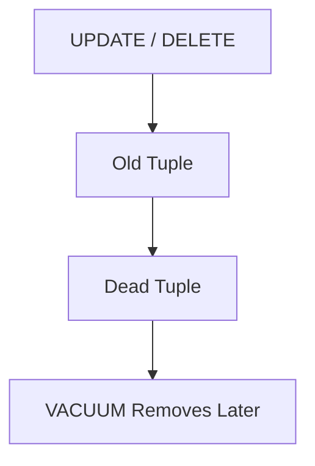
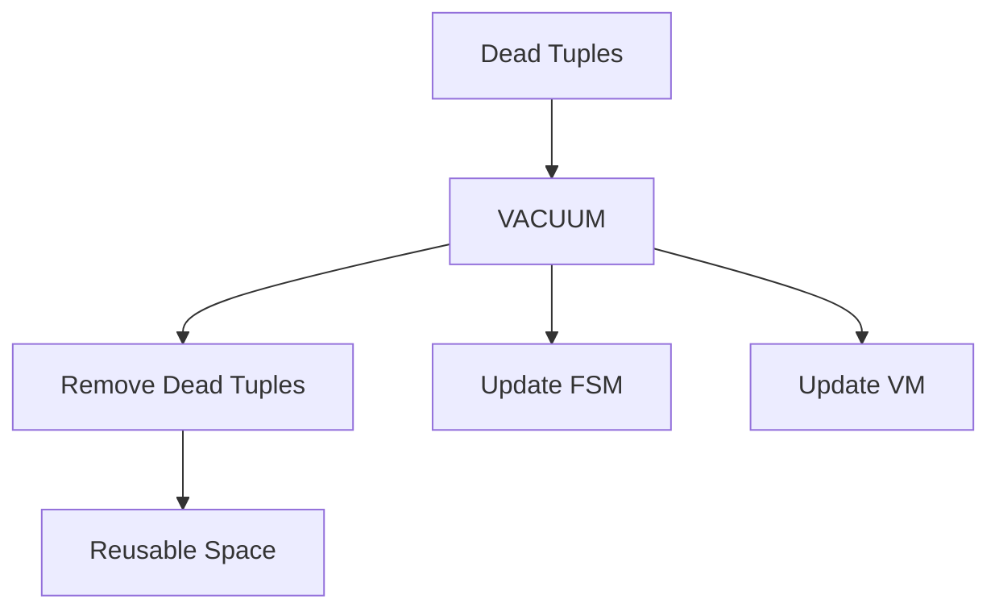
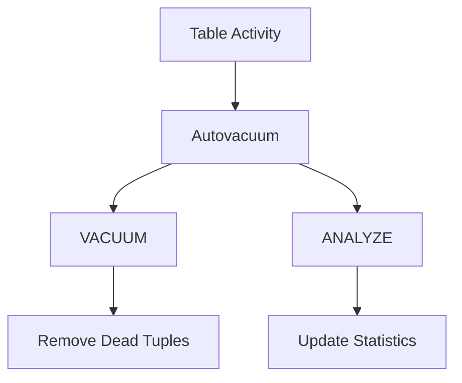
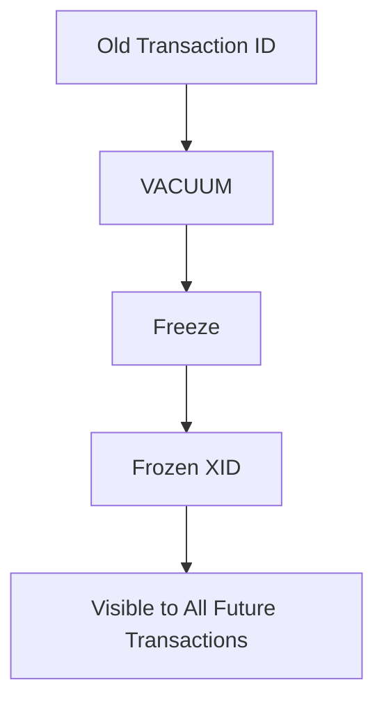
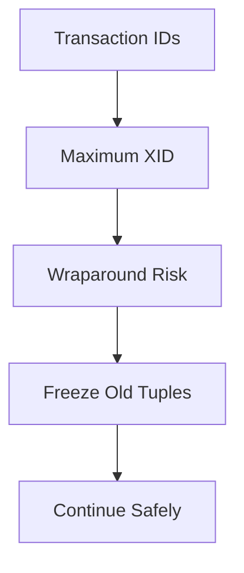
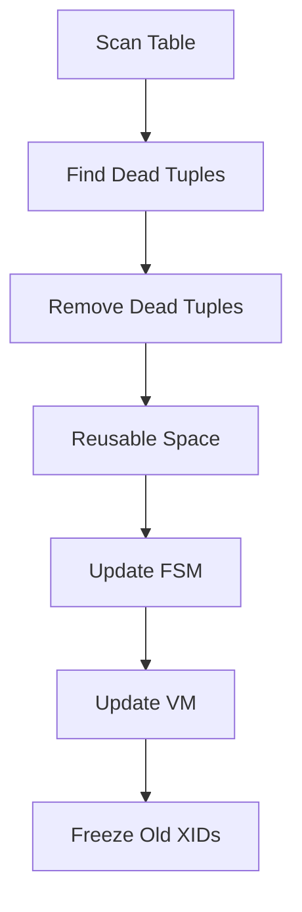
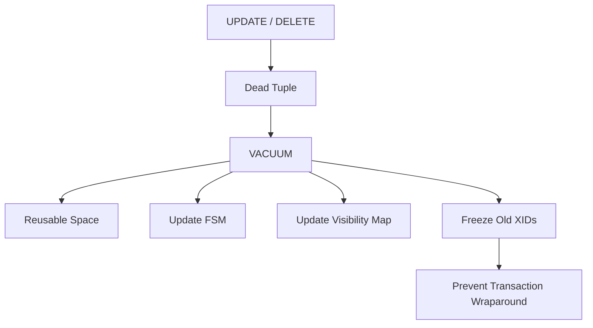
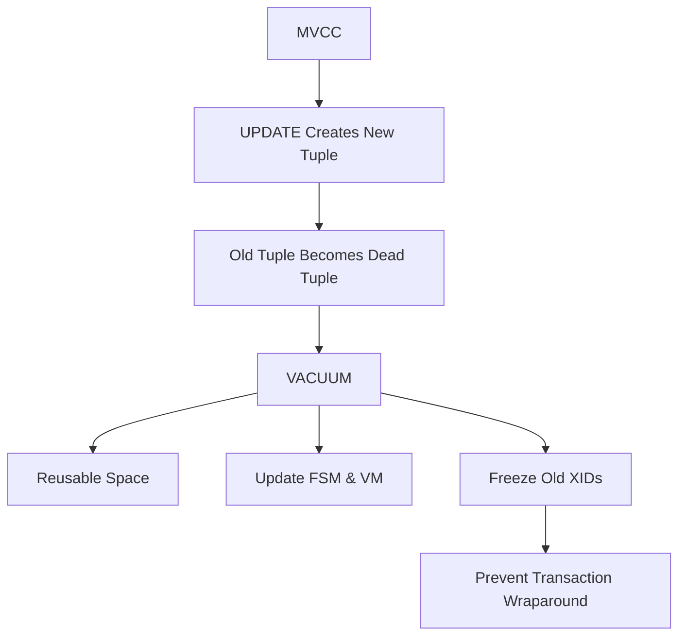

# Chapter 9 – VACUUM

**Question:** Why doesn't PostgreSQL delete rows immediately?

---

# Lesson 1 – Dead Tuples

**Interview Question:** What is a Dead Tuple?

## Lesson

When a row is **UPDATED** or **DELETED**, PostgreSQL does **not** immediately remove the old tuple from the table. Because PostgreSQL uses **MVCC**, other transactions that started earlier may still need to read the old version of the row. Once no active transaction can see the old version anymore, it becomes a **Dead Tuple**. Although dead tuples are no longer visible to users, they continue occupying space inside the table until PostgreSQL removes them. As dead tuples accumulate, tables become larger, more pages must be scanned, and query performance gradually decreases. Dead tuples are therefore a normal consequence of MVCC, and PostgreSQL relies on **VACUUM** to reclaim the space they occupy.

### Diagram

### Popular Questions

- What is a Dead Tuple?
- Why isn't the old tuple deleted immediately?
- What problems do Dead Tuples cause?
- Are Dead Tuples visible to queries?

### Remember

- Created by UPDATE and DELETE.
- Required for MVCC.
- Occupy table space.
- Can slow down queries.
- Removed later by VACUUM.

---

# Lesson 2 – VACUUM

**Interview Question:** What is VACUUM?

## Lesson

**VACUUM** is PostgreSQL's maintenance process for cleaning up **Dead Tuples** that are no longer visible to any active transaction. As it scans a table, VACUUM identifies obsolete tuple versions, removes them, and marks the reclaimed space as available for future inserts and updates. Rather than shrinking the table file in most cases, VACUUM makes the freed space reusable inside existing pages. During the scan, VACUUM also updates the **Free Space Map (FSM)** with newly available space and the **Visibility Map (VM)** for pages that have become fully visible. Regular VACUUM operations prevent table bloat, improve query performance, and keep PostgreSQL's MVCC implementation efficient.

### Diagram

### Popular Questions

- What does VACUUM do?
- Does VACUUM delete live rows?
- Does VACUUM shrink the table?
- Why are FSM and VM updated?

### Remember

- Removes Dead Tuples.
- Reclaims reusable space.
- Updates FSM.
- Updates VM.
- Prevents table bloat.
- Supports MVCC.

---

# Lesson 3 – Autovacuum

**Interview Question:** What is Autovacuum?

## Lesson

**Autovacuum** is PostgreSQL's automatic maintenance system that runs **VACUUM** and **ANALYZE** in the background without user intervention. It continuously monitors table activity and starts VACUUM whenever enough rows have been inserted, updated, or deleted. In addition to cleaning Dead Tuples, Autovacuum updates planner statistics through ANALYZE, allowing PostgreSQL's optimizer to choose efficient execution plans. Most importantly, Autovacuum prevents **Transaction ID Wraparound**, which could otherwise threaten database integrity. Because of these responsibilities, Autovacuum is considered one of PostgreSQL's most critical background processes, and it is enabled by default in almost every production system.

### Diagram

### Popular Questions

- What is Autovacuum?
- Why is Autovacuum enabled by default?
- What happens if Autovacuum is disabled?
- Does Autovacuum also run ANALYZE?

### Remember

- Runs automatically.
- Executes VACUUM.
- Executes ANALYZE.
- Removes Dead Tuples.
- Updates planner statistics.
- Prevents Transaction ID Wraparound.
---

# Lesson 4 – Freeze

**Interview Question:** What is Freeze?

## Lesson

**Transaction IDs (XIDs)** in PostgreSQL are finite and eventually wrap around after billions of transactions. To prevent very old tuples from appearing newer than they really are, PostgreSQL periodically performs **Freeze** during VACUUM. Freezing replaces the tuple's old Transaction ID with a special **Frozen XID**, which is treated as permanently committed and visible to every future transaction. Applications never notice this change because it only affects PostgreSQL's internal metadata. Freeze is an essential maintenance operation that protects the database from Transaction ID aging and ensures that MVCC continues working correctly over long periods of time.

### Diagram

### Popular Questions

- What is Freeze?
- Why is Freeze needed?
- Who performs Freeze?
- Do applications notice frozen tuples?

### Remember

- Prevents Transaction ID aging.
- Performed during VACUUM.
- Uses Frozen XID.
- Internal maintenance operation.
- Protects long-term database correctness.

---

# Lesson 5 – Transaction Wraparound

**Interview Question:** What is Transaction Wraparound?

## Lesson

Every PostgreSQL transaction receives a **Transaction ID (XID)**, but XIDs are finite and eventually reach their maximum value. When this happens, PostgreSQL begins assigning Transaction IDs from the beginning again, a process known as **Transaction Wraparound**. Without proper maintenance, an old tuple could incorrectly appear to belong to a future transaction, causing PostgreSQL to make incorrect visibility decisions. To prevent this, PostgreSQL periodically **Freezes** old tuples before their XIDs become too old. If wraparound protection is ignored for too long, PostgreSQL may refuse new write transactions to protect database integrity. This is why **Autovacuum** is considered critical rather than optional in production systems.

### Diagram

### Popular Questions

- What is Transaction Wraparound?
- Why is Wraparound dangerous?
- How does PostgreSQL prevent it?
- Why is Autovacuum so important?

### Remember

- XIDs are finite.
- Wraparound is dangerous.
- Freeze prevents incorrect visibility.
- Autovacuum performs Freeze automatically.
- Critical for database integrity.

---

# Lesson 6 – Complete VACUUM Walkthrough

**Interview Question:** Walk me through a VACUUM operation.

## Lesson

When PostgreSQL runs **VACUUM**, it scans the table one page at a time looking for **Dead Tuples**. For each tuple, PostgreSQL checks transaction visibility to determine whether any active transaction can still access it. If the tuple is no longer visible to anyone, VACUUM removes it and marks the reclaimed space as reusable for future inserts and updates. During the scan, PostgreSQL also updates the **Free Space Map (FSM)** with newly available space and marks fully visible pages in the **Visibility Map (VM)**. If it encounters very old Transaction IDs, VACUUM performs **Freeze** to replace them with **Frozen XIDs**, preventing Transaction Wraparound. Once the scan completes, the table contains less bloat, more reusable space, and up-to-date visibility information.

### Diagram

### Popular Questions

- Walk me through a VACUUM operation.
- What happens to Dead Tuples?
- Does VACUUM rewrite the table?
- When does VACUUM perform Freeze?
- Why are FSM and VM updated?

### Remember

- Scan table pages.
- Remove Dead Tuples.
- Reclaim reusable space.
- Update FSM.
- Update VM.
- Freeze old Transaction IDs.
---

# 📌 Chapter 9 Summary

### VACUUM Pipeline

1. An **UPDATE** or **DELETE** creates a new tuple version.
2. The old tuple eventually becomes a **Dead Tuple**.
3. **VACUUM** scans the table and identifies obsolete tuples.
4. Dead Tuples are removed, and their space becomes reusable.
5. **Free Space Map (FSM)** is updated with newly available space.
6. **Visibility Map (VM)** is updated for fully visible pages.
7. Very old **Transaction IDs** are **Frozen**.
8. **Freeze** prevents **Transaction Wraparound**.
9. **Autovacuum** performs these maintenance tasks automatically in the background.

---

# ⭐ Interview Tip

One of the most common PostgreSQL interview questions is:

> **"Why does PostgreSQL need VACUUM while many other databases don't?"**

A strong answer is:

> **PostgreSQL uses MVCC, which creates new tuple versions instead of overwriting existing rows. Older versions remain available for active transactions, eventually becoming Dead Tuples. VACUUM removes those obsolete tuples, reclaims reusable space, updates visibility information, and freezes old Transaction IDs to prevent wraparound.**

This connects the entire lifecycle into one explanation:

---

# 🎯 Interview Outcome

After this chapter, you should confidently answer:

- What is a **Dead Tuple**?
- Why doesn't PostgreSQL delete rows immediately?
- What does **VACUUM** do?
- What is **Autovacuum**, and why is it important?
- What is **Freeze**?
- What is **Transaction Wraparound**, and why is it dangerous?
- Walk through a complete **VACUUM** operation.
- Explain how **MVCC**, **Dead Tuples**, **VACUUM**, **Freeze**, and **Autovacuum** work together.

---

# 💡 Interview Cheat Sheet

One of the strongest interview answers is understanding the complete maintenance lifecycle:

| Step | PostgreSQL Action |
|------|-------------------|
| **1** | UPDATE/DELETE creates a new tuple version. |
| **2** | Old version becomes a Dead Tuple. |
| **3** | VACUUM removes obsolete tuples. |
| **4** | Freed space is recorded in the Free Space Map (FSM). |
| **5** | Visibility Map (VM) is updated for Index-Only Scans. |
| **6** | Old Transaction IDs are Frozen. |
| **7** | Freeze prevents Transaction Wraparound. |
| **8** | Autovacuum performs these operations automatically. |

If an interviewer asks:

> **"Why is Autovacuum one of PostgreSQL's most important background processes?"**

A concise, interview-quality answer is:

> **Autovacuum continuously runs VACUUM and ANALYZE in the background. It removes Dead Tuples, updates planner statistics, maintains the Free Space Map and Visibility Map, freezes old Transaction IDs, and prevents Transaction Wraparound. Without Autovacuum, tables would bloat, query performance would degrade, and the database could eventually stop accepting writes to protect itself from XID wraparound.**
