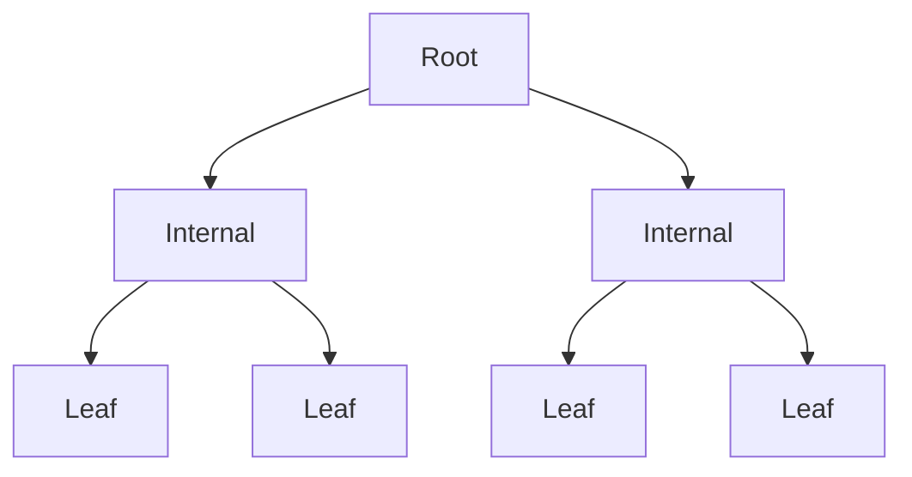
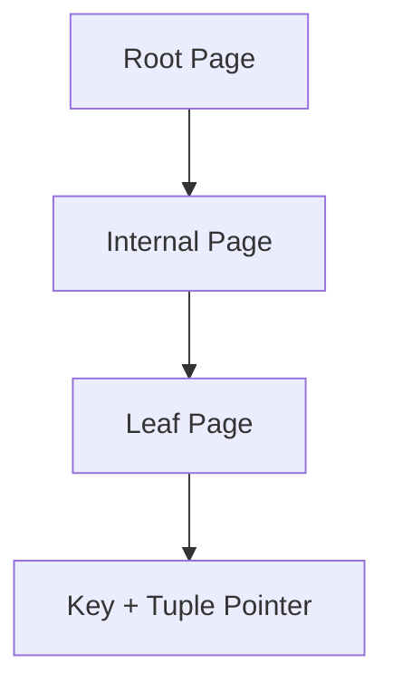
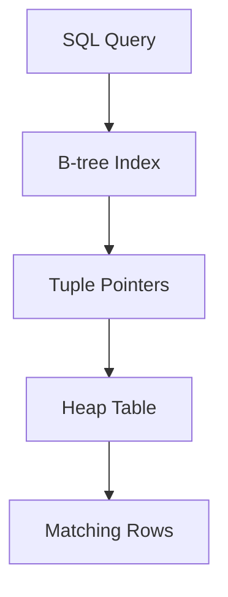
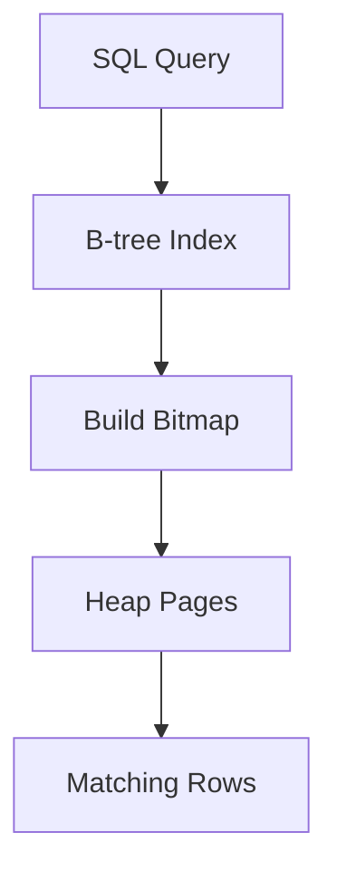
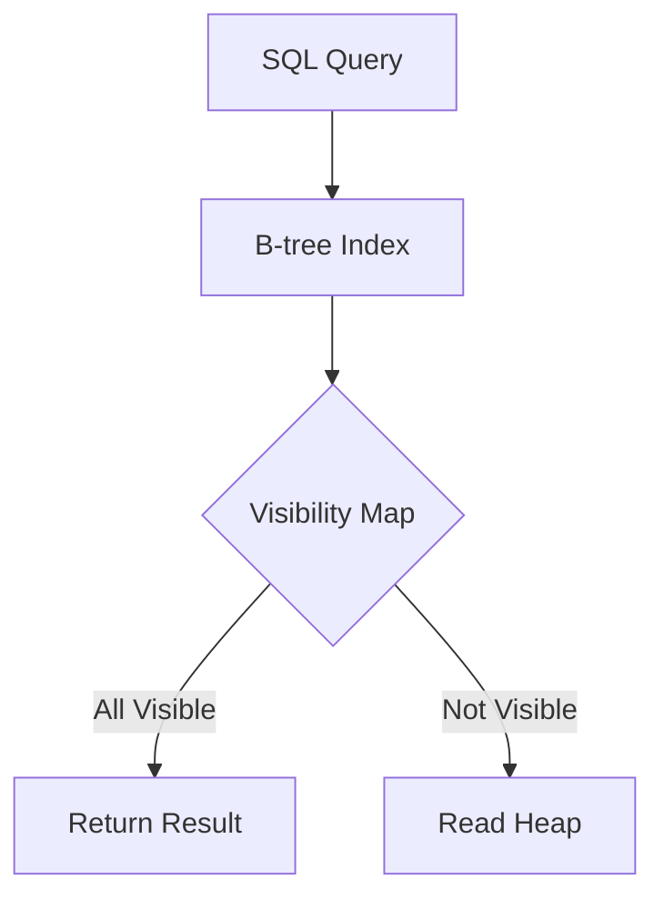
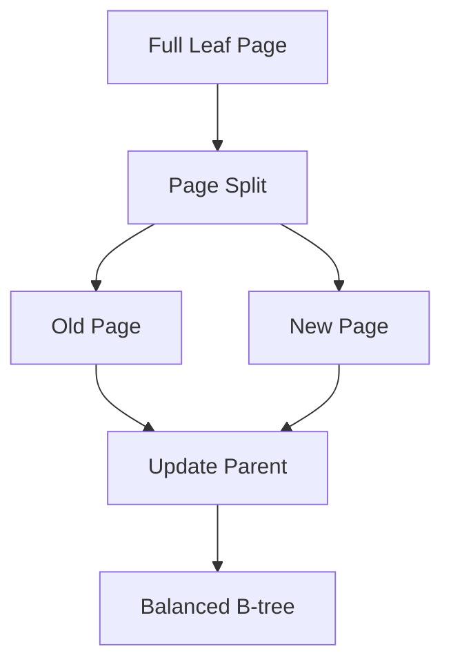
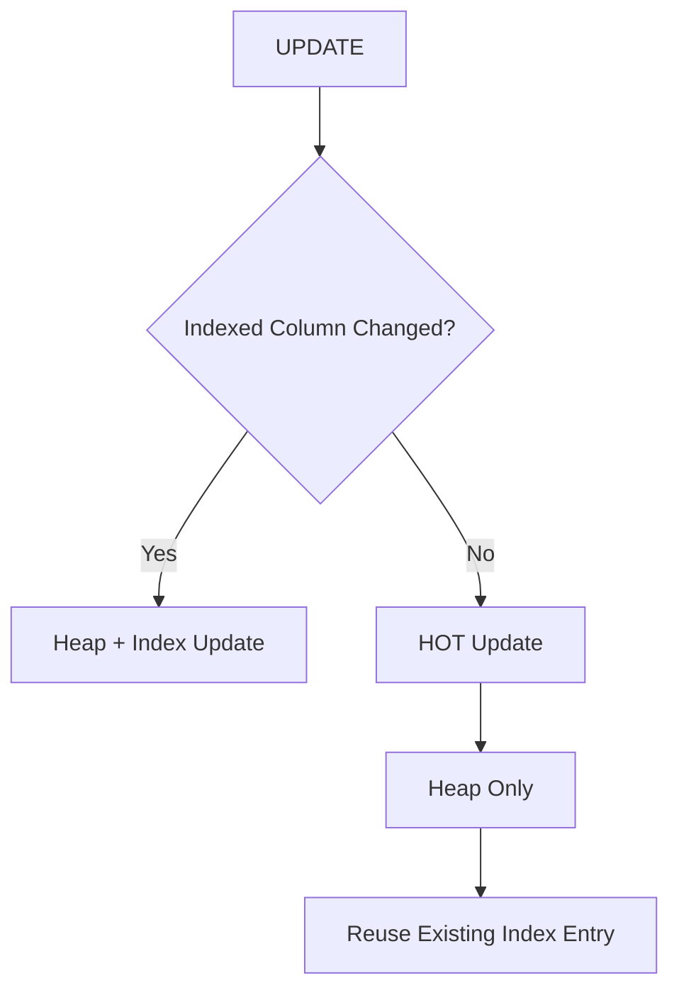
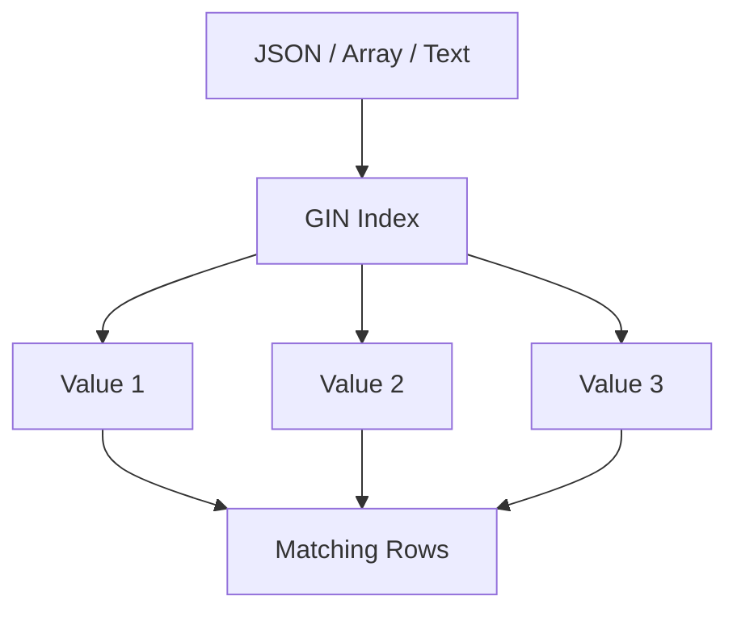
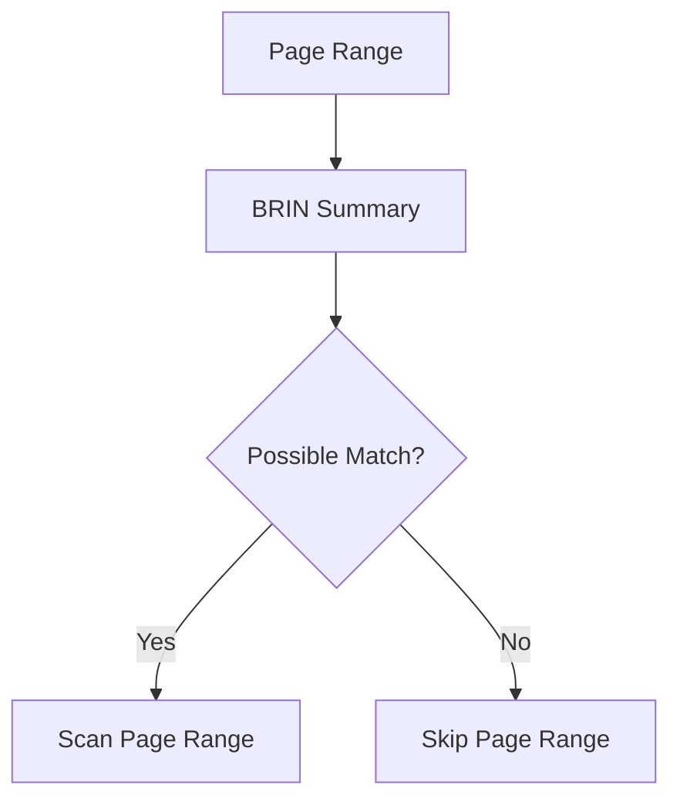
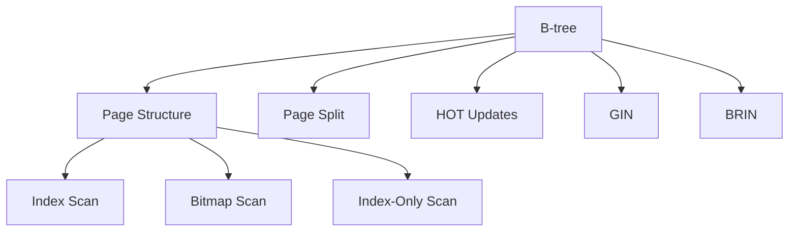

# Chapter 10 – Indexes

**Question:** How does PostgreSQL find data efficiently?

---

# Lesson 1 – B-tree Basics

**Interview Question:** Why does PostgreSQL use B-tree indexes?

## Lesson

A **B-tree** is PostgreSQL's default index type because it provides efficient **searching, insertion, and deletion** while remaining balanced as data grows. Instead of scanning every row in a table, PostgreSQL traverses the B-tree from the **root** to the appropriate **leaf page**, requiring only a few page reads even for very large tables. Because every leaf page is approximately the same distance from the root, lookup time remains predictable. B-tree indexes are ideal for **equality (`=`)** and **range (`<`, `>`, `<=`, `>=`, `BETWEEN`)** queries. Each leaf entry stores the indexed key together with a reference (tuple pointer) to the corresponding row in the heap. PostgreSQL automatically creates B-tree indexes for most **PRIMARY KEY** and **UNIQUE** constraints.

### Diagram

### Popular Questions

- Why are B-tree indexes PostgreSQL's default?
- What queries benefit from a B-tree?
- Why is a B-tree balanced?
- What does a leaf page contain?

### Remember

- Default PostgreSQL index.
- Balanced tree.
- Fast lookups.
- Supports range queries.
- Leaf pages store keys and tuple pointers.

---

# Lesson 2 – B-tree Page Structure

**Interview Question:** How is a B-tree stored on disk?

## Lesson

Like heap tables, PostgreSQL stores a **B-tree** as a collection of fixed-size **8 KB index pages**. The **Root Page** is the entry point into the tree. **Internal Pages** contain separator keys that guide the search toward the correct branch. **Leaf Pages** store the indexed keys together with **tuple pointers** that reference rows in the heap table. During an index lookup, PostgreSQL starts at the root, follows the appropriate internal pages, and eventually reaches the leaf page containing the matching key. Index pages are cached in **Shared Buffers**, reducing disk I/O for frequently accessed indexes. As new keys are inserted, PostgreSQL allocates additional pages while keeping the tree balanced.

### Diagram

### Popular Questions

- What are Root, Internal, and Leaf pages?
- What is stored in a Leaf Page?
- Are indexes page-based?
- Are index pages cached?

### Remember

- Stored in 8 KB pages.
- Root starts every search.
- Internal pages guide navigation.
- Leaf pages store keys.
- Cached in Shared Buffers.

---

# Lesson 3 – Index Scan

**Interview Question:** What is an Index Scan?

## Lesson

An **Index Scan** uses an index to locate matching rows before accessing the table itself. PostgreSQL first searches the index for the requested key and retrieves the associated **tuple pointers**. It then follows those pointers to fetch the corresponding rows from the **heap table**. This approach is highly efficient when only a **small percentage of rows** satisfy the query because it avoids scanning the entire table. However, if many rows qualify, repeatedly jumping between the index and heap can become expensive due to random I/O. PostgreSQL's **Planner** uses table statistics collected by **ANALYZE** to estimate the cost of an Index Scan and compares it with other strategies such as a Sequential Scan or Bitmap Scan before making its decision.

### Diagram

### Popular Questions

- What is an Index Scan?
- When does PostgreSQL choose an Index Scan?
- Why might PostgreSQL avoid an Index Scan?
- What role does the Planner play?

### Remember

- Search index first.
- Follow tuple pointers.
- Read heap rows.
- Best for selective queries.
- Planner chooses using statistics.
---

# Lesson 4 – Bitmap Scan

**Interview Question:** What is a Bitmap Scan?

## Lesson

A **Bitmap Scan** is used when a query matches **more rows than a typical Index Scan** but not enough to justify a full Sequential Scan. Instead of immediately fetching each matching row from the heap, PostgreSQL first scans the index and builds a **bitmap** containing the heap pages that contain matching tuples. Once the bitmap is complete, PostgreSQL reads those heap pages in page order rather than jumping randomly between pages. This greatly reduces random disk I/O while still benefiting from the index. Bitmap Scans are especially useful for medium-sized result sets and for combining multiple indexes using **Bitmap AND** and **Bitmap OR** operations. The Planner automatically chooses a Bitmap Scan when it estimates that it is cheaper than both an Index Scan and a Sequential Scan.

### Diagram

### Popular Questions

- What is a Bitmap Scan?
- Why not use a normal Index Scan?
- When does PostgreSQL choose a Bitmap Scan?
- Why is it faster for medium-sized result sets?

### Remember

- Builds a bitmap first.
- Reads heap pages sequentially.
- Reduces random I/O.
- Good for medium-sized result sets.
- Planner chooses automatically.

---

# Lesson 5 – Index-Only Scan

**Interview Question:** What is an Index-Only Scan?

## Lesson

An **Index-Only Scan** returns query results **directly from the index** without reading the heap table whenever possible. This is possible only when all required columns are stored in the index **and** PostgreSQL knows that every tuple on the referenced heap page is visible to all transactions. That visibility information comes from the **Visibility Map (VM)**. If a heap page is marked **All Visible**, PostgreSQL trusts the index and skips reading the heap entirely. Otherwise, it must still visit the heap to verify tuple visibility. By eliminating heap access, Index-Only Scans can significantly reduce disk I/O and improve performance for read-heavy workloads.

### Diagram

### Popular Questions

- What is an Index-Only Scan?
- Why is the Visibility Map required?
- When does PostgreSQL still read the heap?
- What queries benefit most from an Index-Only Scan?

### Remember

- Reads directly from the index.
- Requires Visibility Map.
- Avoids heap reads.
- Excellent for read-heavy queries.
- Works only when required columns are indexed.

---

# Lesson 6 – Page Splits

**Interview Question:** What is a Page Split?

## Lesson

As new keys are inserted into a **B-tree**, an index page may eventually become full. When this happens, PostgreSQL performs a **Page Split**. Instead of rebuilding the entire index, PostgreSQL allocates a **new index page** and redistributes the keys between the original page and the new page. It then updates the parent page so that future searches can navigate to the correct child page. If the parent page also becomes full, additional splits may propagate upward, even creating a new root page if necessary. Throughout this process, PostgreSQL maintains the balanced structure of the B-tree, ensuring that search performance remains efficient. Although Page Splits are automatic, frequent splits increase write overhead and can contribute to index fragmentation.

### Diagram

### Popular Questions

- What is a Page Split?
- Why are Page Splits needed?
- Does a Page Split rebalance the tree?
- Can a split reach the root page?

### Remember

- Happens when a page becomes full.
- Creates a new page.
- Redistributes keys.
- Updates parent pages.
- Keeps the B-tree balanced.
- Happens automatically.
---

# Lesson 7 – HOT vs Index Updates

**Interview Question:** How do HOT Updates affect indexes?

## Lesson

A normal **UPDATE** creates a new tuple version and usually requires updating every affected index because the new tuple has a different physical location. This increases write overhead, especially for tables with multiple indexes. PostgreSQL optimizes this using **HOT (Heap-Only Tuple) Updates**. If the UPDATE does **not** modify any indexed columns and there is enough free space on the same heap page, PostgreSQL creates the new tuple on that page without creating new index entries. Existing index entries continue pointing to the tuple chain instead of the new tuple directly. This significantly reduces index maintenance, lowers write amplification, and helps prevent index bloat. If any indexed column changes, PostgreSQL cannot use HOT and must update the indexes normally.

### Diagram

### Popular Questions

- What is the difference between a HOT Update and a normal UPDATE?
- When can HOT Updates be used?
- Why are HOT Updates faster?
- Do HOT Updates modify indexes?

### Remember

- HOT avoids index updates.
- Indexed columns must remain unchanged.
- New tuple stays on the same heap page.
- Reduces write amplification.
- Helps prevent index bloat.

---

# Lesson 8 – GIN Index

**Interview Question:** What is a GIN index?

## Lesson

A **GIN (Generalized Inverted Index)** is designed for columns that contain **multiple values**, such as **JSONB**, **arrays**, **full-text search**, and some composite data types. Unlike a B-tree, which maps **one key to one row**, a GIN index maps **one value to many matching rows**. This inverted structure makes it extremely efficient for searching within documents, arrays, and text. For example, PostgreSQL can quickly find every row containing a particular word in a document or a specific key inside a JSON object. Because many index entries may need updating when data changes, GIN indexes are generally **slower to update** than B-tree indexes. They are therefore best suited for read-heavy workloads.

### Diagram

### Popular Questions

- What is a GIN index?
- When should GIN be used?
- Why are GIN updates slower?
- Is GIN good for JSONB?

### Remember

- Designed for JSON, arrays, and text.
- Inverted index structure.
- Maps values to many rows.
- Excellent for search.
- Slower updates than B-tree.

---

# Lesson 9 – BRIN Index

**Interview Question:** What is a BRIN index?

## Lesson

A **BRIN (Block Range Index)** stores **summary information** for ranges of table pages instead of indexing every individual row. Each BRIN entry describes a group of heap pages, recording information such as the minimum and maximum values within that range. During a query, PostgreSQL uses these summaries to quickly identify which page ranges might contain matching rows and skips unrelated ranges. BRIN indexes are **extremely small**, require very little maintenance, and work best when data is **naturally ordered**, such as timestamps, increasing IDs, or time-series data. Although they are less precise than B-tree indexes, they are highly efficient for very large tables where the data is physically correlated.

### Diagram

### Popular Questions

- What is a BRIN index?
- When should BRIN be used?
- How is BRIN different from a B-tree?
- Why is BRIN so small?

### Remember

- Summarizes page ranges.
- Very small index.
- Ideal for ordered data.
- Excellent for time-series workloads.
- Low maintenance cost.

---

# 📌 Chapter 10 Summary

### Index Access Methods

| Access Method | Best Used For |
|--------------|---------------|
| **Sequential Scan** | Most rows match the query. |
| **Index Scan** | Small, selective result sets. |
| **Bitmap Scan** | Medium-sized result sets with many matching rows. |
| **Index-Only Scan** | Indexed columns + Visibility Map allows skipping the heap. |

### Index Types

| Index Type | Best For |
|------------|----------|
| **B-tree** | Equality and range queries. |
| **GIN** | JSONB, arrays, full-text search. |
| **BRIN** | Very large, naturally ordered tables (time-series, logs). |

---

# ⭐ Interview Tip

One of the most common PostgreSQL interview questions is:

> **"When would PostgreSQL choose a Sequential Scan instead of an Index Scan?"**

A strong answer is:

> **If the query is expected to return a large percentage of the table, repeatedly following index pointers to the heap becomes more expensive than simply reading the table sequentially. PostgreSQL's Cost-Based Optimizer uses table statistics collected by ANALYZE to estimate the cost of each strategy and chooses the lowest-cost execution plan.**

Another common question is:

> **"What's the difference between an Index Scan, Bitmap Scan, and Index-Only Scan?"**

| Scan Type | Heap Access | Best Use Case |
|-----------|-------------|---------------|
| **Index Scan** | Yes | Small result sets. |
| **Bitmap Scan** | Yes (page-oriented) | Medium result sets. |
| **Index-Only Scan** | Usually No | Read-heavy queries using indexed columns. |

---

# 🎯 Interview Outcome

After this chapter, you should confidently answer:

- Why does PostgreSQL use **B-tree** indexes?
- How is a B-tree stored on disk?
- What is the difference between an **Index Scan**, **Bitmap Scan**, and **Index-Only Scan**?
- What is a **Page Split**, and why is it necessary?
- How do **HOT Updates** reduce index maintenance?
- When should you use a **GIN** index?
- When should you use a **BRIN** index?
- Why does PostgreSQL sometimes choose a **Sequential Scan** instead of an index?

