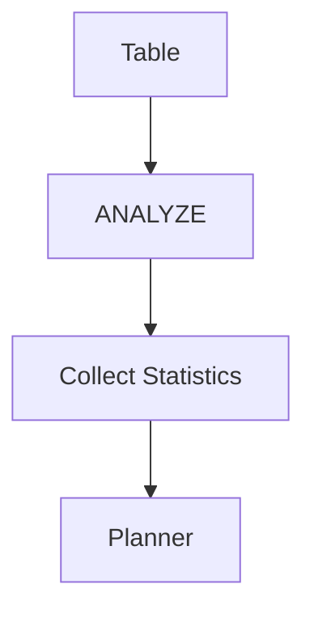
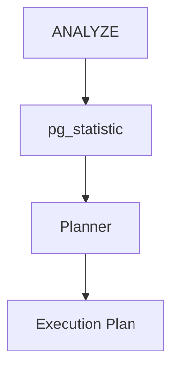
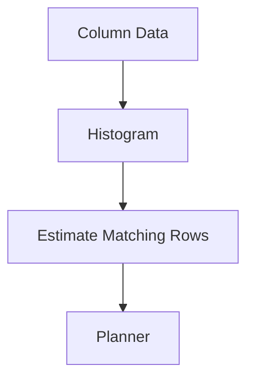
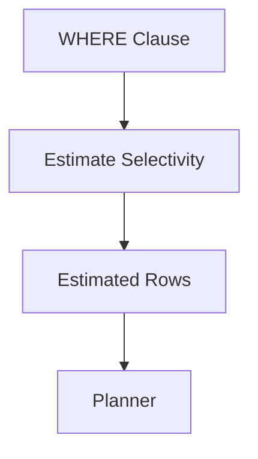
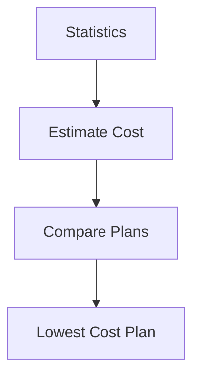
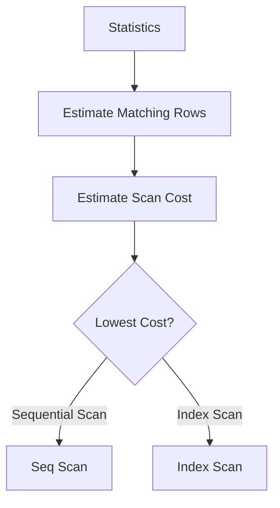
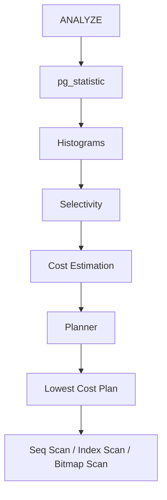
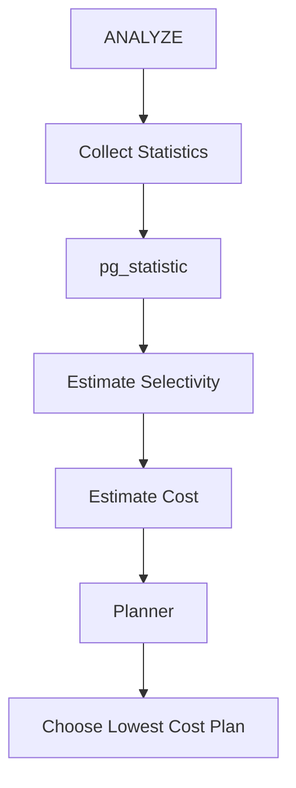

# Chapter 11 – Statistics & Optimization

**Question:** How does PostgreSQL choose the best execution plan?

---

# Lesson 1 – ANALYZE

**Interview Question:** What does ANALYZE do?

## Lesson

**ANALYZE** collects statistics about the data stored in PostgreSQL tables. Instead of scanning every row, PostgreSQL samples a portion of the table and records information such as **row counts**, **value distribution**, **most common values**, **null fractions**, and **the number of distinct values**. These statistics are stored in PostgreSQL's system catalogs and are used by the **Planner** when estimating the cost of different execution plans. Without accurate statistics, PostgreSQL may choose inefficient plans, resulting in slow queries. **Autovacuum** automatically runs ANALYZE as tables change over time, ensuring that statistics remain reasonably up to date. Keeping statistics current is essential for PostgreSQL's Cost-Based Optimizer (CBO).

### Diagram

### Popular Questions

- What does ANALYZE do?
- Why is ANALYZE important?
- Does ANALYZE scan every row?
- Who runs ANALYZE automatically?

### Remember

- Collects statistics.
- Uses sampling.
- Helps the Planner.
- Improves execution plans.
- Runs automatically through Autovacuum.

---

# Lesson 2 – pg_statistic

**Interview Question:** What is `pg_statistic`?

## Lesson

`pg_statistic` is PostgreSQL's internal **system catalog** that stores the statistics collected by **ANALYZE**. For each table column, it records information such as the **number of distinct values**, **most common values**, **null fraction**, **histograms**, and other metadata used by the Planner. Whenever PostgreSQL estimates how many rows a query will return, it consults `pg_statistic` rather than scanning the actual table. Applications normally do not access this catalog directly because it is intended for PostgreSQL's internal optimizer. Accurate entries in `pg_statistic` allow the Planner to choose efficient scan methods, join algorithms, and execution plans.

### Diagram

### Popular Questions

- What is `pg_statistic`?
- Who updates `pg_statistic`?
- Who uses the statistics?
- Is `pg_statistic` a user table?

### Remember

- Stores optimizer statistics.
- Updated by ANALYZE.
- Read by the Planner.
- Internal system catalog.
- Supports Cost-Based Optimization.

---

# Lesson 3 – Histograms

**Interview Question:** Why does PostgreSQL use Histograms?

## Lesson

A **Histogram** summarizes how values are distributed within a table column. Instead of storing every value, PostgreSQL records a set of representative boundaries that approximate the data distribution. The Planner uses these histograms to estimate how many rows satisfy **range predicates** such as `<`, `>`, `<=`, `>=`, and `BETWEEN`. Better row estimates lead to better execution plans because PostgreSQL can more accurately compare the cost of different scan methods and join algorithms. Histograms are automatically built during **ANALYZE** using sampled data. They are especially valuable for columns whose values are unevenly distributed.

### Diagram

### Popular Questions

- What is a Histogram?
- Why are Histograms useful?
- Which queries benefit from Histograms?
- Who creates Histograms?

### Remember

- Summarizes data distribution.
- Built by ANALYZE.
- Estimates range queries.
- Improves planning accuracy.
- Uses sampled data.
---

# Lesson 4 – Selectivity

**Interview Question:** What is Selectivity?

## Lesson

**Selectivity** measures how many rows are expected to satisfy a query condition. A **highly selective** condition matches only a few rows, while a **low-selectivity** condition matches a large portion of the table. PostgreSQL estimates selectivity using the statistics collected by **ANALYZE**, including histograms, most common values, and the number of distinct values stored in `pg_statistic`. These estimates help the Planner predict how many rows each operation will process. Highly selective conditions often favor an **Index Scan**, whereas low-selectivity conditions frequently make a **Sequential Scan** cheaper. Accurate selectivity estimates are therefore essential for choosing an efficient execution plan.

### Diagram

### Popular Questions

- What is Selectivity?
- Why is Selectivity important?
- How does PostgreSQL estimate Selectivity?
- How does Selectivity affect index usage?

### Remember

- Estimates matching rows.
- Based on table statistics.
- High selectivity = few rows.
- Low selectivity = many rows.
- Influences scan selection.

---

# Lesson 5 – Cost Estimation

**Interview Question:** How does PostgreSQL estimate query cost?

## Lesson

Before executing a query, PostgreSQL's **Planner** estimates the cost of every possible execution plan. These estimates are based on statistics rather than actual execution. PostgreSQL considers factors such as **estimated row counts**, **disk I/O**, **CPU processing**, **index access**, **sorting**, **join algorithms**, and other operations. Each candidate plan receives a numerical cost estimate, and the Planner selects the one with the **lowest estimated cost**. If the underlying statistics are inaccurate or outdated, PostgreSQL may choose an inefficient plan. This cost estimation process forms the foundation of PostgreSQL's **Cost-Based Optimizer (CBO)**.

### Diagram

### Popular Questions

- What is Cost Estimation?
- What factors affect query cost?
- Why can PostgreSQL choose the wrong plan?
- Does PostgreSQL execute every plan before choosing?

### Remember

- Uses statistics.
- Estimates before execution.
- Compares multiple plans.
- Lowest estimated cost wins.
- Depends on accurate ANALYZE data.

---

# Lesson 6 – Why PostgreSQL Chooses a Sequential Scan

**Interview Question:** Why does PostgreSQL sometimes choose a Sequential Scan instead of an Index Scan?

## Lesson

An **Index Scan** is not always the fastest way to read data. When a query is expected to return a **large percentage of the table**, repeatedly following index pointers to heap pages results in significant random I/O. In these situations, reading the table sequentially is often more efficient because the pages are accessed in physical order. PostgreSQL estimates the number of matching rows using statistics collected by **ANALYZE** and calculates the cost of both a **Sequential Scan** and an **Index Scan**. If the estimated cost of the Sequential Scan is lower, the Planner selects it—even if an appropriate index exists. PostgreSQL always chooses the **lowest-cost execution plan**, not simply the one that uses an index.

### Diagram

### Popular Questions

- Why doesn't PostgreSQL always use indexes?
- When is a Sequential Scan faster?
- How does the Planner decide?
- Can an index exist but still not be used?

### Remember

- Indexes are not always faster.
- Large result sets often favor Seq Scan.
- Planner compares estimated costs.
- Uses ANALYZE statistics.
- Lowest estimated cost wins.
---

# 📌 Chapter 11 Summary

### Optimization Pipeline

1. **ANALYZE** samples table data.
2. Statistics are stored in **`pg_statistic`**.
3. PostgreSQL builds **Histograms** and records other column statistics.
4. The Planner estimates **Selectivity** for query conditions.
5. It performs **Cost Estimation** for multiple execution plans.
6. The **Planner** compares all candidate plans.
7. PostgreSQL chooses the **lowest estimated cost** plan.
8. The selected plan may be a **Sequential Scan**, **Index Scan**, or **Bitmap Scan**, depending on the estimated cost.

---

# ⭐ Interview Tip

One of the classic PostgreSQL interview questions is:

> **"I created an index, but PostgreSQL still uses a Sequential Scan. Why?"**

A strong answer is:

> **The Planner uses statistics collected by ANALYZE to estimate how many rows the query will return. If it predicts that a large percentage of the table must be read, a Sequential Scan is often cheaper than repeatedly following index pointers to heap pages. PostgreSQL always chooses the execution plan with the lowest estimated cost, not simply the one that uses an index.**

Another common interview question is:

> **"How does PostgreSQL choose the best execution plan?"**

A concise answer is the optimization pipeline:

---

# 💡 Optimization Components

| Component | Purpose |
|-----------|---------|
| **ANALYZE** | Collects table statistics using sampling. |
| **pg_statistic** | Stores optimizer statistics. |
| **Histograms** | Describe data distribution. |
| **Selectivity** | Estimates how many rows match a condition. |
| **Cost Estimation** | Predicts the cost of each execution plan. |
| **Planner** | Chooses the lowest-cost execution plan. |

---

# 🎯 Interview Outcome

After this chapter, you should confidently answer:

- What does **ANALYZE** do?
- What is **`pg_statistic`**?
- Why are **Histograms** needed?
- What is **Selectivity**?
- How does PostgreSQL estimate query cost?
- Why does PostgreSQL sometimes choose a **Sequential Scan** instead of an **Index Scan**?
- How does PostgreSQL's **Cost-Based Optimizer (CBO)** choose the best execution plan?

