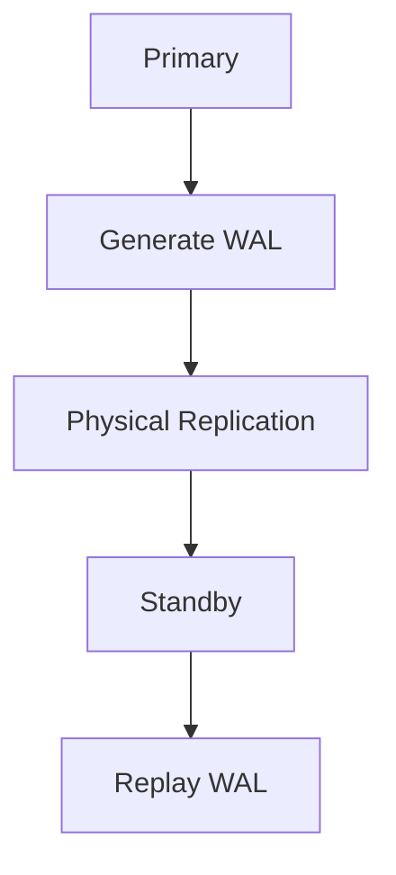
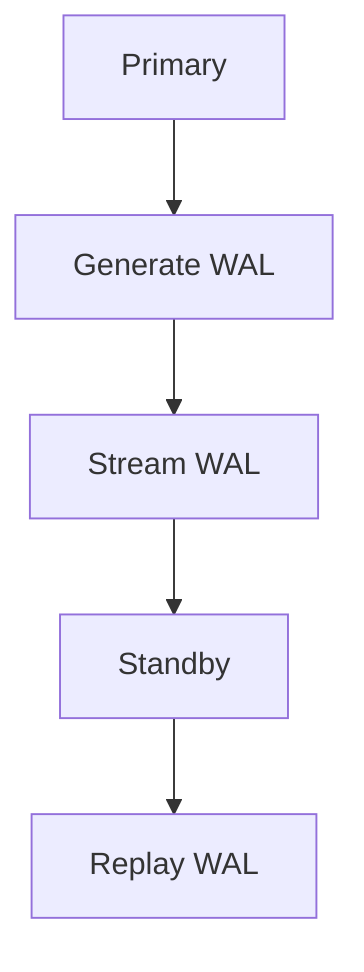
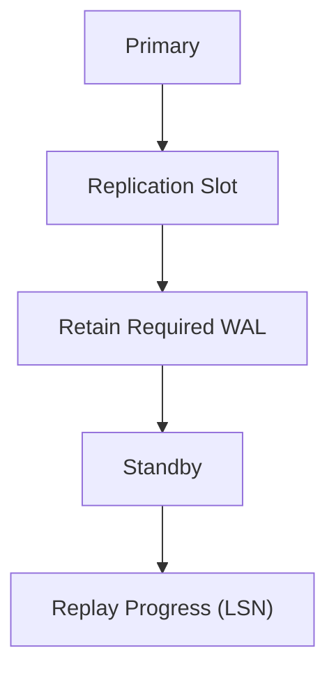
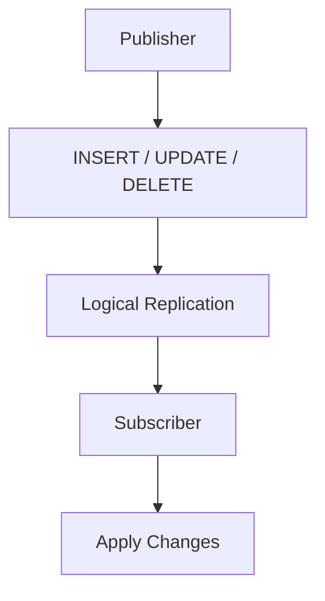
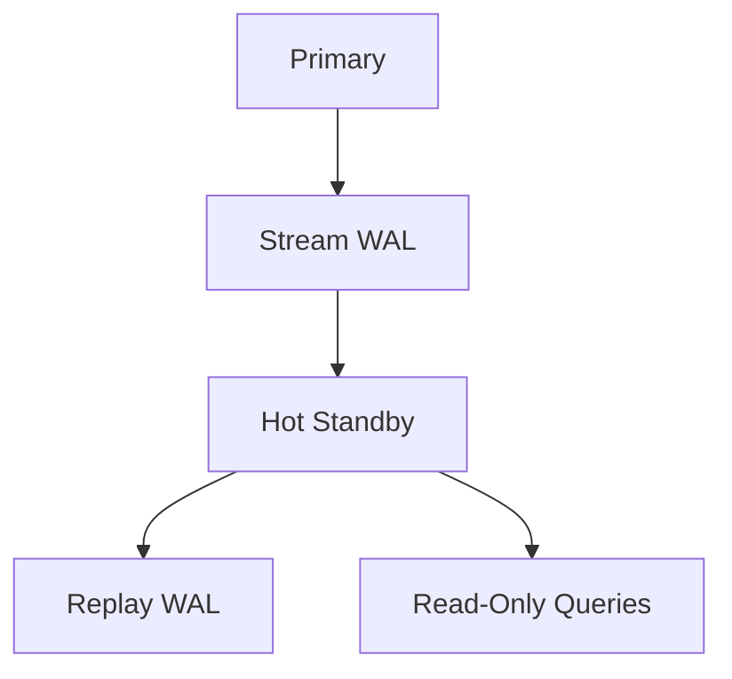
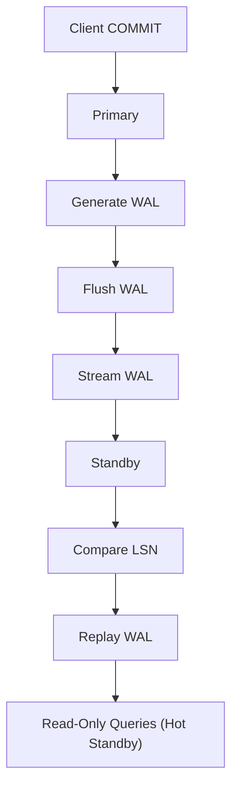
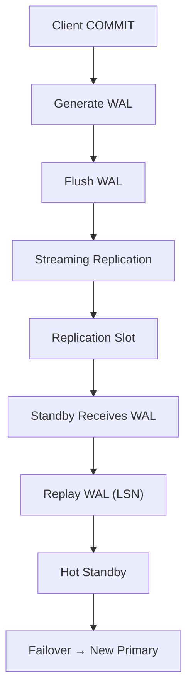
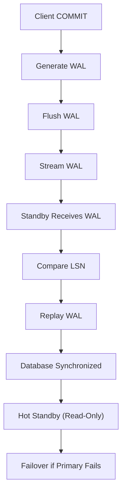

# Chapter 12 – Replication

**Question:** How does PostgreSQL scale beyond one server?

---

# Lesson 1 – Physical Replication

**Interview Question:** What is Physical Replication?

## Lesson

**Physical Replication** copies the entire PostgreSQL database at the **storage level** from a **Primary** server to one or more **Standby** servers. Instead of sending SQL statements, PostgreSQL streams **Write-Ahead Log (WAL)** records that describe physical changes made to the database pages. Each Standby replays these WAL records, producing an almost identical copy of the Primary database. Since replication occurs below the SQL layer, every table, index, and system catalog is replicated exactly as it exists on the Primary. Physical Replication is primarily used for **High Availability (HA)**, **Disaster Recovery (DR)**, and **Read Replicas**. Standard Physical Standbys are read-only because they must remain synchronized with the Primary.

### Diagram

### Popular Questions

- What is Physical Replication?
- What exactly is replicated?
- Why does PostgreSQL replicate WAL instead of SQL?
- When should Physical Replication be used?

### Remember

- Replicates WAL records.
- Storage-level replication.
- Entire database is copied.
- Standby is normally read-only.
- Used for HA and Disaster Recovery.

---

# Lesson 2 – Streaming Replication

**Interview Question:** What is Streaming Replication?

## Lesson

**Streaming Replication** continuously transfers newly generated **WAL records** from the Primary server to one or more Standby servers over the network. As soon as transactions commit and their WAL records become durable, PostgreSQL begins streaming them without waiting for an entire WAL segment to be completed. Each Standby receives the incoming WAL stream and immediately replays the changes, allowing it to remain nearly synchronized with the Primary. Because WAL is transferred continuously, replication lag is typically very small, enabling fast failover if the Primary becomes unavailable. Streaming Replication is the most common replication mechanism used in PostgreSQL production deployments and is built directly on PostgreSQL's WAL infrastructure.

### Diagram

### Popular Questions

- What is Streaming Replication?
- How is it different from Physical Replication?
- Why is it called "Streaming"?
- How does it reduce replication lag?

### Remember

- Continuous WAL transfer.
- Low replication lag.
- Uses network streaming.
- Built on WAL.
- Enables fast failover.

---

# Lesson 3 – Replication Slots

**Interview Question:** What is a Replication Slot?

## Lesson

A **Replication Slot** ensures that the Primary server retains all **WAL records** required by each Standby server. Without a Replication Slot, PostgreSQL may recycle or delete old WAL files before a slow Standby has finished receiving them, forcing the Standby to perform a new base backup. A Replication Slot tracks the replay progress of each replica using **Log Sequence Numbers (LSNs)** and prevents WAL removal until it is safe. This greatly improves replication reliability, especially when Standbys experience temporary network delays. However, inactive Replication Slots must be monitored because they can cause WAL files to accumulate indefinitely and consume significant disk space.

### Diagram

### Popular Questions

- What is a Replication Slot?
- Why is a Replication Slot needed?
- What happens if a Replication Slot becomes inactive?
- How does PostgreSQL know which WAL files to keep?

### Remember

- Retains required WAL.
- Protects slow Standbys.
- Tracks replay progress.
- Prevents WAL loss.
- Must be monitored.
---

# Lesson 4 – Logical Replication

**Interview Question:** What is Logical Replication?

## Lesson

**Logical Replication** replicates database changes as **logical operations** such as **INSERT**, **UPDATE**, and **DELETE** instead of streaming raw WAL records. Unlike Physical Replication, which copies the entire database, Logical Replication allows PostgreSQL to replicate **selected tables** or even subsets of data. A **Publisher** sends logical changes, while one or more **Subscribers** apply those changes to their own databases. Since replication happens at the SQL level, subscribers can run different PostgreSQL versions and may replicate only the data they need. Logical Replication is commonly used for **database migrations**, **data integration**, **microservices**, and **reporting systems** where flexibility is more important than maintaining an exact physical copy.

### Diagram

### Popular Questions

- What is Logical Replication?
- How is it different from Physical Replication?
- When should Logical Replication be used?
- Can subscribers run different PostgreSQL versions?

### Remember

- Replicates logical changes.
- Table-level replication.
- Flexible.
- Ideal for migrations.
- Different from WAL replay.

---

# Lesson 5 – Hot Standby

**Interview Question:** What is a Hot Standby?

## Lesson

A **Hot Standby** is a Standby server that accepts **read-only queries** while continuously replaying WAL records received from the Primary. Because it stays synchronized through Streaming Replication, applications can execute **SELECT** statements on the Standby without affecting replication. This allows reporting, analytics, backups, and other read-heavy workloads to be offloaded from the Primary database. Under normal operation, a Hot Standby cannot accept writes because it must faithfully replay changes from the Primary. By distributing read traffic across multiple servers, Hot Standby improves scalability while simultaneously providing high availability.

### Diagram

### Popular Questions

- What is a Hot Standby?
- Can clients write to a Hot Standby?
- Why is Hot Standby useful?
- How does it improve scalability?

### Remember

- Read-only Standby.
- Continuously replays WAL.
- Offloads read traffic.
- Improves scalability.
- Common with Streaming Replication.

---

# Lesson 6 – Replication Walkthrough

**Interview Question:** Walk me through PostgreSQL replication.

## Lesson

When a transaction **COMMITs** on the **Primary** server, PostgreSQL generates **WAL records** describing the changes. These WAL records are first flushed to durable storage, ensuring the transaction is safe. PostgreSQL then streams the WAL records to connected **Standby** servers using **Streaming Replication**. Each Standby compares the incoming **Log Sequence Numbers (LSNs)** with the latest LSN it has already applied. If new WAL records are available, the Standby replays them to update its local copy of the database. If a **Replication Slot** is configured, the Primary retains the required WAL until every Standby has safely received it. During normal operation, the Standby remains nearly synchronized with the Primary and can serve **read-only queries** if **Hot Standby** is enabled. If the Primary fails, a Standby can be promoted to become the new Primary.

### Diagram

### Popular Questions

- Walk through PostgreSQL replication.
- What is streamed between servers?
- What role does the LSN play?
- How does failover work?
- Why are Replication Slots useful?

### Remember

- Generate WAL.
- Flush WAL.
- Stream WAL.
- Compare LSNs.
- Replay WAL.
- Promote Standby during failover.
---

# 📌 Chapter 12 Summary

### Replication Pipeline

1. A transaction **COMMITs** on the **Primary** server.
2. PostgreSQL generates **WAL Records** describing the changes.
3. WAL is **flushed to durable storage**.
4. **Streaming Replication** continuously sends WAL to Standby servers.
5. **Replication Slots** ensure the required WAL is retained until every Standby receives it.
6. Each Standby compares incoming **LSNs** with its latest replayed LSN.
7. New WAL records are replayed to keep the Standby synchronized.
8. If **Hot Standby** is enabled, the Standby accepts **read-only queries**.
9. If the Primary fails, a Standby can be **promoted** to become the new Primary.

---

# ⭐ Interview Tip

One of the most common PostgreSQL interview questions is:

> **"What is the difference between Physical Replication and Logical Replication?"**

| Physical Replication | Logical Replication |
|----------------------|---------------------|
| Replicates WAL records | Replicates INSERT, UPDATE, DELETE |
| Entire database | Selected tables |
| Storage-level replication | SQL-level replication |
| Standby is an exact copy | Subscriber can replicate specific data |
| Best for High Availability and Disaster Recovery | Best for migrations and data integration |

Another common interview question is:

> **"Walk me through PostgreSQL replication after COMMIT."**

A strong answer is the complete replication pipeline:

---

# 💡 Replication Components

| Component | Purpose |
|-----------|---------|
| **Physical Replication** | Replicates the entire database using WAL. |
| **Streaming Replication** | Continuously streams WAL to Standbys. |
| **Replication Slots** | Prevent required WAL files from being removed too early. |
| **Logical Replication** | Replicates SQL-level changes for selected tables. |
| **Hot Standby** | Allows read-only queries on Standby servers. |
| **LSN** | Tracks replication and replay progress. |

---

# 🎯 Interview Outcome

After this chapter, you should confidently answer:

- What is **Physical Replication**?
- What is **Streaming Replication**?
- What is a **Replication Slot**, and why is it needed?
- What is **Logical Replication**?
- What is a **Hot Standby**?
- Walk through PostgreSQL replication from **COMMIT** to **Standby replay**.
- Explain the difference between **Physical** and **Logical Replication**.
- Describe how PostgreSQL performs **failover** after a Primary server failure.

---

# 🎉 Handbook Complete

With this chapter, you've covered the PostgreSQL internals that are most frequently discussed in storage engine and database engineering interviews:

- **Server Architecture**
- **Storage Engine**
- **Query Processing**
- **Buffer Manager**
- **Transactions & MVCC**
- **WAL & Durability**
- **Checkpoints & Recovery**
- **Locking & Concurrency**
- **VACUUM**
- **Indexes**
- **Statistics & Optimization**
- **Replication**

