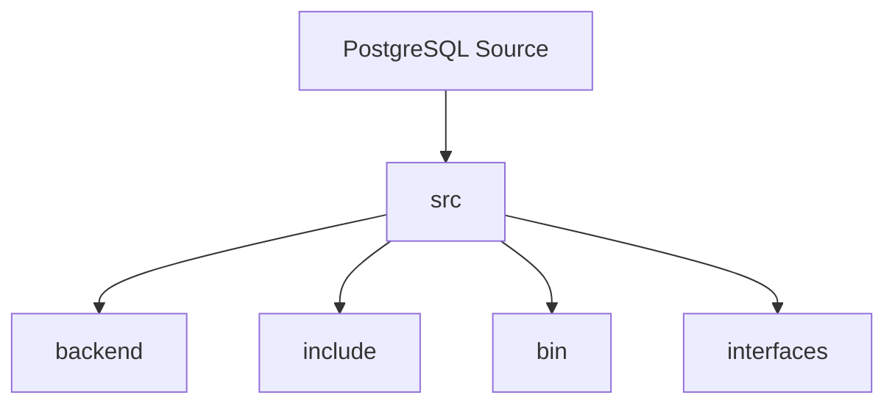
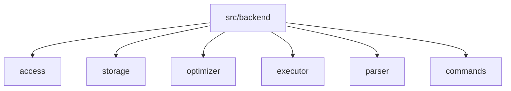
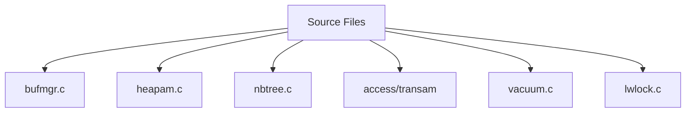
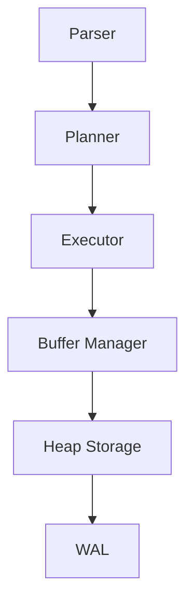
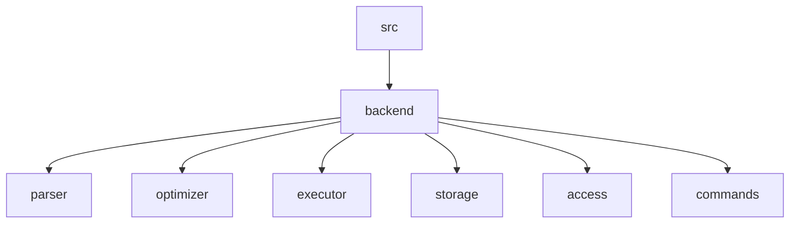

# Appendix A – PostgreSQL Source Tree

**Question:** Where is each PostgreSQL subsystem implemented?

---

# Lesson 1 – PostgreSQL Source Tree Overview

**Interview Question:** How is the PostgreSQL source code organized?

## Lesson

The PostgreSQL source code is organized into directories based on functionality, making it easier for developers to locate different subsystems. The core database engine is implemented under **`src/backend`**, while shared header files are located in **`src/include`**. Command-line applications such as **`psql`** are implemented under **`src/bin`**, and client libraries such as **`libpq`** are found in **`src/interfaces`**. When debugging PostgreSQL internals, developers usually begin with **`src/backend`** because it contains the storage engine, query processor, transaction manager, WAL subsystem, executor, and optimizer. You do not need to memorize every directory, but understanding the major ones makes navigating the PostgreSQL codebase much easier.

### Diagram

### Popular Questions

- How is the PostgreSQL source tree organized?
- Which directory contains the database engine?
- Where are header files located?
- Where is `psql` implemented?

### Remember

- `backend` = Database engine.
- `include` = Header files.
- `bin` = Command-line tools.
- `interfaces` = Client libraries.
- Most PostgreSQL internals live in `src/backend`.

---

# Lesson 2 – Important Backend Directories

**Interview Question:** Which backend directories are most important?

## Lesson

The **`src/backend`** directory is divided into modules that implement different parts of PostgreSQL. The **`access`** directory contains heap storage, index access methods, and transaction/WAL-related components. The **`storage`** directory implements the **Buffer Manager**, lock manager, shared memory, and low-level storage subsystem. The **`optimizer`** directory contains PostgreSQL's **Planner** and Cost-Based Optimizer, while the **`executor`** directory executes query plans generated by the Planner. SQL parsing is implemented in the **`parser`** directory, and SQL commands such as `CREATE TABLE` and `ALTER TABLE` are implemented in **`commands`**. Knowing these directories allows you to quickly locate the relevant code during debugging and source code exploration.

### Diagram

### Popular Questions

- Where is the Planner implemented?
- Where is the Buffer Manager implemented?
- Where is SQL parsing implemented?
- Which directory contains heap storage?

### Remember

- `access` = Storage engine, heap, indexes, WAL.
- `storage` = Buffers, locks, shared memory.
- `optimizer` = Planner.
- `executor` = Query execution.
- `parser` = SQL parser.
- `commands` = SQL command implementation.
---

# Lesson 3 – Important Source Files

**Interview Question:** Which PostgreSQL source files should every engineer know?

## Lesson

Although PostgreSQL is organized into modules, a handful of source files appear frequently when exploring the codebase. **`bufmgr.c`** implements the **Buffer Manager** and manages Shared Buffers. **`heapam.c`** implements heap table storage and tuple operations such as inserts, updates, and scans. **`nbtree.c`** contains PostgreSQL's B-tree index implementation. PostgreSQL's **WAL** and crash recovery logic live under **`src/backend/access/transam`** (historically associated with files such as `xlog.c`, though newer PostgreSQL versions have refactored this code). **`vacuum.c`** implements VACUUM, while **`lwlock.c`** manages Lightweight Locks (LWLocks). These files map directly to the concepts covered throughout this handbook and are excellent starting points when reading PostgreSQL internals.

### Diagram

### Major Source Files

| File / Module | Responsibility |
|---------------|----------------|
| **bufmgr.c** | Buffer Manager and Shared Buffers |
| **heapam.c** | Heap tables and tuple operations |
| **nbtree.c** | B-tree index implementation |
| **access/transam** | WAL generation, recovery, and transaction management |
| **vacuum.c** | VACUUM implementation |
| **lwlock.c** | Lightweight Locks (LWLocks) |

### Popular Questions

- Where is the Buffer Manager implemented?
- Which file contains the B-tree implementation?
- Where is WAL implemented?
- Which file implements VACUUM?

### Remember

- `bufmgr.c` = Buffer Manager.
- `heapam.c` = Heap storage.
- `nbtree.c` = B-tree indexes.
- `access/transam` = WAL and transactions.
- `vacuum.c` = VACUUM.
- `lwlock.c` = Lightweight Locks.

---

# Lesson 4 – Reading the PostgreSQL Source Code

**Interview Question:** Where would you start reading the PostgreSQL source code?

## Lesson

One of the best ways to learn PostgreSQL internals is to follow the lifecycle of a SQL query through the source code. Begin with the **Parser**, which converts SQL into a parse tree. Next, study the **Planner (Optimizer)** to understand how PostgreSQL generates execution plans. Continue with the **Executor**, where the chosen plan is actually executed. From there, move to the **Buffer Manager** to learn how pages are loaded into Shared Buffers, then study **Heap Storage** to understand how tuples are stored and updated. Finally, explore the **WAL** subsystem to see how PostgreSQL guarantees durability and crash recovery. Reading the source in this order mirrors the way PostgreSQL processes queries, making the codebase much easier to understand.

### Diagram

### Popular Questions

- Where would you start reading PostgreSQL?
- Which modules should be studied first?
- How do the major components connect?
- What is the best learning order?

### Remember

- Follow the query lifecycle.
- Parser first.
- Planner before Executor.
- Study storage after execution.
- Finish with WAL and recovery.

---

# 📌 Appendix A Summary

### Source Code Learning Path

1. Learn the **Parser** and SQL parsing.
2. Study the **Planner** and Cost-Based Optimizer.
3. Explore the **Executor** and query execution.
4. Understand the **Buffer Manager** and Shared Buffers.
5. Learn **Heap Storage**, indexes, and tuple management.
6. Finish with **WAL**, recovery, and transaction management.

---

# 🎯 Interview Outcome

After this appendix, you should confidently answer:

- How is the PostgreSQL source tree organized?
- Which directory contains the **Planner**?
- Where is the **Buffer Manager** implemented?
- Which file implements **B-tree indexes**?
- Where is **WAL** implemented?
- Where would you begin reading the PostgreSQL source code?
- How do the major PostgreSQL modules relate to query execution?

---

# 💡 Source Code Note

The PostgreSQL source tree evolves over time, and some filenames have changed as the codebase has been refactored. For example, older versions referenced files such as **`xlog.c`**, while modern PostgreSQL versions organize WAL and recovery code across multiple files under **`src/backend/access/transam`**.

For interviews, it's more important to understand **which module owns a responsibility** than to memorize individual filenames.

For example:

| Subsystem | Primary Module |
|-----------|----------------|
| Parser | `src/backend/parser` |
| Planner | `src/backend/optimizer` |
| Executor | `src/backend/executor` |
| Buffer Manager | `src/backend/storage` |
| Heap Storage | `src/backend/access/heap` |
| B-tree Indexes | `src/backend/access/nbtree` |
| WAL & Recovery | `src/backend/access/transam` |
| VACUUM | `src/backend/commands` + `src/backend/access` |

Understanding the architecture and module boundaries is what interviewers typically care about—not memorizing every source filename.

