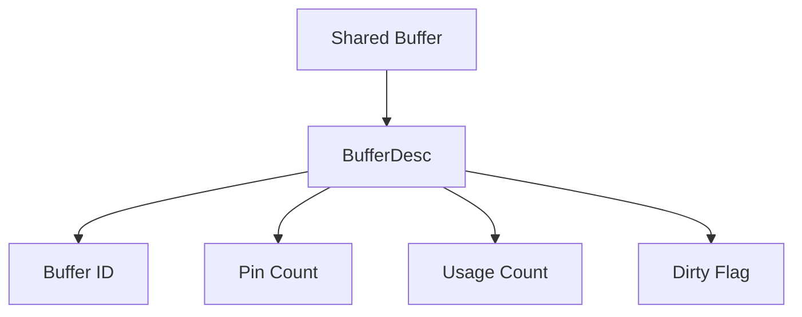
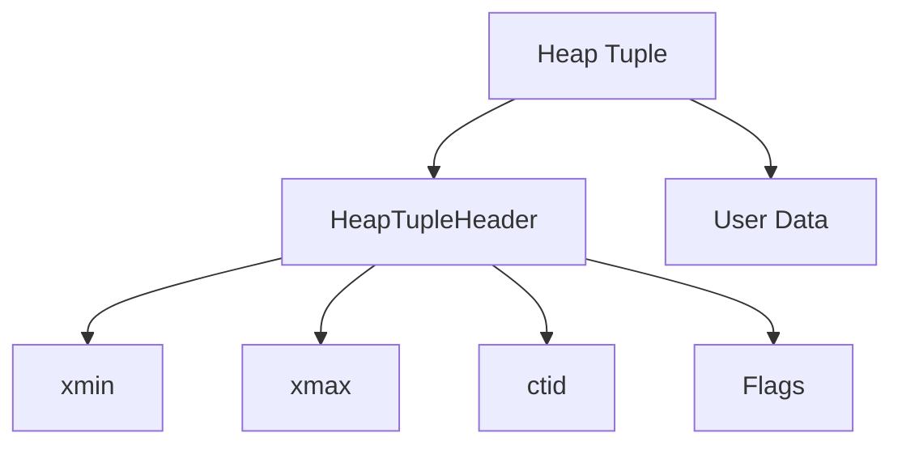
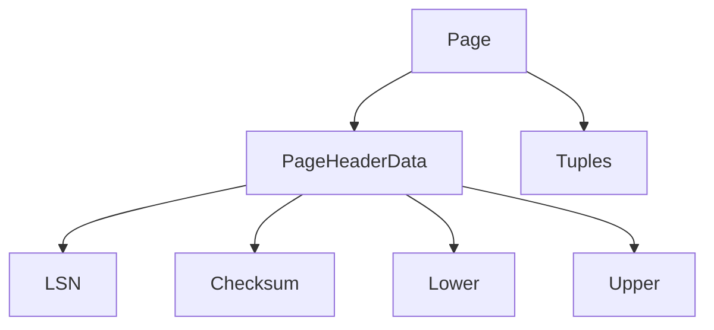
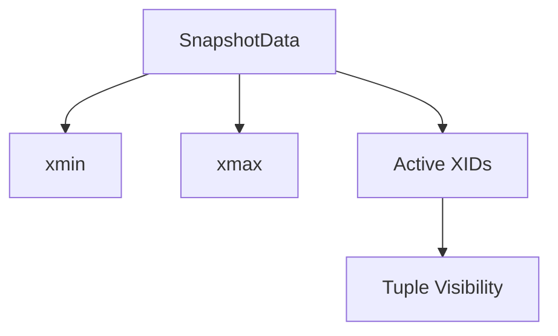
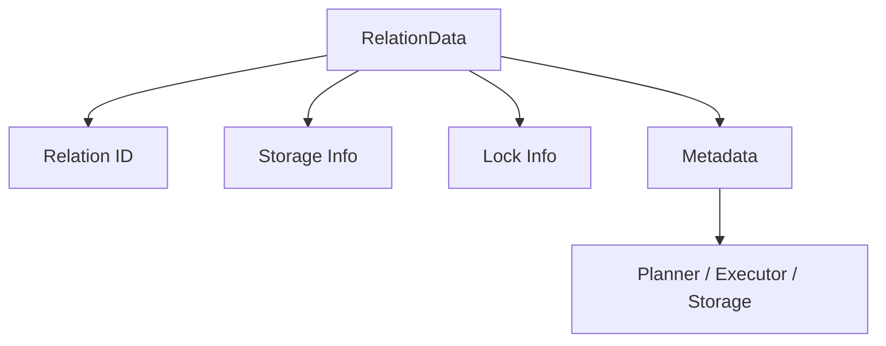
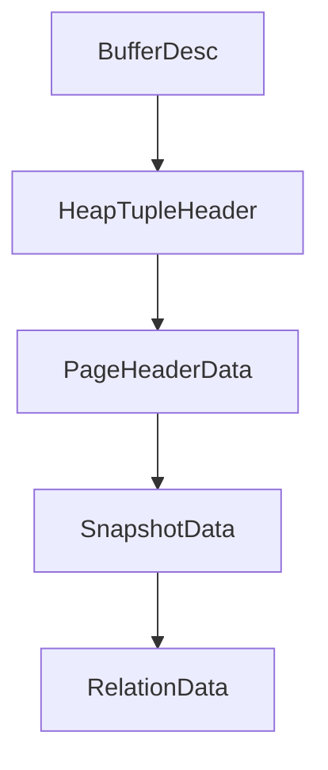

# Appendix B – Important Data Structures

**Question:** Which PostgreSQL data structures should every engineer know?

---

# Lesson 1 – BufferDesc

**Interview Question:** What is BufferDesc?

## Lesson

Every page stored in **Shared Buffers** has a corresponding **BufferDesc** (Buffer Descriptor) structure. Rather than storing the page contents, BufferDesc stores metadata that the **Buffer Manager** uses to manage the cached page. Important information includes the **Buffer ID**, **Pin Count**, **Usage Count**, and **Dirty Flag**. The Pin Count indicates whether the page is currently being used by one or more Backend Processes, while the Dirty Flag indicates whether the page has been modified and must eventually be written to disk. The Usage Count is used by PostgreSQL's **Clock Sweep** replacement algorithm to determine which pages can be evicted. Whenever a page enters or leaves Shared Buffers, its BufferDesc is updated. This makes BufferDesc one of the most important structures in PostgreSQL's memory management subsystem.

### Diagram

### Popular Questions

- What is BufferDesc?
- What information does BufferDesc store?
- Why is BufferDesc needed?
- Which subsystem uses BufferDesc?

### Remember

- One BufferDesc per Shared Buffer.
- Stores metadata, not page contents.
- Tracks dirty pages.
- Tracks Pin Count.
- Used by the Buffer Manager.
- Supports Clock Sweep.

---

# Lesson 2 – HeapTupleHeader

**Interview Question:** What is HeapTupleHeader?

## Lesson

Every row stored in a PostgreSQL heap page begins with a **HeapTupleHeader**, which contains metadata describing the tuple. Important fields include **xmin**, **xmax**, **ctid**, and various status flags. PostgreSQL uses **xmin** and **xmax** to implement **MVCC**, determining whether a tuple is visible to a particular transaction. The **ctid** field identifies the tuple's current physical location and is used to follow tuple version chains created by UPDATE operations. The actual user data immediately follows the HeapTupleHeader. Instead of modifying rows in place, PostgreSQL creates a **new tuple with a new HeapTupleHeader** during UPDATE, allowing multiple versions of the same logical row to coexist.

### Diagram

### Popular Questions

- What is HeapTupleHeader?
- What are xmin and xmax?
- What is ctid?
- Why does every tuple have a header?

### Remember

- One per tuple.
- Stores MVCC metadata.
- Contains xmin.
- Contains xmax.
- Stores ctid.
- User data follows the header.

---

# Lesson 3 – PageHeaderData

**Interview Question:** What is PageHeaderData?

## Lesson

Every PostgreSQL **heap page** and **index page** begins with a **PageHeaderData** structure. This header stores metadata describing the page rather than the tuples inside it. Important fields include the page's **Log Sequence Number (LSN)**, checksum, and pointers such as **Lower** and **Upper**, which track free space and tuple boundaries. Before PostgreSQL accesses tuples within a page, it first reads the PageHeaderData to understand the page layout. During **Crash Recovery**, PostgreSQL compares the page's LSN with WAL records to determine whether **REDO** is necessary. Because every page begins with this structure, PageHeaderData is fundamental to storage management, crash recovery, and page organization.

### Diagram

### Popular Questions

- What is PageHeaderData?
- Why does every page store an LSN?
- What information is stored in the page header?
- Which subsystem uses PageHeaderData?

### Remember

- One per page.
- Stores page metadata.
- Contains the page LSN.
- Tracks free space.
- Used during crash recovery.
- Exists in both heap and index pages.
---

# Lesson 4 – SnapshotData

**Interview Question:** What is SnapshotData?

## Lesson

A **SnapshotData** structure represents the **snapshot** used by a transaction or query to determine which tuple versions are visible. It is one of the core data structures behind PostgreSQL's **MVCC** implementation. Rather than storing table data, SnapshotData records visibility information such as the current **xmin**, **xmax**, and the list of **active Transaction IDs (XIDs)** when the snapshot was taken. During query execution, PostgreSQL compares each tuple's **xmin** and **xmax** with the SnapshotData to decide whether that tuple should be visible. Because every transaction may have a different snapshot, two concurrent transactions can legitimately see different versions of the same row. SnapshotData is therefore fundamental to consistent reads and concurrent transaction processing.

### Diagram

### Popular Questions

- What is SnapshotData?
- What information does SnapshotData store?
- How is SnapshotData used?
- Which subsystem owns SnapshotData?

### Remember

- Represents a transaction snapshot.
- Used by MVCC.
- Stores visibility information.
- Compared with tuple metadata.
- Enables consistent reads.
- Used by the Transaction Manager.

---

# Lesson 5 – RelationData

**Interview Question:** What is RelationData?

## Lesson

A **RelationData** structure represents an **open database object** such as a table, index, sequence, or materialized view. Instead of repeatedly reading metadata from the system catalogs, PostgreSQL caches important information about the relation in memory. RelationData contains identifiers, storage information, locking information, access method details, and pointers to supporting structures required during query execution. The **Planner**, **Executor**, and **Storage Engine** all use RelationData whenever they work with a table or index. By caching this metadata, PostgreSQL avoids repeated catalog lookups and improves performance. Every relation opened during query execution has an associated RelationData structure stored in the **Relation Cache (Relcache)**.

### Diagram

### Popular Questions

- What is RelationData?
- What does RelationData represent?
- Which PostgreSQL components use RelationData?
- Why is RelationData cached?

### Remember

- Represents an open relation.
- Used for tables and indexes.
- Cached in memory.
- Stores relation metadata.
- Used throughout PostgreSQL.
- Managed by the Relation Cache.

---

# 📌 Appendix B Summary

### Key PostgreSQL Data Structures

| Data Structure | Primary Responsibility | Main Subsystem |
|----------------|------------------------|----------------|
| **BufferDesc** | Manages cached buffer metadata | Buffer Manager |
| **HeapTupleHeader** | Stores tuple metadata for MVCC | Heap Storage |
| **PageHeaderData** | Stores page metadata and recovery information | Storage Manager |
| **SnapshotData** | Determines tuple visibility | Transaction Manager / MVCC |
| **RelationData** | Represents an open table or index | Relation Cache |

---

# ⭐ Interview Tip

You are **not expected to memorize every field** inside these structures.

Interviewers usually want to know:

| Structure | Purpose |
|-----------|---------|
| **BufferDesc** | Manages cached pages in Shared Buffers. |
| **HeapTupleHeader** | Stores MVCC metadata for every row. |
| **PageHeaderData** | Manages page metadata and crash recovery information. |
| **SnapshotData** | Determines whether a tuple is visible to a transaction. |
| **RelationData** | Represents an open table or index in memory. |

If an interviewer asks:

> **"Which PostgreSQL data structures should every storage engineer know?"**

A strong answer is:

> **BufferDesc manages cached pages, HeapTupleHeader stores MVCC metadata for each row, PageHeaderData manages page metadata and recovery information, SnapshotData determines tuple visibility, and RelationData represents open database objects used by the Planner, Executor, and Storage Engine.**

---

# 🎯 Interview Outcome

After this appendix, you should confidently answer:

- What is **BufferDesc**?
- What metadata is stored in a **HeapTupleHeader**?
- Why does every page contain a **PageHeaderData** structure?
- What does **SnapshotData** represent?
- What is the purpose of **RelationData**?
- Which PostgreSQL subsystem owns each of these structures?
- How do these structures support PostgreSQL's **architecture**, **MVCC**, **Buffer Manager**, and **Storage Engine**?

