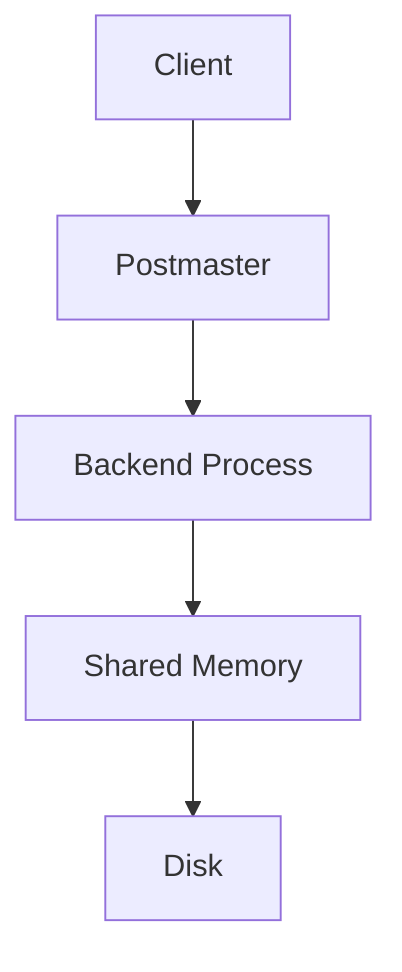
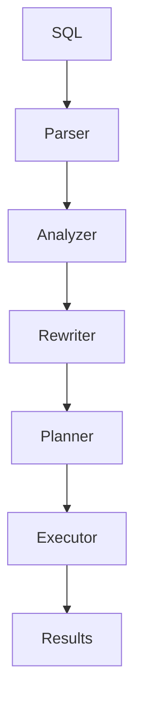
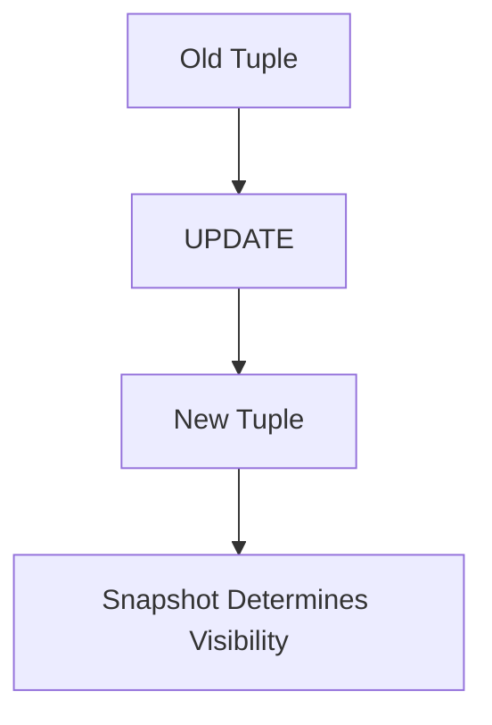
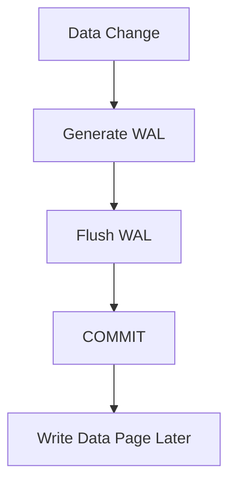
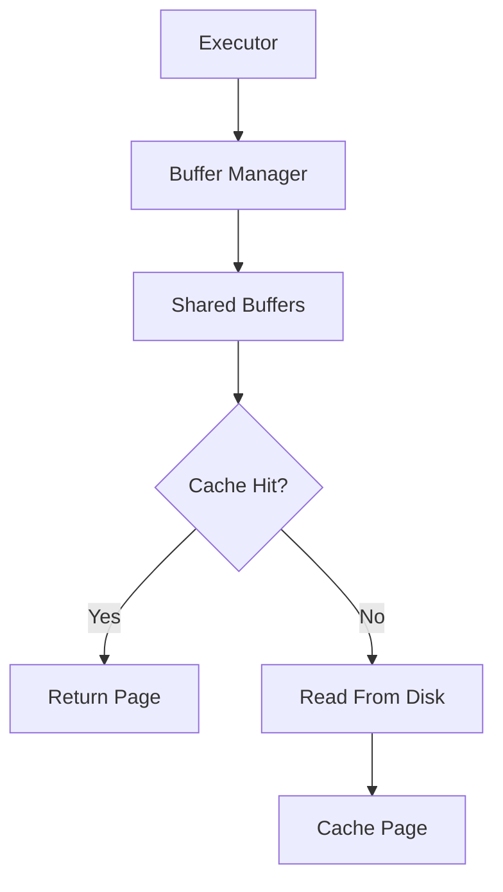
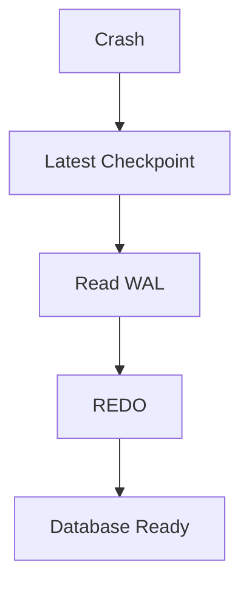
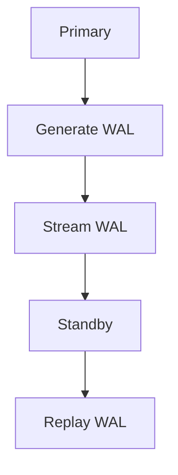
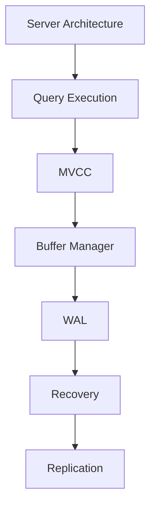

# Appendix C – PostgreSQL Interview Questions

**Question:** Can you answer the most common PostgreSQL internals interview questions?

---

# Lesson 1 – Server Architecture

**Interview Question:** Explain PostgreSQL Architecture.

## Lesson

PostgreSQL follows a **process-per-connection architecture**, where every client connection is handled by its own **Backend Process**. The **Postmaster** starts the server, accepts incoming client connections, and creates Backend Processes. Each Backend executes SQL independently while sharing common resources through **Shared Memory**, including **Shared Buffers**, **WAL Buffers**, and lock information. **Background Processes** handle maintenance tasks such as flushing dirty pages, writing WAL, checkpointing, and running Autovacuum. Frequently accessed pages are cached in memory, while permanent data is stored on disk. This architecture provides concurrency, reliability, and scalability.

### Diagram



### Popular Questions

- Explain PostgreSQL Architecture.
- Why does PostgreSQL use process-per-connection?
- What is the role of the Postmaster?
- What is stored in Shared Memory?

### 30-Second Answer

> PostgreSQL uses a **process-per-connection architecture**. The **Postmaster** accepts client connections and creates one **Backend Process** per connection. Backend Processes execute SQL while sharing resources such as **Shared Buffers** and **WAL Buffers** through Shared Memory. Background Processes handle maintenance tasks, and permanent data is stored on disk.

---

# Lesson 2 – Query Execution

**Interview Question:** Walk me through a SELECT query.

## Lesson

When PostgreSQL receives a SQL query, it first sends it to the **Parser**, which checks syntax and produces a Parse Tree. The **Analyzer** validates tables, columns, functions, and permissions using the system catalogs. The **Rewriter** expands views and applies rewrite rules if necessary. The **Planner** generates multiple execution plans and chooses the one with the lowest estimated cost using table statistics. Finally, the **Executor** runs the chosen plan, accessing pages through the **Buffer Manager** and **Shared Buffers**, before returning the results to the client.

### Diagram



### Popular Questions

- Walk me through a SELECT query.
- Which stage chooses the execution plan?
- Which stage reads table data?
- What happens after parsing?

### 30-Second Answer

> A SQL query flows through the **Parser**, **Analyzer**, **Rewriter**, **Planner**, and **Executor**. The Planner chooses the lowest-cost execution plan using statistics, and the Executor accesses data through the **Buffer Manager** and **Shared Buffers** before returning the results.

---

# Lesson 3 – MVCC

**Interview Question:** What is MVCC?

## Lesson

**MVCC (Multi-Version Concurrency Control)** allows readers and writers to operate concurrently without blocking each other. Instead of overwriting rows during an UPDATE, PostgreSQL creates a **new tuple version**. Each tuple stores **xmin** and **xmax** Transaction IDs that identify the transaction that created or invalidated the tuple. Every transaction uses a **Snapshot** to determine which tuple versions are visible. Older tuple versions remain available for transactions that still need them and are later removed by **VACUUM**. This approach provides high concurrency while maintaining transaction consistency.

### Diagram



### Popular Questions

- What is MVCC?
- Why doesn't PostgreSQL overwrite rows?
- What are xmin and xmax?
- How do Snapshots work?

### 30-Second Answer

> PostgreSQL uses **MVCC** by creating new tuple versions instead of overwriting existing rows. **xmin**, **xmax**, and **Snapshots** determine which version each transaction can see, allowing readers and writers to run concurrently with minimal blocking.

---

# Lesson 4 – WAL

**Interview Question:** Why does PostgreSQL use WAL?

## Lesson

PostgreSQL uses **Write-Ahead Logging (WAL)** to guarantee **durability**, one of the ACID properties. Before any modified data page is written to disk, PostgreSQL first generates a **WAL record** describing the change and flushes it to durable storage. Only after the WAL is safely written can the transaction **COMMIT** successfully. If the server crashes before the data page reaches disk, PostgreSQL replays the WAL during recovery to restore all committed changes. This allows PostgreSQL to delay writing data pages while still protecting committed transactions. WAL is also the foundation for **crash recovery** and **replication**.

### Diagram



### Popular Questions

- Why does PostgreSQL use WAL?
- Why is WAL written before data pages?
- What happens if PostgreSQL crashes?
- How does WAL guarantee durability?

### 30-Second Answer

> PostgreSQL writes **WAL records before data pages**. During COMMIT, WAL is flushed to durable storage first. If a crash occurs, PostgreSQL replays the WAL to restore committed transactions, ensuring durability even if the data pages were never written.

---

# Lesson 5 – Buffer Manager

**Interview Question:** How does PostgreSQL read a page?

## Lesson

Whenever the **Executor** needs a page, it requests it from the **Buffer Manager**. The Buffer Manager first checks whether the page already exists in **Shared Buffers**. If the page is present, PostgreSQL returns it immediately as a **cache hit**. If it is missing, PostgreSQL performs a **cache miss**, reads the page from disk, and stores it in Shared Buffers for future access. When all buffers are occupied, PostgreSQL uses the **Clock Sweep** algorithm to select a buffer for replacement, skipping pinned pages and writing dirty pages to disk if necessary. This caching mechanism minimizes expensive disk I/O and significantly improves query performance.

### Diagram



### Popular Questions

- How does PostgreSQL read a page?
- What is a cache hit?
- What is a cache miss?
- When is Clock Sweep used?

### 30-Second Answer

> Every page request goes through the **Buffer Manager**. It first checks **Shared Buffers**. On a cache hit, the page is returned immediately. On a cache miss, PostgreSQL reads the page from disk, caches it, and uses **Clock Sweep** if a buffer must be replaced.

---

# Lesson 6 – Recovery

**Interview Question:** What happens after PostgreSQL crashes?

## Lesson

After an unexpected shutdown, PostgreSQL performs **Crash Recovery**. Recovery begins from the **latest checkpoint**, reducing the amount of WAL that must be processed. PostgreSQL reads all WAL records generated after that checkpoint and performs **REDO**, replaying committed changes that have not yet reached the data files. Each page's **LSN** is compared with the WAL record to avoid applying the same change twice. Changes from transactions that never committed are ignored because they were never made durable. Once PostgreSQL reaches the end of the WAL stream, the database opens normally and begins accepting new client connections.

### Diagram



### Popular Questions

- What happens after PostgreSQL crashes?
- Why does recovery begin from the checkpoint?
- What is REDO?
- How does PostgreSQL avoid replaying changes twice?

### 30-Second Answer

> PostgreSQL starts recovery from the **latest checkpoint**, reads all WAL records generated afterward, performs **REDO** for committed changes, skips uncommitted work, and then opens the database for normal operation.

---

# Lesson 7 – Replication

**Interview Question:** Explain PostgreSQL Replication.

## Lesson

PostgreSQL primarily uses **WAL-based replication**. The **Primary** server generates WAL records whenever transactions commit and streams them to one or more **Standby** servers. Each Standby replays the WAL records to remain synchronized with the Primary. **Replication Slots** ensure that required WAL files are retained until Standbys have received them. **Physical Replication** copies the entire database at the storage level, while **Logical Replication** sends row-level operations such as INSERT, UPDATE, and DELETE for selected tables. This architecture supports high availability, disaster recovery, read scaling, and online migrations.

### Diagram



### Popular Questions

- Explain PostgreSQL Replication.
- What is streamed between servers?
- What is the difference between Physical and Logical Replication?
- What is a Replication Slot?

### 30-Second Answer

> PostgreSQL replicates by **streaming WAL** from the **Primary** to **Standby** servers. Physical Replication copies the entire database at the storage level, while Logical Replication sends logical row changes for selected tables. Replication Slots ensure Standbys never miss required WAL records.

---

# 📌 Appendix C Summary

These are the **seven PostgreSQL internals interview questions** you should be able to answer confidently in **30 seconds or less**.



## 30-Second Interview Checklist

| Topic | Key Points |
|--------|------------|
| **Server Architecture** | Process-per-connection, Postmaster, Backend Processes, Shared Memory, Background Processes. |
| **Query Execution** | Parser → Analyzer → Rewriter → Planner → Executor. |
| **MVCC** | Tuple versions, xmin/xmax, Snapshots, VACUUM. |
| **Buffer Manager** | Shared Buffers, cache hit, cache miss, Clock Sweep. |
| **WAL** | WAL before data pages, COMMIT after WAL flush, durability. |
| **Recovery** | Checkpoint → WAL → REDO → Database Ready. |
| **Replication** | Primary → WAL → Standby, Physical vs Logical Replication. |

---

# ⭐ Final Interview Tip

Many PostgreSQL interviews begin with one of these questions:

- **Explain PostgreSQL Architecture.**
- **Walk me through a SELECT query.**
- **What is MVCC?**
- **Why does PostgreSQL use WAL?**
- **How does PostgreSQL read a page?**
- **What happens after PostgreSQL crashes?**
- **Explain PostgreSQL Replication.**

A simple way to answer confidently is to think in terms of **execution flows** instead of isolated concepts.

### Architecture

```text
Client
   │
Postmaster
   │
Backend
   │
Shared Memory
   │
Disk
```

### Query Execution

```text
SQL
 │
Parser
 │
Analyzer
 │
Rewriter
 │
Planner
 │
Executor
```

### Write Path

```text
UPDATE
   │
Shared Buffers
   │
Generate WAL
   │
Flush WAL
   │
COMMIT
   │
Write Data Page Later
```

### Crash Recovery

```text
Checkpoint
     │
Read WAL
     │
REDO
     │
Database Ready
```

### Replication

```text
Primary
   │
Generate WAL
   │
Stream WAL
   │
Standby
   │
Replay WAL
```

If you can explain these flows clearly, you'll naturally cover most follow-up questions.

---

# 🎯 Final Interview Outcome

After completing this handbook, you should be able to confidently explain:

- PostgreSQL Server Architecture
- Query Processing Pipeline
- Storage Engine Internals
- Buffer Manager and Shared Buffers
- Transactions and MVCC
- WAL and Durability
- Checkpoints and Crash Recovery
- Locking and Concurrency
- VACUUM and Autovacuum
- B-tree, GIN, and BRIN Indexes
- Planner Statistics and Cost-Based Optimization
- Physical and Logical Replication
- Core PostgreSQL source modules
- Important internal data structures

More importantly, you should be able to connect these topics into complete execution flows instead of describing them independently.

---
