# Appendix D – End-to-End PostgreSQL Walkthroughs

**Question:** What happens inside PostgreSQL from start to finish?

---

# Walkthrough 1 – Server Startup

**Interview Question:** What happens when PostgreSQL starts?

## Overview

When PostgreSQL starts, it initializes all shared resources required by the database server, performs crash recovery if necessary, launches the background processes, and finally begins accepting client connections. This ensures the database is in a consistent state before processing any SQL requests.

## Execution Flow

1. The **Postmaster** process starts.
2. Shared Memory is allocated for Shared Buffers, WAL Buffers, lock tables, and other shared structures.
3. Background Processes such as the Checkpointer, Background Writer, WAL Writer, Autovacuum Launcher, and Logger are started.
4. PostgreSQL checks whether the previous shutdown was clean.
5. If recovery is required, PostgreSQL locates the latest checkpoint.
6. WAL records generated after the checkpoint are replayed.
7. Recovery completes.
8. PostgreSQL begins listening for client connections.

### Diagram

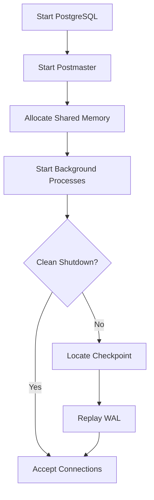

### Subsystems Involved

- Postmaster
- Shared Memory
- Shared Buffers
- WAL
- Recovery
- Background Processes

### Related Chapters

- Chapter 1 – Server Architecture
- Chapter 6 – WAL & Durability
- Chapter 7 – Checkpoints & Recovery

### What Interviewers Are Testing

- Do you know which process starts first?
- Do you understand when Shared Memory is created?
- Do you know when crash recovery runs?
- Can you explain the purpose of Background Processes?

### Remember

- Postmaster starts first.
- Shared Memory is allocated once.
- Background Processes are launched.
- Recovery runs only if needed.
- Server begins accepting connections last.

### 30-Second Answer

> PostgreSQL starts by launching the Postmaster, allocating Shared Memory, starting the Background Processes, checking whether recovery is needed, replaying WAL from the latest checkpoint if necessary, and finally accepting client connections.

---

# Walkthrough 2 – Client Connection

**Interview Question:** What happens when a client connects?

## Overview

Each client connection receives its own Backend Process. That Backend becomes responsible for executing every SQL statement issued during that client session. PostgreSQL uses a process-per-connection architecture to isolate client sessions while allowing them to share common resources through Shared Memory.

## Execution Flow

1. Client connects to PostgreSQL.
2. Postmaster accepts the connection.
3. Authentication is performed.
4. A new Backend Process is created.
5. The Backend attaches to Shared Memory.
6. Session state is initialized.
7. The Backend waits for SQL commands.

### Diagram

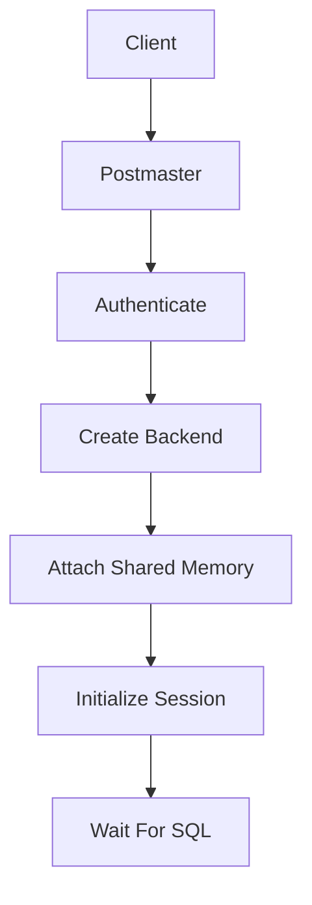

### Subsystems Involved

- Postmaster
- Backend Process
- Authentication
- Shared Memory
- Session Manager

### Related Chapters

- Chapter 1 – Server Architecture
- Chapter 4 – Buffer Manager

### What Interviewers Are Testing

- Do you understand process-per-connection?
- Does the Postmaster execute SQL?
- When is the Backend created?
- When does the Backend attach to Shared Memory?

### Remember

- One Backend per client.
- Postmaster creates the Backend.
- Backend executes SQL.
- Shared Memory is attached after Backend creation.
- Postmaster is no longer involved after connection setup.

### 30-Second Answer

> The Postmaster accepts the client connection, authenticates the client, creates a dedicated Backend Process, attaches it to Shared Memory, initializes the session, and the Backend waits for SQL commands.

---

# Walkthrough 3 – SELECT

**Interview Question:** Walk me through a SELECT query.

## Overview

A SELECT statement passes through PostgreSQL's complete query processing pipeline before rows are returned to the client. Each subsystem performs a specific task, from parsing SQL to checking tuple visibility through MVCC.

## Execution Flow

1. Client sends a SQL query.
2. Parser checks SQL syntax.
3. Analyzer resolves tables, columns, and permissions.
4. Rewriter expands views and rewrite rules.
5. Planner generates candidate execution plans.
6. Cost-Based Optimizer selects the lowest-cost plan.
7. Executor begins execution.
8. Buffer Manager loads required pages into Shared Buffers if necessary.
9. MVCC Snapshot determines tuple visibility.
10. Matching rows are returned to the client.

### Diagram

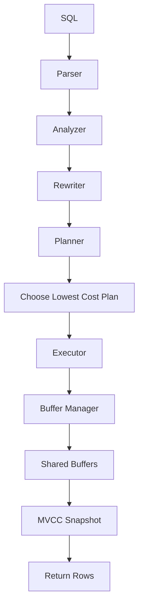

### Subsystems Involved

- Parser
- Analyzer
- Rewriter
- Planner
- Cost-Based Optimizer
- Executor
- Buffer Manager
- Shared Buffers
- MVCC

### Related Chapters

- Chapter 3 – Query Processing
- Chapter 4 – Buffer Manager
- Chapter 5 – Transactions & MVCC
- Chapter 11 – Statistics & Optimization

### What Interviewers Are Testing

- Can you explain the complete query pipeline?
- Do you know where optimization happens?
- Which stage actually reads data?
- Where does MVCC fit into query execution?
- How are pages loaded into memory?

### Remember

- Parser checks syntax.
- Analyzer validates schema.
- Rewriter expands views.
- Planner chooses the execution plan.
- Executor performs the work.
- Buffer Manager loads pages.
- MVCC determines visibility.

### 30-Second Answer

> A SELECT query flows through the Parser, Analyzer, Rewriter, Planner, and Executor. The Planner chooses the lowest-cost execution plan, the Buffer Manager loads the required pages into Shared Buffers, MVCC determines tuple visibility, and the Executor returns the matching rows to the client.
---

# Walkthrough 4 – INSERT

**Interview Question:** Walk me through an INSERT.

## Overview

An **INSERT** creates a new tuple in a heap page, records the modification in the **Write-Ahead Log (WAL)**, and commits the transaction. PostgreSQL first makes the change in memory and guarantees durability by flushing the WAL before reporting success to the client.

## Execution Flow

1. Transaction begins.
2. Executor locates a heap page with sufficient free space using the **Free Space Map (FSM)**.
3. A new Heap Tuple is created in **Shared Buffers**.
4. A WAL Record describing the INSERT is generated.
5. The WAL Record is placed into **WAL Buffers**.
6. During COMMIT, the required WAL is flushed to durable storage.
7. Client receives a successful COMMIT.
8. The modified data page remains in Shared Buffers.
9. The data page is written to disk later by the Background Writer or Checkpointer.

### Diagram

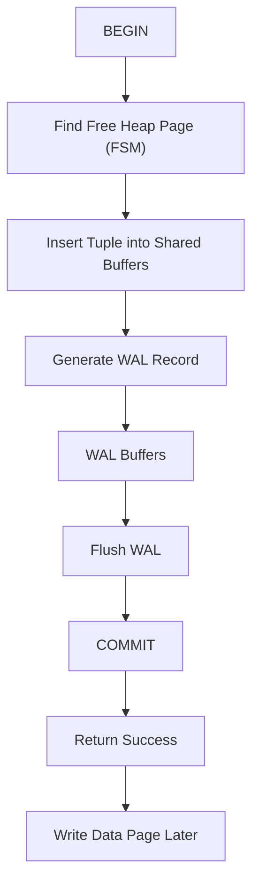

### Subsystems Involved

- Transactions
- Heap Storage
- Free Space Map (FSM)
- Buffer Manager
- Shared Buffers
- WAL
- WAL Buffers
- Background Writer
- Checkpointer

### Related Chapters

- Chapter 2 – Storage Engine
- Chapter 4 – Buffer Manager
- Chapter 5 – Transactions & MVCC
- Chapter 6 – WAL & Durability

### What Interviewers Are Testing

- Do you know where a new row is inserted?
- Why is the row inserted into memory first?
- When is WAL generated?
- Why can COMMIT succeed before the data page reaches disk?
- What role does the FSM play?

### Remember

- INSERT writes to Shared Buffers first.
- FSM finds free space.
- WAL is generated before COMMIT.
- WAL is flushed before success is returned.
- Data pages are written later.

### 30-Second Answer

> During an INSERT, PostgreSQL finds a heap page using the FSM, inserts the new tuple into Shared Buffers, generates a WAL record, flushes the WAL during COMMIT, returns success to the client, and writes the data page to disk later.

---

# Walkthrough 5 – UPDATE

**Interview Question:** Walk me through an UPDATE.

## Overview

Unlike many databases, PostgreSQL **never overwrites an existing row**. Instead, it creates a **new tuple version**, allowing readers and writers to work concurrently using **MVCC**. The old version remains until VACUUM removes it.

## Execution Flow

1. Transaction begins.
2. Executor locates the target tuple.
3. A Row Lock is acquired.
4. A new tuple version is created.
5. The old tuple receives an **xmax**.
6. The new tuple receives a new **xmin**.
7. If possible, PostgreSQL performs a **HOT Update**.
8. A WAL Record describing the UPDATE is generated.
9. WAL is flushed during COMMIT.
10. VACUUM later removes obsolete tuple versions.

### Diagram

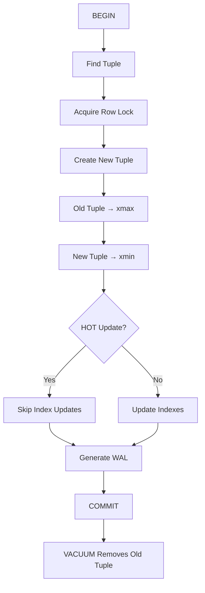

### Subsystems Involved

- Transactions
- MVCC
- Heap Storage
- Row Locks
- HOT Updates
- WAL
- VACUUM

### Related Chapters

- Chapter 5 – Transactions & MVCC
- Chapter 6 – WAL & Durability
- Chapter 8 – Locking & Concurrency
- Chapter 9 – VACUUM
- Chapter 10 – Indexes

### What Interviewers Are Testing

- Do you understand MVCC?
- Why doesn't PostgreSQL overwrite rows?
- What are xmin and xmax?
- When is HOT used?
- When does VACUUM become involved?

### Remember

- UPDATE creates a new tuple.
- Old tuple gets xmax.
- New tuple gets xmin.
- HOT avoids index updates.
- WAL is generated before COMMIT.
- VACUUM removes obsolete versions later.

### 30-Second Answer

> PostgreSQL performs UPDATE using MVCC by creating a new tuple instead of overwriting the old one. The old tuple receives an xmax, the new tuple receives a new xmin, WAL is generated before COMMIT, and VACUUM later removes obsolete versions.

---

# Walkthrough 6 – DELETE

**Interview Question:** Walk me through a DELETE.

## Overview

A **DELETE** does not immediately remove a row from disk. Instead, PostgreSQL marks the tuple as deleted using **xmax**. The tuple becomes invisible to future transactions according to MVCC rules, while older transactions can still see it if required. VACUUM later reclaims the space.

## Execution Flow

1. Transaction begins.
2. Executor locates the target tuple.
3. A Row Lock is acquired.
4. The tuple receives an **xmax**.
5. A WAL Record describing the DELETE is generated.
6. WAL is flushed during COMMIT.
7. Future transactions stop seeing the row according to Snapshot rules.
8. VACUUM later removes the dead tuple.

### Diagram

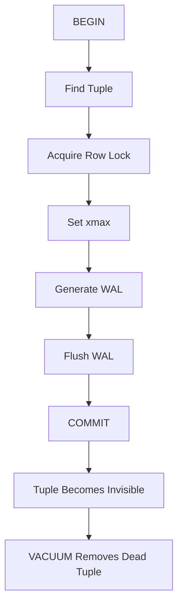

### Subsystems Involved

- Transactions
- MVCC
- Row Locks
- WAL
- Snapshots
- VACUUM

### Related Chapters

- Chapter 5 – Transactions & MVCC
- Chapter 6 – WAL & Durability
- Chapter 8 – Locking & Concurrency
- Chapter 9 – VACUUM

### What Interviewers Are Testing

- Does DELETE immediately remove the row?
- What is xmax?
- Why can other transactions still see the row?
- When is the row physically removed?
- What role does VACUUM play?

### Remember

- DELETE does not remove the tuple immediately.
- xmax marks the tuple as deleted.
- Snapshots determine visibility.
- WAL guarantees durability.
- VACUUM performs physical cleanup later.

### 30-Second Answer

> During DELETE, PostgreSQL acquires a Row Lock, marks the tuple with an xmax instead of removing it, generates WAL, commits the transaction, and lets VACUUM physically remove the dead tuple later after no active transaction can see it.
---

# Walkthrough 7 – COMMIT

**Interview Question:** What happens during COMMIT?

## Overview

A **COMMIT** makes a transaction durable. PostgreSQL guarantees durability by ensuring that all WAL records generated by the transaction are safely written to disk before reporting success to the client. The modified data pages may still remain only in memory.

## Execution Flow

1. Transaction finishes executing.
2. Required WAL Records have already been generated.
3. WAL Records are placed in WAL Buffers.
4. WAL Buffers are flushed to durable storage.
5. Group Commit may combine multiple transactions into one WAL flush.
6. WAL reaches durable storage.
7. COMMIT succeeds.
8. Client receives acknowledgement.
9. Dirty data pages remain in Shared Buffers until written later.

### Diagram

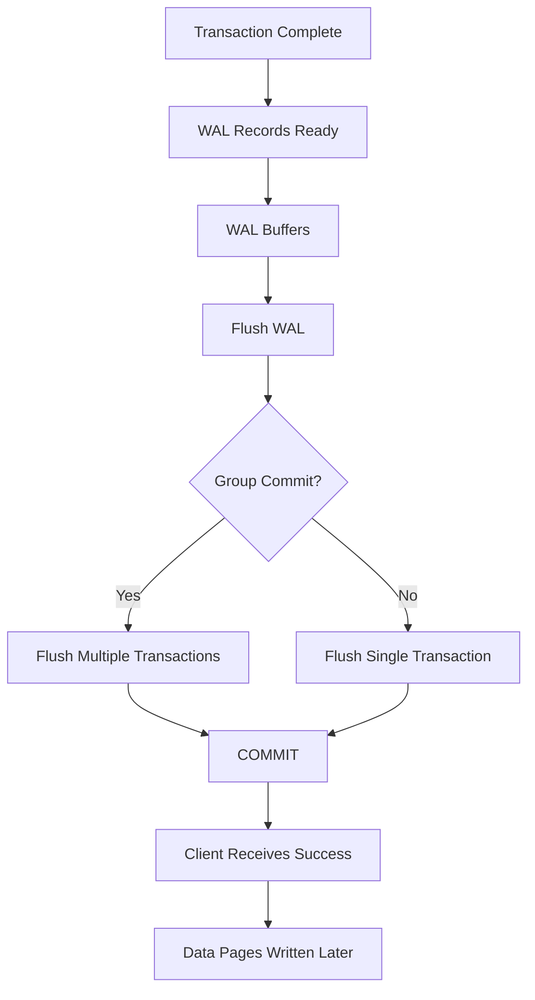

### Subsystems Involved

- Transactions
- WAL
- WAL Buffers
- WAL Writer
- Group Commit
- Shared Buffers

### Related Chapters

- Chapter 5 – Transactions & MVCC
- Chapter 6 – WAL & Durability

### What Interviewers Are Testing

- What makes COMMIT durable?
- Does COMMIT write data pages?
- Why is WAL flushed before COMMIT?
- What is Group Commit?

### Remember

- WAL must reach durable storage first.
- COMMIT depends on WAL, not data pages.
- Data pages remain in memory.
- Group Commit reduces disk I/O.
- Durability is guaranteed after WAL flush.

### 30-Second Answer

> During COMMIT, PostgreSQL flushes the transaction's WAL records to durable storage. Only after the WAL flush succeeds does COMMIT return success to the client. The modified data pages remain in Shared Buffers and are written to disk later.

---

# Walkthrough 8 – ROLLBACK

**Interview Question:** What happens during ROLLBACK?

## Overview

A **ROLLBACK** aborts a transaction and discards all uncommitted changes. Since the transaction never commits, its modifications are never made visible to other transactions. Any tuple versions created during the aborted transaction are ignored by MVCC and eventually cleaned up by VACUUM.

## Execution Flow

1. Transaction decides to abort.
2. COMMIT is never executed.
3. Changes remain invisible according to MVCC Snapshot rules.
4. Row Locks and other resources are released.
5. Client receives rollback confirmation.
6. Obsolete tuple versions are removed later by VACUUM.

### Diagram

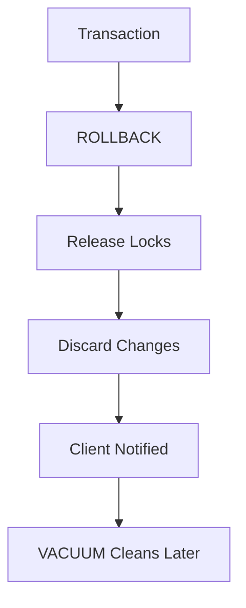

### Subsystems Involved

- Transactions
- MVCC
- Snapshots
- Row Locks
- VACUUM

### Related Chapters

- Chapter 5 – Transactions & MVCC
- Chapter 8 – Locking & Concurrency
- Chapter 9 – VACUUM

### What Interviewers Are Testing

- Does ROLLBACK undo committed work?
- What happens to tuple versions?
- When are locks released?
- Why is VACUUM still involved?

### Remember

- No COMMIT means no visible changes.
- MVCC hides aborted tuples.
- Locks are released.
- VACUUM cleans obsolete versions later.
- Database consistency is preserved.

### 30-Second Answer

> During ROLLBACK, PostgreSQL aborts the transaction, releases its locks, discards all uncommitted changes, and ensures those tuple versions remain invisible. VACUUM later removes any obsolete versions created by the aborted transaction.

---

# Walkthrough 9 – CHECKPOINT

**Interview Question:** Walk me through a CHECKPOINT.

## Overview

A **Checkpoint** writes dirty pages from Shared Buffers to disk and establishes a new recovery starting point. By flushing modified pages, PostgreSQL reduces the amount of WAL that must be replayed after a crash.

## Execution Flow

1. Checkpointer begins a checkpoint.
2. Dirty pages in Shared Buffers are identified.
3. Required dirty pages are written to disk.
4. WAL position (Checkpoint LSN) is recorded.
5. Checkpoint completes successfully.
6. Future crash recovery starts from this checkpoint.

### Diagram

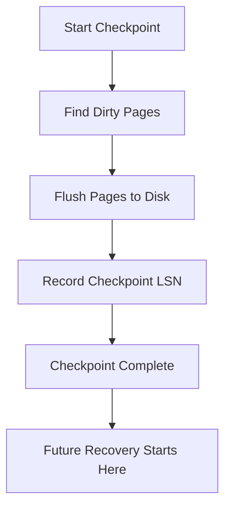

### Subsystems Involved

- Checkpointer
- Shared Buffers
- Buffer Manager
- WAL
- LSN

### Related Chapters

- Chapter 4 – Buffer Manager
- Chapter 6 – WAL & Durability
- Chapter 7 – Checkpoints & Recovery

### What Interviewers Are Testing

- What is the purpose of a Checkpoint?
- Does a Checkpoint replace WAL?
- Why are dirty pages flushed?
- Where does recovery begin after a crash?

### Remember

- Checkpoints flush dirty pages.
- They establish a recovery boundary.
- WAL is still required.
- Recovery starts from the latest checkpoint.
- Fewer WAL records need to be replayed.

### 30-Second Answer

> During a Checkpoint, PostgreSQL flushes dirty pages from Shared Buffers to disk and records a new recovery point. If the server crashes later, recovery begins from this checkpoint instead of replaying the entire WAL history.
---

# Walkthrough 10 – VACUUM

**Interview Question:** Walk me through a VACUUM operation.

## Overview

VACUUM is PostgreSQL's garbage collection process. It scans heap pages, removes dead tuples that are no longer visible to any active transaction, updates metadata structures, and reclaims space for future inserts and updates. VACUUM is essential for keeping MVCC efficient and preventing table bloat.

## Execution Flow

1. VACUUM starts scanning the table.
2. Heap pages are examined one by one.
3. Dead tuples are identified using MVCC visibility rules.
4. Dead tuples are removed.
5. Freed space is recorded in the **Free Space Map (FSM)**.
6. Fully visible pages are marked in the **Visibility Map (VM)**.
7. Very old Transaction IDs may be frozen.
8. VACUUM completes.

### Diagram

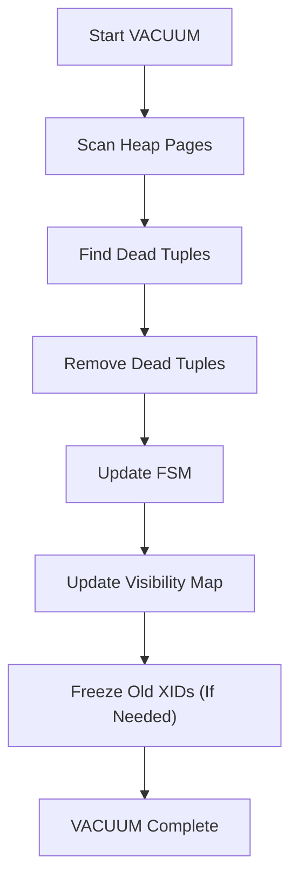

### Subsystems Involved

- MVCC
- Heap Storage
- Free Space Map (FSM)
- Visibility Map (VM)
- Freeze
- Transaction IDs

### Related Chapters

- Chapter 2 – Storage Engine
- Chapter 5 – Transactions & MVCC
- Chapter 9 – VACUUM

### What Interviewers Are Testing

- Why doesn't PostgreSQL delete rows immediately?
- What is a dead tuple?
- What does VACUUM actually remove?
- Why are FSM and VM updated?
- What is Freeze?

### Remember

- VACUUM removes dead tuples.
- Live tuples are never removed.
- FSM tracks reusable space.
- VM tracks fully visible pages.
- Freeze prevents XID wraparound.

### 30-Second Answer

> VACUUM scans heap pages, removes dead tuples that are no longer visible, updates the Free Space Map and Visibility Map, freezes old Transaction IDs when necessary, and makes space available for future inserts without rewriting the table.

---

# Walkthrough 11 – AUTOVACUUM

**Interview Question:** What happens during Autovacuum?

## Overview

Autovacuum automatically performs routine database maintenance. It monitors table activity and launches worker processes when tables accumulate enough dead tuples or require updated planner statistics. It also prevents Transaction ID wraparound by freezing old tuples.

## Execution Flow

1. PostgreSQL monitors table activity.
2. VACUUM and ANALYZE thresholds are evaluated.
3. Autovacuum Launcher starts an Autovacuum Worker.
4. Worker runs VACUUM.
5. Dead tuples are removed.
6. ANALYZE updates planner statistics.
7. Old Transaction IDs are frozen if required.
8. Worker exits.

### Diagram

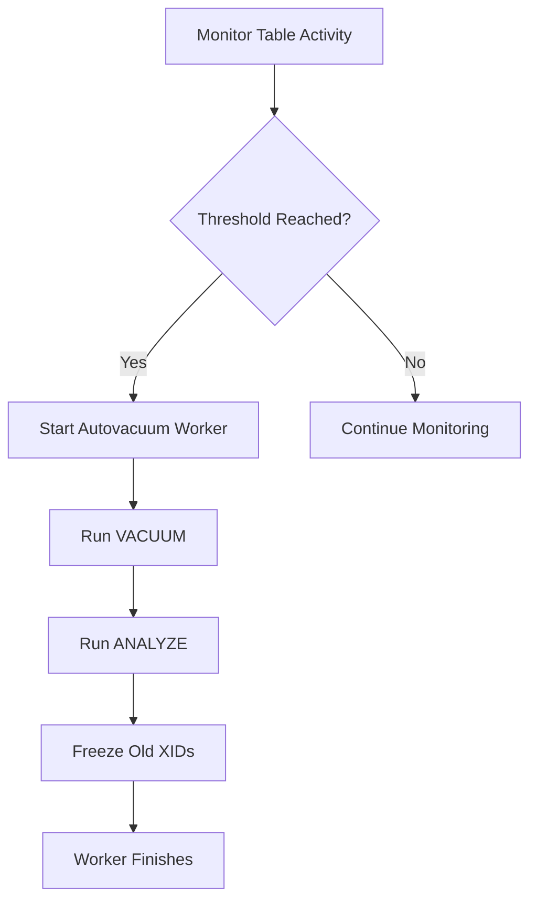

### Subsystems Involved

- Autovacuum Launcher
- Autovacuum Worker
- VACUUM
- ANALYZE
- Planner Statistics
- Freeze

### Related Chapters

- Chapter 9 – VACUUM
- Chapter 11 – Statistics & Optimization

### What Interviewers Are Testing

- Why is Autovacuum enabled by default?
- What triggers Autovacuum?
- Does it only run VACUUM?
- How does it prevent wraparound?

### Remember

- Runs automatically.
- Removes dead tuples.
- Updates planner statistics.
- Performs Freeze.
- Prevents wraparound.

### 30-Second Answer

> Autovacuum continuously monitors table activity and automatically runs VACUUM and ANALYZE when thresholds are reached. It removes dead tuples, updates planner statistics, freezes old Transaction IDs, and prevents database wraparound issues.

---

# Walkthrough 12 – INDEX SCAN

**Interview Question:** Walk me through an Index Scan.

## Overview

An Index Scan uses a B-tree index to locate matching rows efficiently. PostgreSQL first searches the index, retrieves pointers to heap tuples, loads the corresponding heap pages, checks MVCC visibility, and returns the qualifying rows.

## Execution Flow

1. Planner selects an Index Scan.
2. Executor traverses the B-tree.
3. Matching index entries are found.
4. Heap tuple pointers are retrieved.
5. Buffer Manager loads required heap pages.
6. MVCC Snapshot checks tuple visibility.
7. Matching rows are returned to the client.

### Diagram

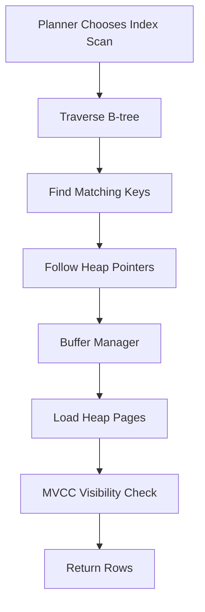

### Subsystems Involved

- Planner
- Executor
- B-tree Index
- Buffer Manager
- Shared Buffers
- MVCC

### Related Chapters

- Chapter 3 – Query Processing
- Chapter 4 – Buffer Manager
- Chapter 5 – Transactions & MVCC
- Chapter 10 – Indexes
- Chapter 11 – Statistics & Optimization

### What Interviewers Are Testing

- How does an Index Scan work?
- Why are heap pages still accessed?
- Where does MVCC fit?
- Why doesn't every query use an Index Scan?
- What determines whether an Index Scan is chosen?

### Remember

- Search the index first.
- Follow pointers to the heap.
- Load heap pages through the Buffer Manager.
- MVCC checks visibility.
- Planner chooses the scan based on cost.

### 30-Second Answer

> During an Index Scan, PostgreSQL traverses the B-tree, finds matching keys, follows heap tuple pointers, loads the necessary heap pages through the Buffer Manager, checks tuple visibility using MVCC, and returns the matching rows.
---

# Walkthrough 13 – CRASH RECOVERY

**Interview Question:** Walk me through crash recovery.

## Overview

Crash Recovery restores the database to a consistent state after an unexpected shutdown. PostgreSQL starts from the latest checkpoint, replays committed WAL records that have not yet reached the data files, and ignores uncommitted transactions. This guarantees durability without requiring every data page to be written at COMMIT time.

## Execution Flow

1. PostgreSQL starts.
2. The latest checkpoint is located.
3. WAL records generated after the checkpoint are read.
4. Each page's LSN is compared with the WAL record's LSN.
5. Missing changes are replayed using **REDO**.
6. Uncommitted transactions are ignored.
7. Recovery reaches the end of the WAL.
8. Database opens for normal operation.

### Diagram

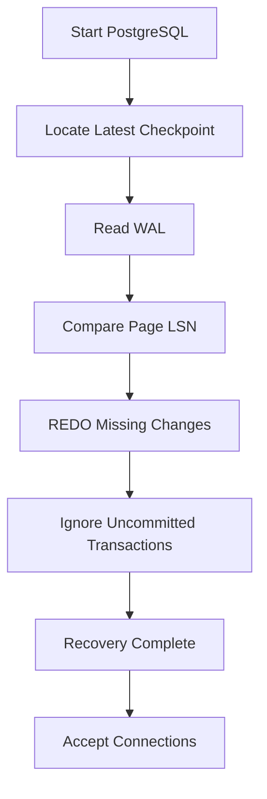

### Subsystems Involved

- WAL
- Checkpointer
- REDO
- LSN
- Recovery Manager

### Related Chapters

- Chapter 6 – WAL & Durability
- Chapter 7 – Checkpoints & Recovery

### What Interviewers Are Testing

- Where does recovery begin?
- Why are checkpoints important?
- What is REDO?
- How does PostgreSQL avoid replaying changes twice?
- Why aren't uncommitted transactions recovered?

### Remember

- Recovery starts from the latest checkpoint.
- WAL is replayed.
- Page LSNs prevent duplicate replay.
- Only committed changes are restored.
- Database opens after recovery completes.

### 30-Second Answer

> PostgreSQL starts recovery from the latest checkpoint, reads WAL records generated afterward, compares LSNs, performs REDO for committed changes that haven't reached disk, skips uncommitted transactions, and then opens the database for normal operation.

---

# Walkthrough 14 – STREAMING REPLICATION

**Interview Question:** Walk me through Streaming Replication.

## Overview

Streaming Replication continuously transfers WAL records from a Primary server to one or more Standby servers. The Standby replays the received WAL so it remains closely synchronized with the Primary, providing high availability and read scaling.

## Execution Flow

1. Transaction commits on the Primary.
2. WAL Records are generated.
3. WAL is flushed to durable storage.
4. WAL Sender streams new WAL records.
5. WAL Receiver accepts the records.
6. Standby replays the WAL.
7. Standby stays synchronized with the Primary.
8. Read-only queries can execute on the Standby (Hot Standby).

### Diagram

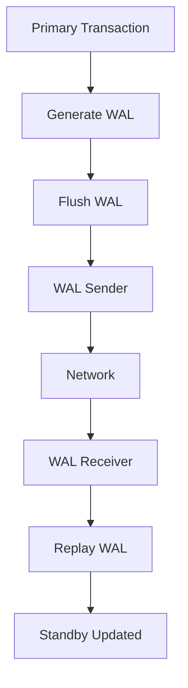

### Subsystems Involved

- WAL
- WAL Sender
- WAL Receiver
- Streaming Replication
- Replication Slots
- Hot Standby

### Related Chapters

- Chapter 6 – WAL & Durability
- Chapter 7 – Checkpoints & Recovery
- Chapter 12 – Replication

### What Interviewers Are Testing

- What is streamed between servers?
- Why is WAL used instead of SQL?
- What does the Standby replay?
- What is a Replication Slot?
- What is Hot Standby?

### Remember

- WAL is streamed continuously.
- Standby replays WAL.
- Replication Slots prevent WAL loss.
- Standby stays synchronized.
- Hot Standby allows read-only queries.

### 30-Second Answer

> Streaming Replication sends WAL records from the Primary to the Standby. The Standby continuously replays those records to remain synchronized, while Replication Slots ensure required WAL files are retained until they have been received.

---

# Walkthrough 15 – FAILOVER

**Interview Question:** What happens during failover?

## Overview

Failover promotes a Standby server to become the new Primary when the original Primary becomes unavailable. After promotion, the Standby creates a new WAL timeline and begins accepting read-write traffic.

## Execution Flow

1. Primary server becomes unavailable.
2. Standby finishes replaying available WAL.
3. Recovery ends.
4. A new WAL Timeline is created.
5. Standby is promoted to Primary.
6. Clients reconnect to the new Primary.
7. Replication is re-established from the new leader.

### Diagram

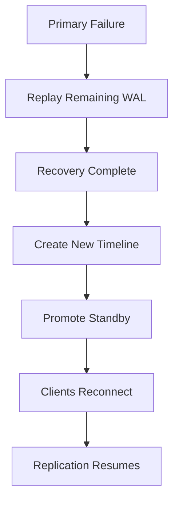

### Subsystems Involved

- Streaming Replication
- WAL
- Recovery
- Timelines
- Standby Promotion

### Related Chapters

- Chapter 7 – Checkpoints & Recovery
- Chapter 12 – Replication

### What Interviewers Are Testing

- What happens after Primary failure?
- Why is a new Timeline created?
- When can the Standby accept writes?
- How does failover maintain consistency?

### Remember

- Primary fails.
- Standby finishes replaying WAL.
- Recovery completes.
- New Timeline is created.
- Standby becomes the new Primary.
- Clients reconnect.

### 30-Second Answer

> During failover, the Standby finishes replaying all available WAL, completes recovery, creates a new Timeline, promotes itself to the new Primary, and begins accepting client writes while replication is reconfigured.

---

# 📌 Appendix D Summary

The walkthroughs connect every major PostgreSQL subsystem into complete execution flows.

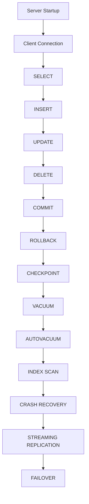

---

# 🎯 Interview Outcome

After completing Appendix D, you should be able to confidently walk an interviewer through:

- PostgreSQL Server Startup
- Client Connection Lifecycle
- SELECT Execution
- INSERT Execution
- UPDATE Execution with MVCC
- DELETE Execution
- COMMIT Processing
- ROLLBACK Processing
- CHECKPOINT Execution
- VACUUM and AUTOVACUUM
- Index Scan Execution
- Crash Recovery
- Streaming Replication
- Failover and Standby Promotion

